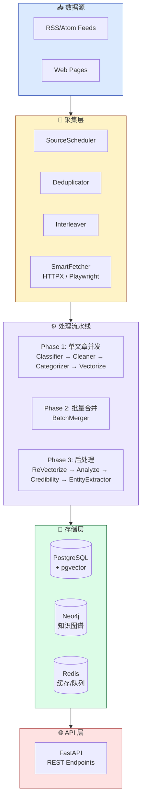
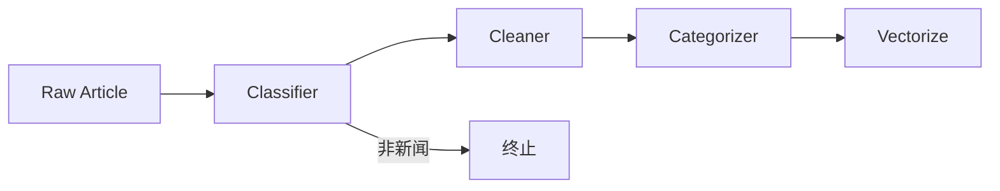

<span id="top"></span>

<div align="center">

<p>
  
  
  
  
</p>

<p align="center">
  <strong>WEAVER - 智能新闻采集、分析与知识图谱构建平台</strong>
</p>

<p align="center">
  <a href="#features" style="color:#3B82F6">✨ 功能特性</a> •
  <a href="#quick-start" style="color:#3B82F6">🚀 快速开始</a> •
  <a href="#architecture" style="color:#3B82F6">🏗️ 架构设计</a> •
  <a href="#api" style="color:#3B82F6">📡 API 文档</a> •
  <a href="#scheduler-config" style="color:#3B82F6">📅 调度器配置</a> •
  <a href="#contributing" style="color:#3B82F6">🤝 参与贡献</a>
</p>

</div>

---

<div align="center" style="padding: 32px; margin: 24px 0">

### 🎯 智能新闻处理流水线

| ✨ RSS 管理  |        🕷️ 智能爬取        |     🤖 LLM 处理      |    📊 知识图谱     |
| :----------: | :-----------------------: | :------------------: | :----------------: |
| 订阅调度解析 | HTTPX/Playwright 自动选择 | 分类清洗摘要情感分析 | Neo4j 实体关系存储 |

</div>

---

## 📋 目录

<details open style="padding:16px">
<summary style="cursor:pointer; font-weight:600; color:#1E293B">📑 目录（点击展开）</summary>

- [✨ 功能特性](#features)
- [🚀 快速开始](#quick-start)
  - [📦 环境要求](#requirements)
  - [🔧 安装](#installation)
  - [⚙️ 配置](#configuration)
  - [📅 调度器配置](#scheduler-config)
  - [🗄️ 数据库迁移](#migration)
  - [▶️ 启动服务](#start)
- [🏗️ 架构设计](#architecture)
- [📡 API 文档](#api)
- [🔄 Pipeline 流程](#pipeline)
- [📊 可信度评分](#credibility)
- [🤖 LLM 调用点](#llm-callpoints)
- [⏰ 定时任务](#scheduled-jobs)
- [🧪 开发指南](#development)
- [🤝 参与贡献](#contributing)
- [📄 许可证](#license)

</details>

---

## <span id="features">✨ 功能特性</span>

<table style="width:100%; border-collapse: collapse">
<tr>
<td width="50%" style="vertical-align:top; padding: 16px">

### 🎯 核心功能

| 状态 | 功能               | 描述                                           |
| :--: | ------------------ | ---------------------------------------------- |
|  ✅  | **RSS 源管理**     | 订阅、调度、解析 RSS/Atom 源，支持增量抓取     |
|  ✅  | **智能爬取**       | 自动选择 HTTPX 或 Playwright，支持动态页面渲染 |
|  ✅  | **LLM 处理流水线** | 分类、清洗、摘要、情感分析、实体提取           |
|  ✅  | **知识图谱**       | Neo4j 存储实体关系，支持图谱查询               |
|  ✅  | **向量检索**       | pgvector 支持语义相似度搜索                    |
|  ✅  | **可信度评估**     | 多维度信号聚合计算新闻可信度                   |
|  ✅  | **REST API**       | FastAPI 提供完整 API 接口                      |

</td>
<td width="50%" style="vertical-align:top; padding: 16px">

### ⚡ 技术栈

|      类别       | 技术                       |
| :-------------: | -------------------------- |
|     🐍 语言     | Python 3.12+               |
|   🌐 Web 框架   | FastAPI + Uvicorn          |
|  🐘 关系数据库  | PostgreSQL + pgvector      |
|   🔵 图数据库   | Neo4j 5+                   |
|     🔴 缓存     | Redis 7+                   |
| 🎭 浏览器自动化 | Playwright                 |
|   🤖 LLM 框架   | LangChain / LangGraph      |
|     📝 NLP      | spaCy                      |
|   ⏰ 任务调度   | APScheduler                |
|   📈 可观测性   | Prometheus + OpenTelemetry |

</td>
</tr>
</table>

---

## <span id="quick-start">🚀 快速开始</span>

### <span id="requirements">📦 环境要求</span>

| 依赖       | 版本  | 说明                 |
| ---------- | ----- | -------------------- |
| Python     | 3.12+ | 运行环境             |
| PostgreSQL | 15+   | 需安装 pgvector 扩展 |
| Neo4j      | 5+    | 图数据库             |
| Redis      | 7+    | 缓存与队列           |

### <span id="installation">🔧 安装</span>

```bash
# 克隆项目
git clone <repository-url>
cd weaver

# 安装依赖 (使用 uv)
uv sync

# 安装 Playwright 浏览器
uv run playwright install chromium

# 安装 spaCy 中文模型及依赖
# 注意：zh_core_web_sm 需要 spacy-pkuseg 分词器依赖
uv pip install "spacy-pkuseg>=0.0.27,<0.1.0"
uv run python -m spacy download zh_core_web_sm

# 可选：安装更精确的 transformer 模型（需要额外依赖）
# uv pip install spacy-transformers
# uv run python -m spacy download zh_core_web_trf
```

<details style="padding:16px; margin: 16px 0">
<summary style="cursor:pointer; font-weight:600; color:#1E293B">🔧 SpaCy 模型说明</summary>

| 模型              | 大小   | 依赖                         | 说明                   |
| ----------------- | ------ | ---------------------------- | ---------------------- |
| `zh_core_web_sm`  | ~40MB  | spacy-pkuseg                 | 推荐：轻量级，无需 GPU |
| `zh_core_web_trf` | ~400MB | spacy-transformers + PyTorch | 精度更高，需要 GPU     |
| `en_core_web_sm`  | ~12MB  | -                            | 英文处理               |

**实体类型映射**：

- `PERSON`/`PER` → 人物
- `ORG` → 组织机构
- `GPE`/`LOC` → 地点
- `MONEY`/`CARDINAL`/`PERCENT` → 数据指标
- `LAW` → 法规与政策

</details>
```

### <span id="configuration">⚙️ 配置</span>

Weaver 使用分层配置策略，支持环境变量和 TOML 文件：

1. **复制配置模板**：

```bash
cp config/settings.example.toml config/settings.toml
cp config/llm.example.toml config/llm.toml
cp .env.example .env
```

2. **配置环境变量**（`.env` 文件）：

```bash
# PostgreSQL
POSTGRES_HOST=localhost
POSTGRES_PORT=5432
POSTGRES_DATABASE=weaver
POSTGRES_USER=postgres
POSTGRES_PASSWORD=your_password

# Neo4j
NEO4J_URI=bolt://localhost:7687
NEO4J_USER=neo4j
NEO4J_PASSWORD=your_password
NEO4J_ENABLED=true

# Redis
REDIS_HOST=localhost
REDIS_PORT=6379
REDIS_DB=0
REDIS_PASSWORD=  # 可选

# API
WEAVER_API__API_KEY=your-secure-api-key

# LLM API Keys (供 llm.toml 引用)
OPENAI_API_KEY=sk-xxx
ANTHROPIC_API_KEY=sk-xxx
```

3. **配置 LLM 提供商**（`config/llm.toml`）：

```toml
[global]
default_chat_provider = "openai"
default_embedding_provider = "embedding"
default_rerank_provider = "rerank"

[providers.openai]
type = "openai"
model = "gpt-4o"
api_key = "${OPENAI_API_KEY}"
base_url = "https://api.openai.com/v1"
rpm_limit = 60
concurrency = 5
timeout = 120.0
capabilities = ["chat", "streaming"]

[providers.embedding]
type = "embedding"
model = "text-embedding-3-large"
api_key = "${OPENAI_API_KEY}"
base_url = "https://api.openai.com/v1"
capabilities = ["embedding"]

# 调用点路由配置
[call-points.classifier]
primary = "chat.openai.gpt-4o"
fallbacks = []

[call-points.entity_extractor]
primary = "chat.openai.gpt-4o"
fallbacks = []
```

<details style="padding:16px; margin: 16px 0">
<summary style="cursor:pointer; font-weight:600; color:#1E293B">🔧 完整配置选项</summary>

| 配置项                                  | 类型   | 默认值                  | 描述                      |
| --------------------------------------- | ------ | ----------------------- | ------------------------- |
| **PostgreSQL**                          |        |                         |                           |
| `POSTGRES_HOST`                         | string | `localhost`             | 数据库主机                |
| `POSTGRES_PORT`                         | int    | `5432`                  | 数据库端口                |
| `POSTGRES_DATABASE`                     | string | `weaver`                | 数据库名称                |
| `POSTGRES_USER`                         | string | `postgres`              | 用户名                    |
| `POSTGRES_PASSWORD`                     | string | -                       | 密码（必须设置）          |
| **Neo4j**                               |        |                         |                           |
| `NEO4J_URI`                             | string | `bolt://localhost:7687` | 连接地址                  |
| `NEO4J_USER`                            | string | `neo4j`                 | 用户名                    |
| `NEO4J_PASSWORD`                        | string | -                       | 密码（必须设置）          |
| `NEO4J_ENABLED`                         | bool   | `true`                  | 是否启用                  |
| **Redis**                               |        |                         |                           |
| `REDIS_HOST`                            | string | `localhost`             | Redis 主机                |
| `REDIS_PORT`                            | int    | `6379`                  | Redis 端口                |
| `REDIS_DB`                              | int    | `0`                     | 数据库编号                |
| **API**                                 |        |                         |                           |
| `WEAVER_API__API_KEY`                   | string | -                       | API 认证密钥              |
| **Fetcher**                             |        |                         |                           |
| `playwright_pool_size`                  | int    | 5                       | Playwright 浏览器池大小   |
| `default_per_host_concurrency`          | int    | 2                       | 每主机默认并发数          |
| `global_max_concurrency`                | int    | 32                      | 全局最大并发数            |
| `httpx_timeout`                         | float  | 15.0                    | HTTPX 超时时间（秒）      |
| **Scheduler**                           |        |                         |                           |
| `pipeline_retry_interval_minutes`       | int    | 15                      | Pipeline 重试间隔（分钟） |
| `pipeline_retry_batch_size`             | int    | 20                      | Pipeline 重试批次大小     |
| `pipeline_retry_dynamic_batch`          | bool   | false                   | 是否启用动态批次调整      |
| `pipeline_retry_success_rate_threshold` | float  | 0.8                     | 动态批次成功率阈值        |

</details>

#### <span id="scheduler-config">📅 调度器配置</span>

Pipeline 处理失败后支持智能重试机制：

| 参数                                    | 类型  | 默认值 | 说明                                                        |
| --------------------------------------- | ----- | ------ | ----------------------------------------------------------- |
| `pipeline_retry_interval_minutes`       | int   | 15     | 重试检查间隔（分钟），控制失败任务的重试频率                |
| `pipeline_retry_batch_size`             | int   | 20     | 每次重试处理的任务数量                                      |
| `pipeline_retry_dynamic_batch`          | bool  | false  | 是否根据成功率动态调整批次大小                              |
| `pipeline_retry_success_rate_threshold` | float | 0.8    | 动态调整的触发阈值（0.0-1.0），成功率低于此值时减少批次大小 |

**动态批次逻辑**：

- 启用后，系统监控上批次处理成功率
- 成功率 ≥ 阈值：批次大小不变或增加
- 成功率 < 阈值：批次大小减半，避免大量任务连续失败

---

### <span id="migration">🗄️ 数据库迁移</span>

```bash
# 运行迁移
uv run alembic upgrade head
```

### <span id="start">▶️ 启动服务</span>

```bash
# 开发模式
uv run uvicorn src.main:app --reload --host 0.0.0.0 --port 8000

# 生产模式
uv run python -m src.main
```

---

## <span id="architecture">🏗️ 架构设计</span>

### 系统架构



### 组件状态

| 组件                    | 描述                        | 状态    |
| ----------------------- | --------------------------- | ------- |
| **SmartFetcher**        | HTTPX/Playwright 自动选择   | ✅ 稳定 |
| **Deduplicator**        | 两级 URL 去重               | ✅ 稳定 |
| **Pipeline**            | LangGraph 流水线编排        | ✅ 稳定 |
| **LLM Client**          | 多 Provider 支持 + Fallback | ✅ 稳定 |
| **Neo4j Writer**        | 实体关系写入                | ✅ 稳定 |
| **Vector Repo**         | pgvector 向量存储           | ✅ 稳定 |
| **Credibility Checker** | 多信号可信度评估            | ✅ 稳定 |
| **APScheduler**         | 定时任务调度                | ✅ 稳定 |

---

## <span id="api">📡 API 文档</span>

### 认证

所有 API 请求需要在 Header 中携带 API Key：

```
X-API-Key: your-api-key
```

### 端点列表

| 端点                                  | 方法   | 描述                                             |
| ------------------------------------- | ------ | ------------------------------------------------ |
| `/health`                             | GET    | 健康检查（无需认证）                             |
| `/api/v1/sources`                     | GET    | 获取源列表                                       |
| `/api/v1/sources/{source_id}`         | GET    | 获取指定源                                       |
| `/api/v1/sources`                     | POST   | 添加新源                                         |
| `/api/v1/sources/{source_id}`         | PUT    | 更新源配置                                       |
| `/api/v1/sources/{source_id}`         | DELETE | 删除源                                           |
| `/api/v1/pipeline/trigger`            | POST   | 触发 Pipeline 任务                               |
| `/api/v1/pipeline/tasks/{task_id}`    | GET    | 获取任务状态                                     |
| `/api/v1/pipeline/queue/stats`        | GET    | 获取队列统计                                     |
| `/api/v1/articles`                    | GET    | 查询文章列表（支持分页、过滤、排序）             |
| `/api/v1/articles/{id}`               | GET    | 获取文章详情                                     |
| `/api/v1/search`                      | GET    | 统一搜索（mode 参数路由：local/global/articles） |
| `/api/v1/search/drift`                | POST   | DRIFT 迭代式探索搜索                             |
| `/api/v1/graph/entities/{name}`       | GET    | 查询实体及其关系                                 |
| `/api/v1/graph/articles/{id}/graph`   | GET    | 获取文章的知识图谱                               |
| `/api/v1/graph/metrics/health`        | GET    | 图谱健康度摘要                                   |
| `/api/v1/graph/metrics/full`          | GET    | 图谱完整指标                                     |
| `/api/v1/graph/metrics/components`    | GET    | 连通分量列表                                     |
| `/api/v1/graph/metrics/orphans`       | GET    | 孤立实体列表                                     |
| `/api/v1/graph/metrics/high-degree`   | GET    | 高度数实体列表                                   |
| `/api/v1/graph/metrics/modularity`    | GET    | 模块度评分                                       |
| `/api/v1/graph/metrics/distributions` | GET    | 类型分布统计                                     |
| `/api/v1/graph/communities`           | GET    | 社区列表查询                                     |
| `/api/v1/graph/communities/{id}`      | GET    | 社区详情                                         |
| `/api/v1/admin/sources/authority`     | GET    | 获取源权威度                                     |
| `/api/v1/admin/communities/rebuild`   | POST   | 手动触发社区重建                                 |
| `/metrics`                            | GET    | Prometheus 指标                                  |

<details style="padding:16px; margin: 16px 0">
<summary style="cursor:pointer; font-weight:600; color:#166534">📖 API 示例</summary>

#### 获取文章列表

```bash
curl -X GET "http://localhost:8000/api/v1/articles?page=1&page_size=20&category=politics&min_credibility=0.7&sort_by=publish_time&sort_order=desc" \
  -H "X-API-Key: your-api-key"
```

#### 创建源

```bash
curl -X POST "http://localhost:8000/api/v1/sources" \
  -H "X-API-Key: your-api-key" \
  -H "Content-Type: application/json" \
  -d '{
    "id": "xinhua-news",
    "name": "新华社",
    "url": "http://www.xinhuanet.com/politics/news_politics.xml",
    "source_type": "rss",
    "enabled": true,
    "interval_minutes": 30,
    "credibility": 0.98,
    "tier": 1
  }'
```

**新字段说明**：

- `credibility`: 预设可信度 (0.0-1.0)，用于可信度评估的来源权威度信号
- `tier`: 来源层级 (1=权威, 2=可信, 3=普通)

#### 查询实体

```bash
curl -X GET "http://localhost:8000/api/v1/graph/entities/Apple%20Inc?limit=10" \
  -H "X-API-Key: your-api-key"
```

</details>

---

## <span id="pipeline">🔄 Pipeline 流程</span>

### Phase 1: 单文章并发处理



- **Classifier**: 判断是否为新闻，非新闻直接终止
- **Cleaner**: 清洗 HTML、提取正文
- **Categorizer**: 分类（政治/军事/经济/科技等）、语言、地区
- **Vectorize**: 生成内容向量 (1024维)

### Phase 2: 批量合并

```
BatchMerger (Union-Find 相似度聚类)
```

- 相似度阈值: 0.80
- 合并相似文章，保留最完整版本

### Phase 3: 单文章后处理


- **ReVectorize**: 合并后重新生成向量
- **Analyze**: 摘要、情感分析、关键数据提取
- **Credibility**: 可信度评分
- **EntityExtractor**: spaCy + LLM 实体提取

---

## <span id="credibility">📊 可信度评分</span>

采用三信号类别自适应可信度评估算法：

| 信号       | 说明                                            |
| ---------- | ----------------------------------------------- |
| 来源权威性 | 三级优先级：预设值 > 历史自动计算 > 默认值 0.50 |
| 内容核查   | LLM 事实一致性检查                              |
| 时效性     | 发布时间与事件时间差                            |

### 类别自适应权重

权重根据文章类型动态调整：

| 类别           | 来源     | 内容     | 时效性   | 特点             |
| -------------- | -------- | -------- | -------- | ---------------- |
| 政治/国际/军事 | 0.25     | 0.25     | **0.50** | 突发新闻时效优先 |
| 经济           | **0.45** | 0.35     | 0.20     | 来源权威优先     |
| 科技           | 0.30     | **0.50** | 0.20     | 内容质量优先     |
| 社会/文化/体育 | 0.40     | 0.40     | 0.20     | 均衡分布         |

### 时效性评分规则

| 时间差   | 评分 |
| -------- | ---- |
| ≤6小时   | 1.00 |
| ≤24小时  | 0.85 |
| ≤72小时  | 0.65 |
| ≤168小时 | 0.45 |
| >168小时 | 0.30 |

### 来源权威度三级优先级

1. **预设可信度**：通过 API 为权威来源（央视、新华社等）预设可信度
2. **历史自动计算**：基于历史文章平均分自动计算
3. **默认值**：新来源默认 0.50

---

## <span id="llm-callpoints">🤖 LLM 调用点</span>

| 调用点              | 类型      | 说明         |
| ------------------- | --------- | ------------ |
| classifier          | CHAT      | 新闻分类     |
| cleaner             | CHAT      | 内容清洗     |
| categorizer         | CHAT      | 分类识别     |
| merger              | CHAT      | 文章合并     |
| analyze             | CHAT      | 摘要分析     |
| credibility_checker | CHAT      | 可信度检查   |
| entity_extractor    | CHAT      | 实体提取     |
| entity_resolver     | CHAT      | 实体消歧     |
| search_local        | CHAT      | 本地搜索问答 |
| search_global       | CHAT      | 全局搜索问答 |
| embedding           | EMBEDDING | 向量生成     |
| rerank              | RERANK    | 重排序       |

---

## <span id="scheduled-jobs">⏰ 定时任务</span>

| 任务                          | 间隔      | 说明                                         |
| ----------------------------- | --------- | -------------------------------------------- |
| retry_neo4j_writes            | 10分钟    | 重试失败的 Neo4j 写入                        |
| flush_retry_queue             | 30秒      | 刷新爬虫重试队列                             |
| update_source_auto_scores     | 每天3点   | 更新源权威度                                 |
| archive_old_neo4j_nodes       | 每周六2点 | 归档旧文章                                   |
| cleanup_orphan_entity_vectors | 每周六3点 | 清理孤立向量                                 |
| retry_pipeline_processing     | 15分钟    | 重试失败的 Pipeline 处理                     |
| sync_neo4j_with_postgres      | 1小时     | 同步 Neo4j 与 PostgreSQL 数据一致性          |
| update_persist_status_metrics | 5分钟     | 更新持久化状态 Prometheus 指标（支撑告警）   |
| community_auto_check          | 30分钟    | 社区检测自动检查（基于实体变化阈值触发重建） |

---

## <span id="development">🧪 开发指南</span>

### 测试概述

Weaver 使用分层测试策略：

| 层级     | 位置                 | 数量  | 特点                    |
| -------- | -------------------- | ----- | ----------------------- |
| 单元测试 | `tests/unit/`        | ~1150 | Mock 外部依赖，快速执行 |
| 集成测试 | `tests/integration/` | ~22   | 测试多组件交互          |
| E2E 测试 | `tests/e2e/`         | ~24   | 完整 API 流程，真实服务 |
| 性能测试 | `tests/performance/` | ~8    | HNSW 向量索引性能基准   |

### 运行测试

```bash
# 运行所有测试（不包括 E2E）
uv run pytest

# 运行单元测试
uv run pytest tests/unit/ -v

# 运行集成测试
uv run pytest tests/integration/ -v

# 运行带标记的测试
uv run pytest -m unit -v
uv run pytest -m integration -v

# 带覆盖率报告
uv run pytest --cov=src --cov-report=html

# 跳过慢速测试
uv run pytest -m "not slow"

# E2E 测试（需要 Docker）
cd tests/e2e
docker compose up -d
pytest tests/e2e/ -v
docker compose down
```

### 测试覆盖率

项目要求 80% 覆盖率阈值。查看详细报告：

```bash
# HTML 覆盖率报告
uv run pytest --cov=src --cov-report=html
open htmlcov/index.html

# 覆盖率摘要
uv run pytest --cov=src --cov-report=term-missing
```

### 测试目录结构

```
tests/
├── unit/                    # 单元测试
│   ├── test_analyze.py     # Analyze 节点
│   ├── test_categorizer.py # Categorizer 节点
│   ├── test_classifier.py  # Classifier 节点
│   ├── test_vectorize.py   # Vectorize 节点
│   ├── test_global_search.py
│   ├── test_local_search.py
│   └── ...
├── integration/            # 集成测试
│   ├── test_pipeline_integration.py
│   ├── test_search_integration.py
│   └── test_source_integration.py
├── e2e/                    # E2E 测试
│   ├── conftest.py        # Docker fixtures
│   ├── base/client.py     # API 客户端
│   ├── test_health.py
│   ├── test_sources.py
│   └── test_workflows.py
└── performance/           # 性能测试
    └── test_hnsw_performance.py
```

### E2E 测试环境

E2E 测试使用隔离的 Docker 服务：

```bash
# 启动 E2E 测试服务
docker compose -f tests/e2e/docker-compose.yml up -d

# 等待服务就绪
docker compose -f tests/e2e/docker-compose.yml ps

# 运行 E2E 测试
uv run pytest tests/e2e/ -v

# 清理
docker compose -f tests/e2e/docker-compose.yml down -v
```

### Mock Fixtures

常用测试 fixtures（定义在 `tests/conftest.py`）：

| Fixture              | 描述            |
| -------------------- | --------------- |
| `mock_redis`         | Redis mock      |
| `mock_postgres_pool` | PostgreSQL mock |
| `mock_neo4j_pool`    | Neo4j mock      |
| `mock_llm_client`    | LLM 客户端 mock |
| `mock_settings`      | 配置对象 mock   |
| `sample_article`     | 示例文章数据    |

### 测试数据工厂

使用 `tests/factories.py` 中的工厂类生成测试数据：

```python
from tests.factories import ArticleRawFactory, SourceConfigFactory

# 创建单个对象
article = ArticleRawFactory.create()

# 批量创建
articles = ArticleRawFactory.create_batch(10)
```

### 数据库迁移

```bash
# 创建新迁移
uv run alembic revision --autogenerate -m "description"

# 应用迁移
uv run alembic upgrade head

# 回滚
uv run alembic downgrade -1
```

### 代码风格

- 使用 `ruff` 进行代码格式化和 lint
- 类型注解必须完整
- 文档字符串使用 Google 风格

---

## <span id="contributing">🤝 参与贡献</span>

<table style="width:100%; border-collapse: collapse">
<tr>
<td width="33%" align="center" style="padding: 16px">

### 🐛 报告 Bug

发现问题？<br>
<a href="https://github.com/your-org/weaver/issues/new">创建 Issue</a>

</td>
<td width="33%" align="center" style="padding: 16px">

### 💡 功能建议

有好想法？<br>
<a href="https://github.com/your-org/weaver/discussions">开始讨论</a>

</td>
<td width="33%" align="center" style="padding: 16px">

### 🔧 提交 PR

想贡献代码？<br>
<a href="https://github.com/your-org/weaver/pulls">Fork 并提交 PR</a>

</td>
</tr>
</table>

<details style="padding:16px; margin: 16px 0">
<summary style="cursor:pointer; font-weight:600; color:#1E293B">📝 贡献指南</summary>

### 🚀 如何贡献

1. **Fork** 本仓库
2. **Clone** 你的 fork：`git clone https://github.com/yourusername/weaver.git`
3. **创建** 分支：`git checkout -b feature/amazing-feature`
4. **进行** 修改
5. **测试** 修改：
   ```bash
   uv run pytest tests/unit/ -v
   uv run pytest tests/integration/ -v
   ```
6. **检查** 覆盖率：
   ```bash
   uv run pytest --cov=src --cov-report=term-missing
   ```
7. **提交** 修改：`git commit -m 'feat: 添加某功能'`
8. **推送** 到分支：`git push origin feature/amazing-feature`
9. **创建** Pull Request

### 📋 代码规范

- ✅ 遵循 Python 标准编码规范 (PEP 8)
- ✅ 使用 `ruff` 格式化代码：`uv run ruff check --fix src/`
- ✅ 编写全面的测试（新增功能必须有测试覆盖）
- ✅ 更新文档
- ✅ 类型注解完整

### 🧪 测试要求

- 所有新功能必须包含单元测试
- 公共 API 必须包含集成测试
- 覆盖率阈值：80%
- 测试命名：`test_<模块>_<功能>.py`
- 使用 Mock 隔离外部依赖

### 🔍 代码审查清单

- [ ] 新代码有测试覆盖
- [ ] 所有测试通过
- [ ] 覆盖率不低于阈值
- [ ] 无新增 linting 错误
- [ ] 类型注解完整
- [ ] 文档已更新

</details>

---

## <span id="license">📄 许可证</span>

本项目采用 **MIT 许可证**：

[](LICENSE)

---

**[⬆ 返回顶部](#top)**

---

<sub>© 2026 WEAVER. 保留所有权利。</sub>
