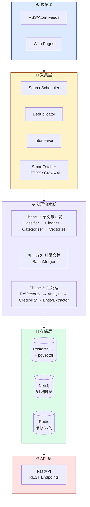
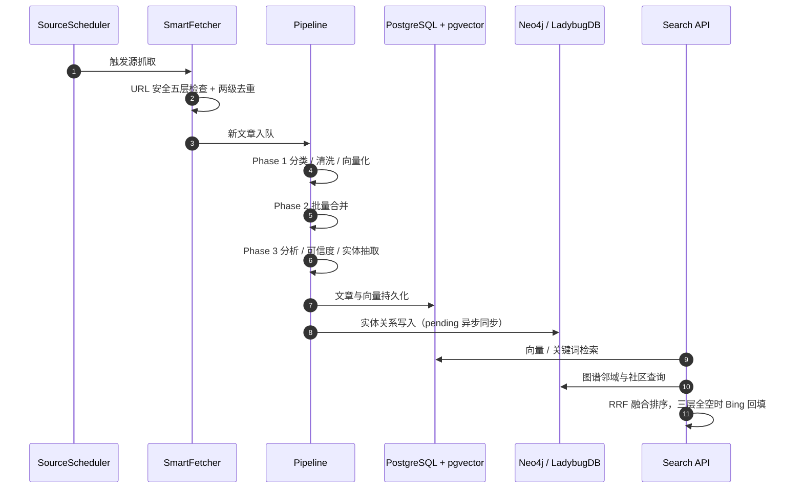

<div align="center">


[](https://github.com/Kirky-X/weaver/releases) [](https://www.python.org/) [](LICENSE) [](https://fastapi.tiangolo.com/)

**中文** | [English](README_EN.md)

**智能新闻采集、分析与知识图谱构建平台**

[✨ 功能特性](#-功能特性) • [🚀 快速开始](#-快速开始) • [📚 文档](#-文档) • [💻 示例](#-示例) • [🤝 参与贡献](#-参与贡献)

</div>

---

## 📋 目录

<details open>
<summary>📑 目录</summary>

- [✨ 功能特性](#-功能特性)
- [🚀 快速开始](#-快速开始)
- [📚 文档](#-文档)
- [💻 示例](#-示例)
- [🏗️ 架构](#️-架构)
- [🧪 测试](#-测试)
- [📊 性能](#-性能)
- [🔒 安全](#-安全)
- [🗺️ 开发路线图](#️-开发路线图)
- [🤝 参与贡献](#-参与贡献)
- [📋 更新日志](#-更新日志)
- [📄 许可证](#-许可证)
- [🙏 致谢](#-致谢)
- [📞 联系与支持](#-联系与支持)
- [⭐ Star 历史](#-star-历史)

</details>

---

## ✨ 功能特性

<table style="width:100%; border-collapse: collapse">
<tr>
<td width="50%" style="vertical-align:top; padding: 16px">

### 🕷️ 智能采集

RSS/Atom 源订阅、调度与增量抓取，HTTPX / Crawl4AI 按站点自动选择，支持动态页面渲染与两级 URL 去重

</td>
<td width="50%" style="vertical-align:top; padding: 16px">

### ⚙️ LLM 处理流水线

三阶段 Pipeline 完成分类、清洗、摘要、情感分析与实体提取，支持 SSE 实时进度推送与失败重试

</td>
</tr>
<tr>
<td width="50%" style="vertical-align:top; padding: 16px">

### 🕸️ 知识图谱

Neo4j / LadybugDB 存储实体关系，Leiden 社区检测、社区报告生成与图谱可视化查询

</td>
<td width="50%" style="vertical-align:top; padding: 16px">

### 🔍 四模式搜索

`local` / `global` / `drift` / `hybrid` 四种搜索引擎，RRF 融合排序，auto 模式基于意图自动路由

</td>
</tr>
<tr>
<td width="50%" style="vertical-align:top; padding: 16px">

### 🎯 向量检索

pgvector + HNSW 索引支撑语义相似度搜索，1024 维向量毫秒级查询

</td>
<td width="50%" style="vertical-align:top; padding: 16px">

### ✅ 可信度评估

多维度信号聚合计算新闻可信度，内置虚假新闻检测与声明抽取

</td>
</tr>
<tr>
<td width="50%" style="vertical-align:top; padding: 16px">

### 🧠 MAGMA 记忆

多图记忆服务，时序图演化、自适应检索与因果推理

</td>
<td width="50%" style="vertical-align:top; padding: 16px">

### 🔀 Smart LLM Router

25 个调用点级 primary/fallback 路由，熔断保护、热重载与用量统计

</td>
</tr>
<tr>
<td width="50%" style="vertical-align:top; padding: 16px">

### 🎲 蒙特卡洛采样

长文档多锚点智能采样 + 置信度加权，节省 60%+ token

</td>
<td width="50%" style="vertical-align:top; padding: 16px">

### 💾 知识簇缓存

语义搜索结果持久化缓存（DuckDB + Parquet），FIFO + 热度评分，命中率 40-70%

</td>
</tr>
<tr>
<td width="50%" style="vertical-align:top; padding: 16px">

### 🔒 多层 URL 安全

SSRF 防护、URLhaus、PhishTank、启发式分析、SSL 验证五层检查，风险五级分级

</td>
<td width="50%" style="vertical-align:top; padding: 16px">

### 📊 可观测性

Prometheus 指标、OpenTelemetry 追踪、LLM 用量聚合与告警系统

</td>
</tr>
</table>

除上述核心能力外，REST API 全套端点、事件驱动总线（Blinker）、双数据库故障转移（PostgreSQL ↔ DuckDB、Neo4j ↔ LadybugDB）、每日简报与趋势告警等能力也均开箱可用：完整的端点清单见 [📘 API 参考](docs/API.md)，模块职责与设计决策见 [🏗️ 架构文档](docs/ARCHITECTURE.md)。

<details>
<summary>🧱 技术栈一览</summary>

|    类别     | 技术                                  |
|:---------:|-------------------------------------|
|   🐍 语言   | Python 3.12+                        |
| 🌐 Web 框架 | FastAPI + Uvicorn                   |
| 🐘 关系数据库  | PostgreSQL + pgvector / DuckDB (备选) |
|  🔵 图数据库  | Neo4j 5+ / LadybugDB (嵌入式备选)        |
|   🔴 缓存   | Redis 7+ / Cashews (可选备选)           |
| 🕷️ 动态页面  | Crawl4AI                            |
| 🤖 LLM 框架 | LiteLLM (统一 LLM 接口 + Smart Router)  |
|  📝 NLP   | spaCy                               |
|  ⏰ 任务调度   | APScheduler                         |
|  📈 可观测性  | Prometheus + OpenTelemetry          |
|  🔔 事件总线  | Blinker (事件驱动架构)                    |

</details>

---

## 🚀 快速开始

### 📦 环境要求

| 依赖         | 版本    | 说明                                |
|------------|-------|-----------------------------------|
| Python     | 3.12+ | 运行环境                              |
| PostgreSQL | 16+   | 需安装 pgvector 扩展 (或使用 DuckDB 作为备选) |
| Neo4j      | 5+    | 图数据库 (或使用 LadybugDB 作为嵌入式备选)      |
| Redis      | 7+    | 缓存与队列 (或使用内置 Cashews 作为备选)        |

### 🔧 安装

#### 一键初始化（推荐）

```bash
# 1. 生成配置（复制模板，不覆盖已有文件）+ 提示模型安装
uv run python scripts/bootstrap.py

# 2. 启动基础设施（或加 --profile full 连应用一起起）
docker compose -f docker/docker-compose.yml up -d

# 3. 安装模型后执行迁移并启动
uv run alembic upgrade head
uv run uvicorn src.main:get_app --factory --reload
```

<details>
<summary>Docker 一体化启动（含应用，无需本地 Python 环境）</summary>

```bash
docker compose -f docker/docker-compose.yml --profile full up -d --build
# 应用启动前自动执行 alembic upgrade head；API 在 http://localhost:8000
```

</details>

#### 手动安装

```bash
# 克隆项目
git clone https://github.com/Kirky-X/weaver.git
cd weaver

# 安装依赖 (使用 uv; --all-extras 启用故障转移依赖, --all-groups 启用 dev/test 组)
uv sync --all-extras --all-groups

# 安装 spaCy 中文模型及依赖
# 注意：zh_core_web_lg 需要 spacy-pkuseg 分词器依赖
uv pip install "spacy-pkuseg>=0.0.27,<0.1.0"
uv run python -m spacy download zh_core_web_lg

# 可选：安装英文模型
uv run python -m spacy download en_core_web_lg

# 可选：安装更精确的 transformer 模型（需要额外依赖）
# uv pip install spacy-transformers
# uv run python -m spacy download zh_core_web_trf
```

<details style="padding:16px; margin: 16px 0">
<summary style="cursor:pointer; font-weight:600; color:#1E293B">🔧 SpaCy 模型说明</summary>

| 模型                | 大小     | 依赖                           | 说明          |
|-------------------|--------|------------------------------|-------------|
| `zh_core_web_lg`  | ~600MB | spacy-pkuseg                 | 推荐：标准版，精度更高 |
| `zh_core_web_sm`  | ~40MB  | spacy-pkuseg                 | 轻量级，无需 GPU  |
| `zh_core_web_trf` | ~400MB | spacy-transformers + PyTorch | 精度最高，需要 GPU |
| `en_core_web_lg`  | ~560MB | -                            | 推荐：英文处理，精度更高 |

**实体类型映射**：

- `PERSON`/`PER` → 人物
- `ORG` → 组织机构
- `GPE`/`LOC` → 地点
- `MONEY`/`CARDINAL`/`PERCENT` → 数据指标
- `LAW` → 法规与政策

</details>

### ⚙️ 配置

Weaver 使用分层配置策略，支持环境变量和 TOML 文件：

1. **复制配置模板**：

```bash
cp config/settings.example.toml config/settings.toml
cp config/llm.example.toml config/llm.toml
cp .env.example .env
```

2. **配置环境变量**（`.env` 文件）：

```bash
# PostgreSQL (使用双下划线分隔嵌套配置)
WEAVER_POSTGRES__PASSWORD=your_secure_postgres_password

# Neo4j
WEAVER_NEO4J__PASSWORD=your_secure_neo4j_password
WEAVER_NEO4J__ENABLED=true

# Redis (可选,留空表示无密码)
WEAVER_REDIS__PASSWORD=

# API 认证 (生产环境至少 32 字符)
WEAVER_API__API_KEY=your_secure_api_key_at_least_32_characters_long

# LLM API Keys (供 llm.toml 引用)
WEAVER_LLM__PROVIDERS__AIPING__API_KEY=your_aiping_api_key
WEAVER_LLM__PROVIDERS__DMX__API_KEY=your_dmx_api_key
```

3. **配置 LLM 提供商**(`config/llm.toml`):

```toml
[global]
circuit_breaker_threshold = 5
circuit_breaker_timeout = 60.0
default_timeout = 120.0

[providers.openai]
type = "openai"
base_url = "https://api.openai.com/v1"
api_key = ""  # 通过环境变量 WEAVER_LLM__PROVIDERS__OPENAI__API_KEY 设置（env > TOML，TOML 不展开 ${VAR}）
rpm_limit = 500
concurrency = 10
timeout = 120.0
priority = 100
weight = 100

  [providers.openai.models.chat]
  model_id = "gpt-4o"
  temperature = 0.0
  max_tokens = 4096
  capabilities = ["chat", "vision"]

  [providers.openai.models.embedding]
  model_id = "text-embedding-3-large"
  capabilities = ["embedding"]

# 调用点路由配置
[call-points.classifier]
primary = "chat.openai.gpt-4o"
fallbacks = ["chat.anthropic.claude-sonnet-4-20250514"]

[call-points.entity_extractor]
primary = "chat.openai.gpt-4o"
fallbacks = ["chat.anthropic.claude-sonnet-4-20250514"]

[call-points.embedding]
primary = "embedding.openai.text-embedding-3-large"
fallbacks = ["embedding.ollama.nomic-embed-text"]
```

<details style="padding:16px; margin: 16px 0">
<summary style="cursor:pointer; font-weight:600; color:#1E293B">🔧 完整配置选项</summary>

| 配置项                                        | 类型     | 默认值                     | 描述                |
|--------------------------------------------|--------|-------------------------|-------------------|
| **PostgreSQL**                             |        |                         |                   |
| `host`                                     | string | `localhost`             | 数据库主机             |
| `port`                                     | int    | `5432`                  | 数据库端口             |
| `database`                                 | string | `weaver`                | 数据库名称             |
| `user`                                     | string | `postgres`              | 用户名               |
| `WEAVER_POSTGRES__PASSWORD`                | string | -                       | 密码(环境变量,必须设置)     |
| `pool_size`                                | int    | `20`                    | 连接池大小             |
| **Neo4j**                                  |        |                         |                   |
| `uri`                                      | string | `bolt://localhost:7687` | 连接地址              |
| `user`                                     | string | `neo4j`                 | 用户名               |
| `WEAVER_NEO4J__PASSWORD`                   | string | -                       | 密码(环境变量,必须设置)     |
| `enabled`                                  | bool   | `true`                  | 是否启用              |
| **Redis**                                  |        |                         |                   |
| `host`                                     | string | `localhost`             | Redis 主机          |
| `port`                                     | int    | `6379`                  | Redis 端口          |
| `db`                                       | int    | `0`                     | 数据库编号             |
| **API**                                    |        |                         |                   |
| `WEAVER_API__API_KEY`                      | string | -                       | API 认证密钥(至少32字符)  |
| **Fetcher**                                |        |                         |                   |
| `crawl4ai_headless`                        | bool   | `true`                  | Crawl4AI 无头模式     |
| `crawl4ai_stealth_enabled`                 | bool   | `true`                  | Crawl4AI 隐身模式     |
| `crawl4ai_timeout`                         | float  | `30.0`                  | Crawl4AI 超时时间（秒）  |
| `default_per_host_concurrency`             | int    | 2                       | 每主机默认并发数          |
| `global_max_concurrency`                   | int    | 32                      | 全局最大并发数           |
| `httpx_timeout`                            | float  | 15.0                    | HTTPX 超时时间（秒）     |
| **Scheduler**                              |        |                         |                   |
| `pipeline_retry_interval_minutes`          | int    | 15                      | Pipeline 重试间隔（分钟） |
| `pipeline_retry_batch_size`                | int    | 20                      | Pipeline 重试批次大小   |
| **URL Security**                           |        |                         |                   |
| `WEAVER_URL_SECURITY__ENABLED`             | bool   | `true`                  | 启用 URL 安全检查       |
| `WEAVER_URL_SECURITY__URLHAUS_API_KEY`     | string | `""`                    | URLhaus API 密钥    |
| `WEAVER_URL_SECURITY__CACHE_SAFE_TTL`      | int    | `21600`                 | 安全缓存 TTL（秒）       |
| `WEAVER_URL_SECURITY__CACHE_MALICIOUS_TTL` | int    | `900`                   | 恶意缓存 TTL（秒）       |

</details>

#### 📅 调度器配置

Pipeline 处理失败后支持智能重试机制：

| 参数                                      | 类型    | 默认值   | 说明                                |
|-----------------------------------------|-------|-------|-----------------------------------|
| `pipeline_retry_interval_minutes`       | int   | 15    | 重试检查间隔（分钟），控制失败任务的重试频率            |
| `pipeline_retry_batch_size`             | int   | 20    | 每次重试处理的任务数量                       |
| `pipeline_retry_dynamic_batch`          | bool  | false | 是否根据成功率动态调整批次大小                   |
| `pipeline_retry_success_rate_threshold` | float | 0.8   | 动态调整的触发阈值（0.0-1.0），成功率低于此值时减少批次大小 |

**动态批次逻辑**：

- 启用后，系统监控上批次处理成功率
- 成功率 ≥ 阈值：批次大小不变或增加
- 成功率 < 阈值：批次大小减半，避免大量任务连续失败

#### 🏷️ 实体提取配置

控制实体提取阶段的行为：

| 参数                           | 类型   | 默认值   | 说明                   |
|------------------------------|------|-------|----------------------|
| `disable_data_metrics_nodes` | bool | false | 是否禁用"数据指标"类型实体的提取和存储 |

**配置方式**：

```bash
# 环境变量
WEAVER_ENTITY__DISABLE_DATA_METRICS_NODES=true

# 或在 settings.toml 中
[entity]
disable_data_metrics_nodes = true
```

**影响范围**：

- **spaCy 阶段**：跳过 `CARDINAL`、`PERCENT`、`MONEY` 标签的实体识别
- **LLM 阶段**：过滤 LLM 返回的"数据指标"类型实体
- **Resolver 阶段**：阻止"数据指标"实体的创建和合并

#### 🔒 URL 安全配置

多层 URL 安全检查，保护爬虫免受恶意 URL 攻击：

| 参数                              | 类型     | 默认值     | 说明                           |
|---------------------------------|--------|---------|------------------------------|
| `enabled`                       | bool   | `true`  | 是否启用 URL 安全检查                |
| `urlhaus_api_key`               | string | `""`    | URLhaus API 密钥（为空则跳过 API 检查） |
| `urlhaus_api_timeout`           | float  | `5.0`   | URLhaus API 超时（秒）            |
| `phishtank_enabled`             | bool   | `true`  | 启用 PhishTank 钓鱼数据库检查         |
| `phishtank_sync_interval_hours` | int    | `6`     | PhishTank 数据同步间隔（小时）         |
| `heuristic_enabled`             | bool   | `true`  | 启用启发式 URL 分析                 |
| `ssl_verify_enabled`            | bool   | `true`  | 启用 SSL 证书验证                  |
| `cache_safe_ttl_seconds`        | int    | `21600` | 安全结果缓存 TTL（6 小时）             |
| `cache_malicious_ttl_seconds`   | int    | `900`   | 恶意结果缓存 TTL（15 分钟）            |

**安全检查层级**：

1. **SSRF 防护**：拦截内网 IP、云元数据地址、危险协议
2. **URLhaus API**：实时查询恶意 URL 数据库
3. **PhishTank**：离线钓鱼 URL 黑名单匹配
4. **启发式分析**：编码混淆检测、可疑关键词、域名异常
5. **SSL 验证**：证书有效性、信任链、EV 证书检测

**配置方式**：

```bash
# 环境变量
WEAVER_URL_SECURITY__ENABLED=true
WEAVER_URL_SECURITY__URLHAUS_API_KEY=your-api-key

# 或在 settings.toml 中
[url_security]
enabled = true
urlhaus_api_key = "your-api-key"
cache_safe_ttl_seconds = 21600
```

---

### 🗄️ 数据库迁移

```bash
# 运行迁移
uv run alembic upgrade head
```

### ▶️ 启动服务

```bash
# 开发模式
uv run uvicorn src.main:get_app --factory --reload --host 0.0.0.0 --port 8000

# 生产模式
uv run python -m src.main
```

### 🧭 核心概念

- **三阶段 Pipeline**：Phase 1 单文章并发（分类 / 清洗 / 向量化）→ Phase 2 批量合并 → Phase 3 后处理（分析 / 可信度 / 实体抽取）
- **调用点路由**：每个 LLM 调用点（`CallPoint`）独立配置 primary/fallback 模型，熔断器保护、支持热重载
- **双数据库故障转移**：PostgreSQL ↔ DuckDB、Neo4j ↔ LadybugDB 启动时自动降级，Protocol 抽象统一接口
- **四模式搜索**：local（实体邻域）/ global（社区报告）/ drift（自适应）/ hybrid（RRF 融合），auto 意图自动路由

---

## 📚 文档

| 文档 | 说明 |
|------|------|
| [📖 用户指南](docs/USER_GUIDE.md) | 从安装到进阶的完整使用教程 |
| [📘 API 参考](docs/API.md) | 全部 API 端点的详细说明 |
| [🏗️ 架构文档](docs/ARCHITECTURE.md) | 设计原则、模块划分与数据流 |
| [🚀 部署指南](docs/DEPLOYMENT.md) | Docker 部署与生产环境配置 |
| [🤝 贡献指南](docs/CONTRIBUTING.md) | 如何参与项目开发 |
| [📋 更新日志](docs/CHANGELOG.md) | 每个版本的变更记录 |
| [🛠️ 脚本工具](scripts/README.md) | scripts/ 目录子命令用法详解 |

---

## 💻 示例

Weaver 提供多种使用方式，从 API 调用到命令行工具。

### 🔌 API 示例

所有 API 请求需要在 Header 中携带 API Key：`X-API-Key: your-api-key`

```bash
# 获取文章列表
curl -X GET "http://localhost:8000/api/v1/articles?page=1&page_size=20" \
  -H "X-API-Key: your-api-key"

# 处理单个 URL
curl -X POST "http://localhost:8000/api/v1/pipeline/url" \
  -H "X-API-Key: your-api-key" \
  -H "Content-Type: application/json" \
  -d '{"url": "https://example.com/article"}'

# 异步批量触发 Pipeline（立即返回 task_id，可轮询任务状态）
curl -X POST "http://localhost:8000/api/v1/pipeline/trigger" \
  -H "X-API-Key: your-api-key" \
  -H "Content-Type: application/json" \
  -d '{"source_ids": ["<source-uuid>"], "force": false}'

# 查询任务状态
curl -X GET "http://localhost:8000/api/v1/pipeline/tasks/<task_id>" \
  -H "X-API-Key: your-api-key"

# 查询实体
curl -X GET "http://localhost:8000/api/v1/graph/entities/Apple%20Inc?limit=10" \
  -H "X-API-Key: your-api-key"
```

完整端点列表与详细参数见 [📡 API 文档](docs/API.md)。

### 🛠️ CLI 工具

`scripts/` 目录提供 argparse 子命令式工具集（完整用法见 [scripts/README.md](scripts/README.md)）：

```bash
# 管道测试：fast 模式（5-10s, 0-2 次 LLM 调用）
uv run python scripts/pipeline.py test --mode fast --url https://example.com/article

# 管道测试：deep 模式（15-30s, 5-8 次 LLM 调用）
uv run python scripts/pipeline.py test --mode deep --url https://example.com/article

# 数据库统计
uv run python scripts/db.py stats

# 初始化示例源
uv run python scripts/pipeline.py seed-sources
```

### 🤖 LLM 调用点

全部 25 个调用点定义于 `src/core/llm/types.py` 的 `CallPoint` 枚举，通过 `llm.toml` 的 `[call-points.*]` 段为每个调用点配置 primary/fallback 模型：

| 调用点                 | 类型        | 说明     |
|---------------------|-----------|--------|
| classifier          | CHAT      | 新闻分类   |
| cleaner             | CHAT      | 内容清洗   |
| categorizer         | CHAT      | 分类识别   |
| merger              | CHAT      | 文章合并   |
| analyze             | CHAT      | 摘要分析   |
| analyze_narrative   | CHAT      | 分析+叙事合并调用 |
| credibility_checker | CHAT      | 可信度检查  |
| quality_scorer      | CHAT      | 质量评分   |
| entity_extractor    | CHAT      | 实体提取   |
| entity_resolver     | CHAT      | 实体消歧   |
| search_local        | CHAT      | 本地搜索问答 |
| search_global       | CHAT      | 全局搜索问答 |
| causal_inference    | CHAT      | 因果推理   |
| community_report    | CHAT      | 社区报告生成 |
| community_title     | CHAT      | 社区标题生成 |
| entity_facts        | CHAT      | 事实验证   |
| narrative_synthesis | CHAT      | 叙述合成   |
| narrative_schema    | CHAT      | 叙事模式抽取 |
| evidence_sampling   | CHAT      | 证据采样   |
| sentiment           | CHAT      | 情感分析   |
| claim_extraction    | CHAT      | 声明抽取   |
| briefing            | CHAT      | 日报生成   |
| query_expander      | CHAT      | 查询扩展   |
| embedding           | EMBEDDING | 向量生成   |
| rerank              | RERANK    | 重排序    |

### ⏰ 定时任务

全部定时任务注册于 `src/container/lifecycle.py`，标注（条件）的任务仅在对应配置开启时注册：

| 任务                            | 间隔       | 说明                            |
|-------------------------------|----------|-------------------------------|
| flush_retry_queue             | 30秒      | 刷新爬虫重试队列                      |
| dispatch_outbox_events        | 30秒      | 派发 Outbox 事件                  |
| process_pending_enrichment    | 5分钟      | 处理待 enrichment 的文章            |
| llm_usage_aggregate           | 5分钟      | LLM 使用量 Redis → PostgreSQL 聚合 |
| llm_compare_aggregate         | 5分钟      | LLM 对比评估数据聚合                  |
| update_persist_status_metrics | 5分钟      | 更新持久化状态 Prometheus 指标（支撑告警）   |
| bm25_rebuild_index            | 5分钟 (条件) | BM25 全文索引重建                   |
| sync_pending_to_neo4j         | 10分钟     | 同步待处理记录到 Neo4j                |
| recover_stale_sagas           | 10分钟     | 恢复卡死的 Saga 事务                 |
| retry_neo4j_writes            | 10分钟     | 重试失败的 Neo4j 写入                |
| retry_pipeline_processing     | 15分钟     | 重试失败的 Pipeline 处理             |
| sync_neo4j_with_postgres      | 1小时      | 全量 Neo4j ↔ PostgreSQL 同步      |
| community_auto_check          | 30分钟     | 社区检测自动检查（基于实体变化阈值触发重建）        |
| memory_consolidation          | 30分钟 (条件) | Memory 慢路径整合                  |
| shift_detection               | 60分钟     | 情感/叙事偏移检测                     |
| community_health_check        | 6小时      | 社区健康检查和自动修复                   |
| sync_phishtank_data           | 6小时      | PhishTank 钓鱼库同步（URL 精确 + 域名模糊双索引） |
| llm_usage_raw_cleanup         | 6小时      | 清理 LLM 使用原始记录 (保留 2 天)        |
| causal_inference              | 2小时 (条件) | 批量因果推理                        |
| evaluate_trend_alerts         | 每小时      | 趋势告警评估                        |
| check_expiring_api_keys       | 每天 2:00  | 检查即将过期的 API Key               |
| daily_hotness_decay           | 每天 3:00  | 文章热度衰减                        |
| consistency_check             | 每天 3:00  | 数据一致性检查                       |
| update_source_auto_scores     | 每天 3:00  | 更新源权威度                        |
| cleanup_old_synced            | 每天 3:30  | 清理旧同步记录 (保留 7 天)              |
| daily_briefing_generation     | 每天 8:00  | 生成每日简报 (Asia/Shanghai)        |
| archive_old_neo4j_nodes       | 每周六 2:00 | 归档旧 Neo4j 节点 (90 天)           |
| cleanup_orphan_entity_vectors | 每周六 3:00 | 清理孤立实体向量                      |
| llm_failure_cleanup           | 24小时     | 清理 LLM 失败记录 (保留 3 天)          |
| startup_sync_pending_to_neo4j | 启动时      | 启动时立即执行一次同步                   |

---

## 🏗️ 架构

核心数据流遵循 **URL → 采集 → 处理 → 知识图谱 → 搜索**：存储层通过 Protocol 抽象隔离数据库方言差异，PostgreSQL ↔ DuckDB、Neo4j ↔ LadybugDB 在启动时自动故障转移。

### 系统架构


```mermaid
graph TB
    subgraph Sources ["📥 数据源"]
        A[RSS/Atom Feeds]
        B[Web Pages]
    end

    subgraph Collector ["🔄 采集层"]
        C[SourceScheduler]
        D[Deduplicator]
        E[Interleaver]
        F[SmartFetcher<br/>HTTPX / Crawl4AI]
    end

    subgraph Pipeline ["⚙️ 处理流水线"]
        G[Phase 1: 单文章并发<br/>Classifier → Cleaner → Categorizer → Vectorize]
        H[Phase 2: 批量合并<br/>BatchMerger]
        I[Phase 3: 后处理<br/>ReVectorize → Analyze → Credibility → EntityExtractor]
    end

    subgraph Storage ["💾 存储层"]
        J[(PostgreSQL<br/>+ pgvector)]
        K[(Neo4j<br/>知识图谱)]
        L[(Redis<br/>缓存/队列)]
    end

    subgraph API ["🌐 API 层"]
        M[FastAPI<br/>REST Endpoints]
    end

    Sources --> Collector
    Collector --> Pipeline
    Pipeline --> Storage
    Storage --> API

    style Sources fill:#DBEAFE,stroke:#1E40AF
    style Collector fill:#FEF3C7,stroke:#92400E
    style Pipeline fill:#EDE9FE,stroke:#5B21B6
    style Storage fill:#DCFCE7,stroke:#166534
    style API fill:#FEE2E2,stroke:#991B1B
```

> 完整的模块职责、Protocol 体系、LLM 客户端与调度设计见 [🏗️ 架构文档](docs/ARCHITECTURE.md)。

### 🔄 核心流程

<details>
<summary>📝 查看端到端时序（从源调度到可检索）</summary>


```mermaid
sequenceDiagram
    autonumber
    participant S as SourceScheduler
    participant F as SmartFetcher
    participant P as Pipeline
    participant PG as PostgreSQL + pgvector
    participant G as Neo4j / LadybugDB
    participant Q as Search API

    S->>F: 触发源抓取
    F->>F: URL 安全五层检查 + 两级去重
    F->>P: 新文章入队
    P->>P: Phase 1 分类 / 清洗 / 向量化
    P->>P: Phase 2 批量合并
    P->>P: Phase 3 分析 / 可信度 / 实体抽取
    P->>PG: 文章与向量持久化
    P->>G: 实体关系写入（pending 异步同步）
    Q->>PG: 向量 / 关键词检索
    Q->>G: 图谱邻域与社区查询
    Q->>Q: RRF 融合排序，三层全空时 Bing 回填
```

抓取结果先落 PostgreSQL（单一真源），图数据库通过 pending 队列异步同步；
查询侧将关系库检索与图谱检索融合，三层结果全空时触发 Bing 网络搜索回填并
后台入库。

</details>

### 组件状态

| 组件                      | 描述                       | 状态   |
|-------------------------|--------------------------|------|
| **SmartFetcher**        | HTTPX/Crawl4AI 自动选择      | ✅ 稳定 |
| **Deduplicator**        | 两级 URL 去重                | ✅ 稳定 |
| **Pipeline**            | LiteLLM 驱动流水线编排          | ✅ 稳定 |
| **LLM Client**          | 多 Provider 支持 + Fallback | ✅ 稳定 |
| **Neo4j Writer**        | 实体关系写入                   | ✅ 稳定 |
| **Vector Repo**         | pgvector 向量存储            | ✅ 稳定 |
| **Credibility Checker** | 多信号可信度评估                 | ✅ 稳定 |
| **URL Security**        | 多层 URL 安全检查              | ✅ 稳定 |
| **APScheduler**         | 定时任务调度                   | ✅ 稳定 |
| **Bing Web Search**     | 三层全空时网络搜索回填 + 后台 pipeline 入库 | ✅ 稳定 |
| **Article 图节点瘦身**   | Neo4j/LadybugDB Article 节点只存 `id+pg_id`，业务字段回查 PG | ✅ 稳定 |

### 网络搜索回填

当统一搜索端点 `GET /api/v1/search` 的三层结果（entities / sources / answer）
全部为空时，系统自动触发 Bing HTML 搜索回填，避免返回空结果。Bing 结果 URL
通过 `asyncio.create_task` 后台调用完整 pipeline 入库，下次查询即可命中本地
数据库。回填行为受 `WEAVER_BING__ENABLED` 开关控制，默认关闭。复用项目
`BaseFetcher` 的 URL 安全链（SSRF / PhishTank / URLhaus），不引入第三方
HTTP 库。详见 [docs/API.md](docs/API.md) "Bing 网络搜索回填" 章节。

### 图节点去冗余

Neo4j / LadybugDB 的 `Article` 节点收敛为仅存储 `{id, pg_id}`，业务字段
（`title` / `category` / `publish_time` / `score`）由 `GraphArticleReader`
通过 `ArticleRepository.fetch_titles_by_pg_ids()` 批量回查 PostgreSQL /
DuckDB。此设计消除了图数据库与关系数据库之间的字段冗余，所有业务字段以 PG
为单一真源，图节点仅保留跨库 ID 链接。

---

## 🧪 测试

### 📈 测试概述

Weaver 使用分层测试策略：

| 层级     | 位置                   | 数量    | 特点             |
|--------|----------------------|-------|----------------|
| 单元测试   | `tests/unit/`        | ~8700 | Mock 外部依赖，快速执行 |
| 集成测试   | `tests/integration/` | ~420  | 测试多组件交互        |
| E2E 测试 | `tests/e2e/`         | ~80   | 完整 API 流程，真实服务 |
| 性能测试   | `tests/performance/` | ~60   | HNSW/社区检测/检索/LLM 成本基准 |

### ▶️ 运行测试

```bash
# 运行所有测试（不包括 E2E；addopts 已含覆盖率门禁 --cov-fail-under=80）
uv run pytest

# 运行单元测试
uv run pytest tests/unit/ -v

# 运行集成测试
uv run pytest tests/integration/ -v

# 运行带标记的测试
uv run pytest -m unit -v
uv run pytest -m integration -v

# 带覆盖率报告
uv run pytest --cov=src --cov-report=html

# 跳过慢速测试
uv run pytest -m "not slow"
```

### 📊 测试覆盖率

项目要求 80% 覆盖率阈值。查看详细报告：

```bash
# HTML 覆盖率报告
uv run pytest --cov=src --cov-report=html
open htmlcov/index.html

# 覆盖率摘要
uv run pytest --cov=src --cov-report=term-missing
```

### 📁 测试目录结构

```
tests/
├── unit/                    # 单元测试
│   ├── conftest.py          # Mock fixtures 定义
│   ├── core/                # core 层（db / llm / security / evidence ...）
│   ├── modules/             # 业务模块（ingestion / processing / knowledge / memory / storage ...）
│   └── api/                 # API 端点测试
├── integration/            # 集成测试
│   ├── api/                 # API 集成
│   ├── core/                # core 集成
│   ├── modules/             # 模块集成
│   ├── cross_db/            # 双数据库兼容
│   └── fast/ deep/          # 快慢分级集成
├── e2e/                    # E2E 测试
│   ├── docker-compose.yml  # 隔离服务环境
│   ├── base/client.py      # API 客户端
│   ├── endpoints/          # 端点流程
│   └── flows/              # 完整业务流程
└── performance/            # 性能测试
    ├── test_hnsw_performance.py
    ├── test_community_detection_performance.py
    └── test_search_benchmark.py
```

### 🐳 E2E 测试环境

E2E 测试使用隔离的 Docker 服务：

```bash
# 启动 E2E 测试服务
docker compose -f tests/e2e/docker-compose.yml up -d

# 等待服务就绪
docker compose -f tests/e2e/docker-compose.yml ps

# 运行 E2E 测试
uv run pytest tests/e2e/ -v

# 清理
docker compose -f tests/e2e/docker-compose.yml down -v
```

### 🧩 Mock Fixtures

常用测试 fixtures（定义在 `tests/unit/conftest.py`）：

| Fixture                | 描述           |
|------------------------|--------------|
| `mock_redis`           | Redis mock   |
| `mock_postgres_pool`   | PostgreSQL 连接池 mock |
| `mock_graph_pool`      | 图数据库 mock    |
| `mock_llm`             | LLM 客户端 mock |
| `mock_settings`        | 配置对象 mock    |
| `sample_article`       | 示例文章数据       |

### 🏭 测试数据工厂

使用 `tests/factories.py` 中的工厂类生成测试数据：

```python
from tests.factories import RawArticleFactory, SourceConfigFactory

# 创建单个对象
article = RawArticleFactory.create()

# 批量创建
articles = RawArticleFactory.create_batch(10)
```

### 🗄️ 数据库迁移

```bash
# 创建新迁移
uv run alembic revision --autogenerate -m "description"

# 应用迁移
uv run alembic upgrade head

# 回滚
uv run alembic downgrade -1
```

### 🎨 代码风格

- 使用 `ruff` 进行代码格式化和 lint
- 类型注解必须完整
- 文档字符串使用 Google 风格

---

## 📊 性能

> 以下数据来自 `tests/performance/` 基准测试（HNSW 默认参数 M=16、ef_construction=64，1024 维向量）。绝对数值因机器与数据规模而异，请以本地复测为准。

Weaver 的性能关键路径经过优化：

| 路径 | 说明 | 备注 |
|------|------|------|
| Pipeline 处理 | Phase 1 单文章并发，Phase 3 后处理并发 | 受 LLM 调用延迟影响 |
| 向量检索 | HNSW 索引，pgvector 后端 | 1024 维向量，毫秒级查询 |
| 知识簇缓存 | 语义搜索持久化缓存（DuckDB + Parquet） | 命中率 40-70%，FIFO + 热度评分 |
| 蒙特卡洛采样 | 长文档智能采样 | 节省 60%+ token |
| 连接池 | SQLAlchemy AsyncPG + Neo4j 连接池 | 默认 pool_size=20 |

### ⚡ 性能设计要点

- Pipeline 按阶段并发执行，LLM 调用点级超时与熔断控制，瓶颈通常在 LLM 调用环节（建议配置多 Provider Fallback）
- pgvector HNSW 索引加速近邻查询，`HNSW_M` / `HNSW_EF_CONSTRUCTION` 环境变量可调优（迁移时生效）
- 知识簇缓存命中时跳过 LLM 调用，FIFO + 热度评分淘汰，TTL 保护时效性
- 蒙特卡洛采样将长文档 LLM 输入压缩至高相关片段，降低输入 token 成本
- SQLAlchemy AsyncPG + Neo4j 连接池复用后端连接，减少握手开销

---

## 🔒 安全

### 🛡️ 安全设计

Weaver 的安全设计覆盖多层防护：URL 安全多层检查（SSRF 防护、URLhaus API、PhishTank 钓鱼数据库、启发式分析、SSL 验证）、API Key 认证、环境变量注入敏感配置（密码、API 密钥不硬编码）、启动时安全配置审计（扫描 f-string SQL/Cypher 注入）。

### ⛓️ 供应链与门禁

- `bandit -r src/`：安全漏洞扫描，无 HIGH/CRITICAL 问题
- Semgrep SAST 扫描：代码级安全检查
- pre-commit 钩子：提交前自动安全审查

### 🚨 报告安全漏洞

请勿通过公开 issue 报告安全漏洞。请使用 GitHub [Security Advisories](https://github.com/Kirky-X/weaver/security/advisories/new) 私密披露通道提交报告。

---

## 🗺️ 开发路线图

<table style="width:100%; border-collapse: collapse">
<tr><th style="text-align:center">状态</th><th style="text-align:left">方向</th><th style="text-align:left">条目</th></tr>
<tr><td align="center">✅</td><td>核心引擎</td><td>RSS/Atom 源管理、智能爬取、LLM Pipeline、知识图谱构建</td></tr>
<tr><td align="center">✅</td><td>搜索与检索</td><td>四模式搜索（local/global/drift/hybrid）、向量检索、知识簇缓存</td></tr>
<tr><td align="center">✅</td><td>安全与可信度</td><td>URL 多层安全检查、三信号可信度评估、启动安全审计</td></tr>
<tr><td align="center">✅</td><td>可观测性</td><td>Prometheus 指标、OpenTelemetry、LLM 使用统计、告警系统</td></tr>
<tr><td align="center">✅</td><td>记忆系统</td><td>MAGMA 多图记忆、时序图演化、自适应检索（演化/集成子模块持续实验性改进）</td></tr>
<tr><td align="center">📋</td><td>性能优化</td><td>大规模知识图谱查询优化、缓存命中率提升、并发处理增强</td></tr>
</table>

---

## 🤝 参与贡献

开发相关的一切规范（环境搭建、提交信息、审查流程）见 [🤝 贡献指南](docs/CONTRIBUTING.md)。

### 🛠️ 开发环境

| 项 | 要求 |
|---|------|
| Python | 3.12+ |
| 包管理 | [uv](https://docs.astral.sh/uv/) |
| Lint / 格式化 | `ruff check` + `ruff format` |
| 类型检查 | `mypy` |
| 测试 | `pytest`（覆盖率门禁 80%） |
| Git 钩子 | pre-commit |
| 提交规范 | Conventional Commits (commitizen) |

### 💖 贡献方式

<table style="width:100%; border-collapse: collapse">
<tr>
<td width="33%" align="center" style="padding: 16px">

### 🐛 报告 Bug

发现问题？<br>
<a href="https://github.com/Kirky-X/weaver/issues/new">创建 Issue</a>

</td>
<td width="33%" align="center" style="padding: 16px">

### 💡 功能建议

有好想法？<br>
<a href="https://github.com/Kirky-X/weaver/discussions">开始讨论</a>

</td>
<td width="33%" align="center" style="padding: 16px">

### 🔧 提交 PR

想贡献代码？<br>
<a href="https://github.com/Kirky-X/weaver/pulls">Fork 并提交 PR</a>

</td>
</tr>
</table>

<details style="padding:16px; margin: 16px 0">
<summary style="cursor:pointer; font-weight:600; color:#1E293B">📝 贡献指南</summary>

### 🚀 如何贡献

1. **Fork** 本仓库
2. **Clone** 你的 fork：`git clone https://github.com/<你的用户名>/weaver.git`（将 `<你的用户名>` 替换为你的 GitHub 用户名）
3. **创建** 分支：`git checkout -b feature/amazing-feature`
4. **进行** 修改
5. **测试** 修改：
   ```bash
   uv run pytest tests/unit/ -v
   uv run pytest tests/integration/ -v
   ```
6. **检查** 覆盖率：
   ```bash
   uv run pytest --cov=src --cov-report=term-missing
   ```
7. **提交** 修改：`git commit -m 'feat: 添加某功能'`
8. **推送** 到分支：`git push origin feature/amazing-feature`
9. **创建** Pull Request

### 📋 代码规范

- ✅ 遵循 Python 标准编码规范 (PEP 8)
- ✅ 使用 `ruff` 格式化代码：`uv run ruff check --fix src/`
- ✅ 编写全面的测试（新增功能必须有测试覆盖）
- ✅ 更新文档
- ✅ 类型注解完整

### 🧪 测试要求

- 所有新功能必须包含单元测试
- 公共 API 必须包含集成测试
- 覆盖率阈值：80%
- 测试命名：`test_<模块>_<功能>.py`
- 使用 Mock 隔离外部依赖

### 🔍 代码审查清单

- [ ] 新代码有测试覆盖
- [ ] 所有测试通过
- [ ] 覆盖率不低于阈值
- [ ] 无新增 linting 错误
- [ ] 类型注解完整
- [ ] 文档已更新

</details>

### ⭐ Contributors

<a href="https://github.com/Kirky-X/weaver/graphs/contributors">
  
</a>

---

## 📋 更新日志

完整版本历史见 [📋 更新日志](docs/CHANGELOG.md)（Keep a Changelog 格式 + 语义化版本）。

| 版本 | 日期 | 要点 |
|------|------|------|
| v0.2.0 | 2026-07-21 | 首个公开 Release：采集 → LLM 流水线 → 知识图谱 → 搜索全链路 |

---

## 📄 许可证

本项目采用 **Apache-2.0 许可证**，详见 [LICENSE](LICENSE)。

---

## 🙏 致谢

### 🌟 核心依赖

Weaver 站在以下优秀开源项目的肩膀上：

| 依赖 | 用途 |
|------|------|
| [FastAPI](https://github.com/tiangolo/fastapi) | Web 框架 |
| [LiteLLM](https://github.com/BerriAI/litellm) | 统一 LLM 接口 |
| [spaCy](https://github.com/explosion/spaCy) | NLP 实体识别 |
| [SQLAlchemy](https://github.com/sqlalchemy/sqlalchemy) | 异步 ORM |
| [Crawl4AI](https://github.com/unclecode/crawl4ai) | 动态网页爬取 |
| [APScheduler](https://github.com/agronholm/apscheduler) | 定时任务调度 |

### 💝 特别感谢

感谢 Python 社区与所有 [贡献者](https://github.com/Kirky-X/weaver/graphs/contributors)。

---

## 📞 联系与支持

<table style="width:100%; max-width: 600px">
<tr>
<td align="center" width="33%">
<a href="https://github.com/Kirky-X/weaver/issues"><b style="color:#991B1B">Issues</b></a><br>
<span style="color:#64748B">报告问题和 Bug</span>
</td>
<td align="center" width="33%">
<a href="https://github.com/Kirky-X/weaver/discussions"><b style="color:#1E40AF">讨论区</b></a><br>
<span style="color:#64748B">提问和分享想法</span>
</td>
<td align="center" width="33%">
<a href="https://github.com/Kirky-X/weaver"><b style="color:#1E293B">GitHub</b></a><br>
<span style="color:#64748B">查看源代码</span>
</td>
</tr>
</table>

---

## ⭐ Star 历史

[](https://star-history.com/#Kirky-X/weaver&Date)

如果这个项目对您有帮助，请考虑给它一个 ⭐️！

**由 Kirky.X 构建**

---

<sub>© 2026 Kirky.X. 保留所有权利。</sub>
