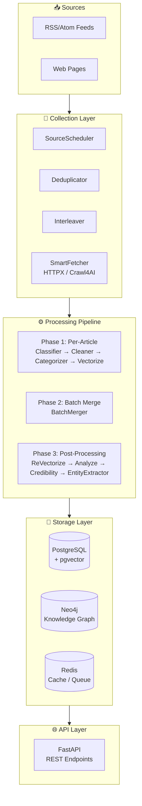

<div align="center">


[](https://github.com/Kirky-X/weaver/releases) [](https://www.python.org/) [](LICENSE) [](https://fastapi.tiangolo.com/)

[中文](README.md) | **English**

**Intelligent News Collection, Analysis & Knowledge Graph Platform**

[✨ Features](#-features) • [🚀 Quick Start](#-quick-start) • [📚 Documentation](#-documentation) • [💻 Examples](#-examples) • [🤝 Contributing](#-contributing)

</div>

---

## 📋 Table of Contents

<details open>
<summary>📑 Table of Contents</summary>

- [✨ Features](#-features)
- [🚀 Quick Start](#-quick-start)
- [📚 Documentation](#-documentation)
- [💻 Examples](#-examples)
- [🏗️ Architecture](#️-architecture)
- [🧪 Testing](#-testing)
- [📊 Performance](#-performance)
- [🔒 Security](#-security)
- [🗺️ Roadmap](#️-roadmap)
- [🤝 Contributing](#-contributing)
- [📋 Changelog](#-changelog)
- [📄 License](#-license)
- [🙏 Acknowledgments](#-acknowledgments)
- [📞 Contact & Support](#-contact--support)
- [⭐ Star History](#-star-history)

</details>

---

## ✨ Features

<table style="width:100%; border-collapse: collapse">
<tr>
<td width="50%" style="vertical-align:top; padding: 16px">

### 🎯 Core

| Status | Feature | Description |
|:--:|---------|-------------|
| ✅ | **RSS Source Management** | Subscribe, schedule, parse RSS/Atom feeds with incremental fetching |
| ✅ | **Smart Fetching** | Auto-selects HTTPX or Crawl4AI, supports dynamic page rendering |
| ✅ | **LLM Pipeline** | Classification, cleaning, summarization, sentiment, entity extraction |
| ✅ | **Knowledge Graph** | Neo4j/LadybugDB entity-relationship storage with graph queries |
| ✅ | **Vector Search** | pgvector-powered semantic similarity search |
| ✅ | **Credibility Assessment** | Multi-signal aggregation for news trustworthiness |
| ✅ | **REST API** | Full FastAPI endpoint suite |
| ✅ | **Smart LLM Router** | Intelligent routing + Fallback + usage statistics |
| ✅ | **Memory Service** | MAGMA memory integration for fast retrieval and causal reasoning |
| ✅ | **Event-Driven Architecture** | Blinker event bus for loose coupling |
| ✅ | **Monte Carlo Sampling** | Smart long-document sampling, saves 60%+ tokens |
| ✅ | **Knowledge Cluster Cache** | Semantic search result caching, 40-70% hit rate |
| ✅ | **SSE Streaming API** | Real-time Pipeline progress feedback |
| ✅ | **Multi-Mode Search** | Fast/Deep dual-mode processing |

</td>
<td width="50%" style="vertical-align:top; padding: 16px">

### ⚡ Tech Stack

| Category | Technology |
|:--------:|-----------|
| 🐍 Language | Python 3.12+ |
| 🌐 Web Framework | FastAPI + Uvicorn |
| 🐘 Relational DB | PostgreSQL + pgvector / DuckDB (alternative) |
| 🔵 Graph DB | Neo4j 5+ / LadybugDB (embedded alternative) |
| 🔴 Cache | Redis 7+ / Cashews (alternative) |
| 🕷️ Dynamic Pages | Crawl4AI |
| 🤖 LLM Framework | LiteLLM (unified interface + Smart Router) |
| 📝 NLP | spaCy |
| ⏰ Scheduler | APScheduler |
| 📈 Observability | Prometheus + OpenTelemetry |
| 🔔 Event Bus | Blinker (event-driven architecture) |

</td>
</tr>
</table>

---

## 🚀 Quick Start

### 📦 Requirements

| Dependency | Version | Description |
|-----------|---------|-------------|
| Python | 3.12+ | Runtime |
| PostgreSQL | 16+ | Requires pgvector extension (or DuckDB as alternative) |
| Neo4j | 5+ | Graph database (or LadybugDB as embedded alternative) |
| Redis | 7+ | Cache & queue (or built-in Cashews as alternative) |

### 🔧 Installation

```bash
# Clone
git clone https://github.com/Kirky-X/weaver.git
cd weaver

# Install dependencies
uv sync --all-extras --all-groups

# Install spaCy Chinese model
uv pip install "spacy-pkuseg>=0.0.27,<0.1.0"
uv run python -m spacy download zh_core_web_lg

# Optional: install English model
uv run python -m spacy download en_core_web_lg
```

<details style="padding:16px; margin: 16px 0">
<summary style="cursor:pointer; font-weight:600; color:#1E293B">🔧 SpaCy Model Details</summary>

| Model | Size | Dependencies | Notes |
|-------|------|-------------|-------|
| `zh_core_web_lg` | ~600MB | spacy-pkuseg | Recommended: standard, higher accuracy |
| `zh_core_web_sm` | ~40MB | spacy-pkuseg | Lightweight, no GPU needed |
| `zh_core_web_trf` | ~400MB | spacy-transformers + PyTorch | Highest accuracy, GPU recommended |
| `en_core_web_lg` | ~560MB | - | Recommended: English processing |

</details>

### ⚙️ Configuration

Weaver uses a layered configuration strategy supporting environment variables and TOML files:

```bash
cp config/settings.example.toml config/settings.toml
cp config/llm.example.toml config/llm.toml
cp .env.example .env
```

Key environment variables (`.env`):

```bash
# PostgreSQL
WEAVER_POSTGRES__PASSWORD=your_secure_postgres_password

# Neo4j
WEAVER_NEO4J__PASSWORD=your_secure_neo4j_password
WEAVER_NEO4J__ENABLED=true

# Redis (optional, leave empty for no password)
WEAVER_REDIS__PASSWORD=

# API auth (at least 32 chars for production)
WEAVER_API__API_KEY=your_secure_api_key_at_least_32_characters_long

# LLM API Keys
WEAVER_LLM__PROVIDERS__AIPING__API_KEY=your_aiping_api_key
WEAVER_LLM__PROVIDERS__DMX__API_KEY=your_dmx_api_key
```

### 🗄️ Database Migration

```bash
uv run alembic upgrade head
```

### ▶️ Start Service

```bash
# Development
uv run uvicorn src.main:get_app --factory --reload --host 0.0.0.0 --port 8000

# Production
uv run python -m src.main
```

---

## 📚 Documentation

| Documentation | Description |
|---------------|-------------|
| [📖 User Guide](docs/USER_GUIDE.md) | Complete usage tutorial from installation to advanced topics |
| [📘 API Reference](docs/API.md) | Full API endpoint documentation |
| [🏗️ Architecture](docs/ARCHITECTURE.md) | Design principles, module structure & data flow |
| [🚀 Deployment](docs/DEPLOYMENT.md) | Docker deployment & production configuration |
| [📋 Changelog](docs/CHANGELOG.md) | Version history |
| [🤝 Contributing](docs/CONTRIBUTING.md) | How to contribute |

---

## 🏗️ Architecture

### System Architecture



### Component Status

| Component | Description | Status |
|-----------|------------|--------|
| **SmartFetcher** | Auto-selects HTTPX/Crawl4AI | ✅ Stable |
| **Deduplicator** | Two-level URL deduplication | ✅ Stable |
| **Pipeline** | LiteLLM-driven pipeline orchestration | ✅ Stable |
| **LLM Client** | Multi-provider + Fallback | ✅ Stable |
| **Neo4j Writer** | Entity-relationship persistence | ✅ Stable |
| **Vector Repo** | pgvector vector storage | ✅ Stable |
| **Credibility Checker** | Multi-signal credibility assessment | ✅ Stable |
| **URL Security** | Multi-layer URL安全检查 | ✅ Stable |
| **APScheduler** | Scheduled task management | ✅ Stable |
| **Bing Web Search** | Network search fallback + background pipeline ingestion | ✅ Stable |
| **Graph Node Slimming** | Neo4j/LadybugDB Article nodes store only `id+pg_id`, business fields via PG | ✅ Stable |

### Network Search Fallback

When the unified search endpoint `GET /api/v1/search` returns empty results across all three tiers (entities / sources / answer), Weaver automatically triggers a Bing HTML search fallback. Result URLs are ingested through the full pipeline via `asyncio.create_task`. Controlled by `WEAVER_BING__ENABLED` (default: disabled).

### Graph Node De-duplication

Neo4j / LadybugDB `Article` nodes store only `{id, pg_id}`. Business fields (`title` / `category` / `publish_time` / `score`) are fetched via `GraphArticleReader` → `ArticleRepository.fetch_titles_by_pg_ids()`. PG is the single source of truth.

---

## 💻 Examples

Weaver provides multiple usage patterns, from API calls to CLI tools.

### API Examples

All API requests require an API Key in the header: `X-API-Key: your-api-key`

```bash
# Get article list
curl -X GET "http://localhost:8000/api/v1/articles?page=1&page_size=20" \
  -H "X-API-Key: your-api-key"

# Process a single URL
curl -X POST "http://localhost:8000/api/v1/pipeline/url" \
  -H "X-API-Key: your-api-key" \
  -H "Content-Type: application/json" \
  -d '{"url": "https://example.com/article"}'

# Query entities
curl -X GET "http://localhost:8000/api/v1/graph/entities/Apple%20Inc?limit=10" \
  -H "X-API-Key: your-api-key"
```

For the full endpoint list and detailed parameters, see [📡 API Documentation](docs/API.md).

### LLM Call Points

| Call Point | Type | Description |
|-----------|------|-------------|
| classifier | CHAT | News classification |
| cleaner | CHAT | Content cleaning |
| categorizer | CHAT | Category identification |
| merger | CHAT | Article merging |
| analyze | CHAT | Summary & analysis |
| credibility_checker | CHAT | Credibility assessment |
| quality_scorer | CHAT | Quality scoring |
| entity_extractor | CHAT | Entity extraction |
| entity_resolver | CHAT | Entity disambiguation |
| search_local | CHAT | Local search QA |
| search_global | CHAT | Global search QA |
| causal_inference | CHAT | Causal reasoning |
| community_report | CHAT | Community report generation |
| community_title | CHAT | Community title generation |
| entity_facts | CHAT | Fact verification |
| narrative_synthesis | CHAT | Narrative synthesis |
| evidence_sampling | CHAT | Evidence sampling |
| roi_summary | CHAT | ROI summary |
| embedding | EMBEDDING | Vector generation |
| rerank | RERANK | Re-ranking |

### Scheduled Jobs

| Job | Interval | Description |
|-----|----------|-------------|
| sync_pending_to_neo4j | 10 min | Sync pending records to Neo4j |
| retry_neo4j_writes | 10 min | Retry failed Neo4j writes |
| sync_neo4j_with_postgres | 1 hour | Full Neo4j ↔ PostgreSQL sync |
| consistency_check | Daily 3:00 | Data consistency check |
| cleanup_old_synced | Daily 3:30 | Clean old sync records (7-day retention) |
| llm_failure_cleanup | 24 hours | Clean LLM failure records (3-day retention) |
| llm_usage_raw_cleanup | 6 hours | Clean raw LLM usage records (2-day retention) |
| archive_old_neo4j_nodes | Sat 2:00 | Archive old Neo4j nodes (90 days) |
| cleanup_orphan_entity_vectors | Sat 3:00 | Clean orphan entity vectors |
| retry_pipeline_processing | 15 min | Retry failed Pipeline processing |
| flush_retry_queue | 30 sec | Flush fetcher retry queue |
| llm_usage_aggregate | 5 min | LLM usage Redis → PostgreSQL aggregation |
| update_source_auto_scores | Daily 3:00 | Update source authority scores |
| community_auto_check | 30 min | Community detection auto-check |
| community_health_check | 6 hours | Community health check & auto-repair |
| update_persist_status_metrics | 5 min | Update persistence status Prometheus metrics |
| memory_consolidation | 30 min | Memory slow-path consolidation (conditional) |
| startup_sync_pending_to_neo4j | On startup | Immediate sync on boot |

---

## 🧪 Testing

### Test Overview

| Layer | Location | Count | Characteristics |
|-------|----------|-------|-----------------|
| Unit | `tests/unit/` | ~245 | Mocked external deps, fast execution |
| Integration | `tests/integration/` | ~18 | Multi-component interaction |
| E2E | `tests/e2e/` | ~16 | Full API flow, real services |
| Performance | `tests/performance/` | ~8 | HNSW vector index benchmarks |

### Running Tests

```bash
# All tests (excluding E2E)
uv run pytest

# Unit tests
uv run pytest tests/unit/ -v

# Integration tests
uv run pytest tests/integration/ -v

# With coverage
uv run pytest --cov=src --cov-report=html
```

### Coverage

Project requires 80% coverage threshold:

```bash
# HTML coverage report
uv run pytest --cov=src --cov-report=html
open htmlcov/index.html

# Coverage summary
uv run pytest --cov=src --cov-report=term-missing
```

### Code Style

- `ruff` for formatting and linting
- Complete type annotations required
- Google-style docstrings

---

## 📊 Performance

Weaver's performance-critical paths are optimized:

| Path | Description | Notes |
|------|-------------|-------|
| Pipeline Processing | Phase 1 per-article concurrent, Phase 3 post-processing concurrent | LLM call latency dependent |
| Vector Search | HNSW index, pgvector backend | 1024-dim vectors, millisecond queries |
| Knowledge Cluster Cache | Semantic search persistent cache (DuckDB + Parquet) | 40-70% hit rate, FIFO + heat scoring |
| Monte Carlo Sampling | Smart long-document sampling | Saves 60%+ tokens |
| Connection Pool | SQLAlchemy AsyncPG + Neo4j connection pool | Default pool_size=20 |

The bottleneck is usually the LLM call layer. Configure multi-Provider Fallback and appropriate timeout parameters.

---

## 🔒 Security

### 🛡️ Security Design

Weaver's security design covers multi-layer protection: URL security multi-layer checks (SSRF protection, URLhaus API, PhishTank phishing database, heuristic analysis, SSL verification), API Key authentication, environment variable injection for sensitive configuration (passwords and API keys are never hardcoded), and startup security configuration audit (scanning for f-string SQL/Cypher injection).

### ⛓️ Supply Chain & Gate

- `bandit -r src/`: Security vulnerability scanning, no HIGH/CRITICAL issues
- Semgrep SAST scanning: Code-level security checks
- pre-commit hooks: Automatic security review before commits

### 🚨 Reporting Security Vulnerabilities

Please do not report security vulnerabilities through public issues. Use the GitHub [Security Advisories](https://github.com/Kirky-X/weaver/security/advisories/new) private disclosure channel.

---

## 🗺️ Roadmap

<table style="width:100%; border-collapse: collapse">
<tr><th style="text-align:center">Status</th><th style="text-align:left">Direction</th><th style="text-align:left">Items</th></tr>
<tr><td align="center">✅</td><td>Core Engine</td><td>RSS/Atom source management, smart fetching, LLM Pipeline, knowledge graph construction</td></tr>
<tr><td align="center">✅</td><td>Search & Retrieval</td><td>Four-mode search (local/global/drift/hybrid), vector search, knowledge cluster cache</td></tr>
<tr><td align="center">✅</td><td>Security & Credibility</td><td>Multi-layer URL security, three-signal credibility assessment, startup security audit</td></tr>
<tr><td align="center">✅</td><td>Observability</td><td>Prometheus metrics, OpenTelemetry, LLM usage statistics, alerting system</td></tr>
<tr><td align="center">🚧</td><td>Memory System</td><td>MAGMA multi-graph memory, temporal graph evolution, adaptive retrieval</td></tr>
<tr><td align="center">📋</td><td>Performance Optimization</td><td>Large-scale knowledge graph query optimization, cache hit rate improvement, concurrency enhancement</td></tr>
</table>

---

## 🤝 Contributing

1. **Fork** the repo
2. **Clone** your fork
3. **Create** branch: `git checkout -b feature/amazing-feature`
4. **Make** changes
5. **Test**: `uv run pytest tests/unit/ -v && uv run pytest tests/integration/ -v`
6. **Commit**: `git commit -m 'feat: add some feature'`
7. **Push**: `git push origin feature/amazing-feature`
8. **Create** Pull Request

### Code Standards

- ✅ PEP 8 compliance
- ✅ `ruff` formatting: `uv run ruff check --fix src/`
- ✅ Comprehensive tests for new features
- ✅ Complete type annotations

---

## 📋 Changelog

Full version history at [📋 Changelog](docs/CHANGELOG.md).

---

## 📄 License

This project is licensed under the **Apache 2.0 License**, see [LICENSE](LICENSE) for details.

---

## 🙏 Acknowledgments

### 🌟 Core Dependencies

Weaver stands on the shoulders of these excellent open-source projects:

| Dependency | Purpose |
|-----------|--------|
| [FastAPI](https://github.com/tiangolo/fastapi) | Web framework |
| [LiteLLM](https://github.com/BerriAI/litellm) | Unified LLM interface |
| [spaCy](https://github.com/explosion/spaCy) | NLP entity recognition |
| [SQLAlchemy](https://github.com/sqlalchemy/sqlalchemy) | Async ORM |
| [Crawl4AI](https://github.com/unclecode/crawl4ai) | Dynamic web scraping |
| [APScheduler](https://github.com/agronholm/apscheduler) | Task scheduling |

### 💝 Special Thanks

Thanks to the Python community and all [contributors](https://github.com/Kirky-X/weaver/graphs/contributors).

---

## 📞 Contact & Support

<table style="width:100%; max-width: 600px">
<tr>
<td align="center" width="33%">
<a href="https://github.com/Kirky-X/weaver/issues"><b style="color:#991B1B">Issues</b></a><br>
<span style="color:#64748B">Report bugs and issues</span>
</td>
<td align="center" width="33%">
<a href="https://github.com/Kirky-X/weaver/discussions"><b style="color:#1E40AF">Discussions</b></a><br>
<span style="color:#64748B">Ask questions and share ideas</span>
</td>
<td align="center" width="33%">
<a href="https://github.com/Kirky-X/weaver"><b style="color:#1E293B">GitHub</b></a><br>
<span style="color:#64748B">View source code</span>
</td>
</tr>
</table>

---

## ⭐ Star History

[](https://star-history.com/#Kirky-X/weaver&Date)

If this project is helpful, please consider giving it a ⭐️!

**Built by Kirky.X**

---

<sub>© 2026 Kirky.X. All rights reserved.</sub>
