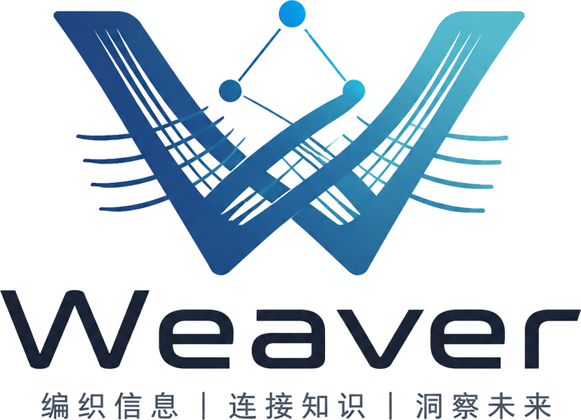
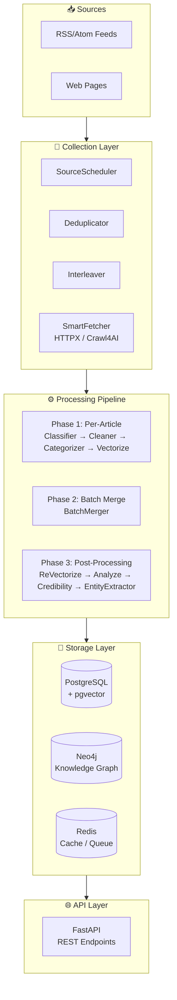
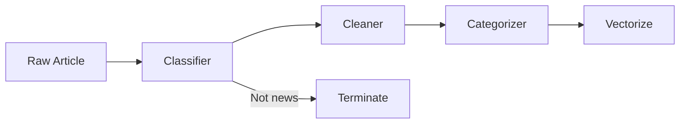
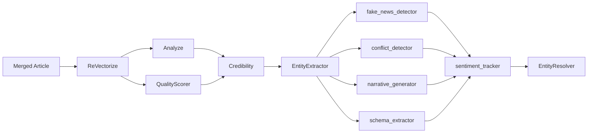

<span id="top"></span>

<div align="center">

<p align="center">
  
</p>

<p align="center">
  <strong>WEAVER - Intelligent News Collection, Analysis & Knowledge Graph Platform</strong>
</p>

<p>
  
  
  
  
</p>

<p align="center">
  <a href="#features" style="color:#3B82F6">✨ Features</a> •
  <a href="#quick-start" style="color:#3B82F6">🚀 Quick Start</a> •
  <a href="#architecture" style="color:#3B82F6">🏗️ Architecture</a> •
  <a href="#api" style="color:#3B82F6">📡 API</a> •
  <a href="#pipeline" style="color:#3B82F6">🔄 Pipeline</a> •
  <a href="#contributing" style="color:#3B82F6">🤝 Contributing</a>
</p>

</div>

---

## 📋 Table of Contents

<details open style="padding:16px">
<summary style="cursor:pointer; font-weight:600; color:#1E293B">📑 Click to expand</summary>

- [Features](#features)
- [Quick Start](#quick-start)
    - [Requirements](#requirements)
    - [Installation](#installation)
    - [Configuration](#configuration)
    - [Database Migration](#migration)
    - [Start Service](#start)
- [Architecture](#architecture)
- [API](#api)
- [Pipeline](#pipeline)
- [Credibility Scoring](#credibility)
- [LLM Call Points](#llm-callpoints)
- [Scheduled Jobs](#scheduled-jobs)
- [Development](#development)
- [Contributing](#contributing)
- [License](#license)

</details>

---

## <span id="features">✨ Features</span>

<table style="width:100%; border-collapse: collapse">
<tr>
<td width="50%" style="vertical-align:top; padding: 16px">

### 🎯 Core

| Status | Feature | Description |
|:--:|---------|-------------|
| ✅ | **RSS Source Management** | Subscribe, schedule, parse RSS/Atom feeds with incremental fetching |
| ✅ | **Smart Fetching** | Auto-selects HTTPX or Crawl4AI, supports dynamic page rendering |
| ✅ | **LLM Pipeline** | Classification, cleaning, summarization, sentiment, entity extraction |
| ✅ | **Knowledge Graph** | Neo4j/LadybugDB entity-relationship storage with graph queries |
| ✅ | **Vector Search** | pgvector-powered semantic similarity search |
| ✅ | **Credibility Assessment** | Multi-signal aggregation for news trustworthiness |
| ✅ | **REST API** | Full FastAPI endpoint suite |
| ✅ | **Smart LLM Router** | Intelligent routing + Fallback + usage statistics |
| ✅ | **Memory Service** | MAGMA memory integration for fast retrieval and causal reasoning |
| ✅ | **Event-Driven Architecture** | Blinker event bus for loose coupling |
| ✅ | **Monte Carlo Sampling** | Smart long-document sampling, saves 60%+ tokens |
| ✅ | **Knowledge Cluster Cache** | Semantic search result caching, 40-70% hit rate |
| ✅ | **SSE Streaming API** | Real-time Pipeline progress feedback |
| ✅ | **Multi-Mode Search** | Fast/Deep dual-mode processing |

</td>
<td width="50%" style="vertical-align:top; padding: 16px">

### ⚡ Tech Stack

| Category | Technology |
|:--------:|-----------|
| 🐍 Language | Python 3.12+ |
| 🌐 Web Framework | FastAPI + Uvicorn |
| 🐘 Relational DB | PostgreSQL + pgvector / DuckDB (alternative) |
| 🔵 Graph DB | Neo4j 5+ / LadybugDB (embedded alternative) |
| 🔴 Cache | Redis 7+ / Cashews (alternative) |
| 🕷️ Dynamic Pages | Crawl4AI |
| 🤖 LLM Framework | LiteLLM (unified interface + Smart Router) |
| 📝 NLP | spaCy |
| ⏰ Scheduler | APScheduler |
| 📈 Observability | Prometheus + OpenTelemetry |
| 🔔 Event Bus | Blinker (event-driven architecture) |

</td>
</tr>
</table>

---

## <span id="quick-start">🚀 Quick Start</span>

### <span id="requirements">📦 Requirements</span>

| Dependency | Version | Description |
|-----------|---------|-------------|
| Python | 3.12+ | Runtime |
| PostgreSQL | 16+ | Requires pgvector extension (or DuckDB as alternative) |
| Neo4j | 5+ | Graph database (or LadybugDB as embedded alternative) |
| Redis | 7+ | Cache & queue (or built-in Cashews as alternative) |

### <span id="installation">🔧 Installation</span>

```bash
# Clone
git clone <repository-url>
cd weaver

# Install dependencies
uv sync --all-extras --all-groups

# Install spaCy Chinese model
uv pip install "spacy-pkuseg>=0.0.27,<0.1.0"
uv run python -m spacy download zh_core_web_lg

# Optional: install English model
uv run python -m spacy download en_core_web_lg
```

<details style="padding:16px; margin: 16px 0">
<summary style="cursor:pointer; font-weight:600; color:#1E293B">🔧 SpaCy Model Details</summary>

| Model | Size | Dependencies | Notes |
|-------|------|-------------|-------|
| `zh_core_web_lg` | ~600MB | spacy-pkuseg | Recommended: standard, higher accuracy |
| `zh_core_web_sm` | ~40MB | spacy-pkuseg | Lightweight, no GPU needed |
| `zh_core_web_trf` | ~400MB | spacy-transformers + PyTorch | Highest accuracy, GPU recommended |
| `en_core_web_lg` | ~560MB | - | Recommended: English processing |

</details>

### <span id="configuration">⚙️ Configuration</span>

Weaver uses a layered configuration strategy supporting environment variables and TOML files:

```bash
cp config/settings.example.toml config/settings.toml
cp config/llm.example.toml config/llm.toml
cp .env.example .env
```

Key environment variables (`.env`):

```bash
# PostgreSQL
WEAVER_POSTGRES__PASSWORD=your_secure_postgres_password

# Neo4j
WEAVER_NEO4J__PASSWORD=your_secure_neo4j_password
WEAVER_NEO4J__ENABLED=true

# Redis (optional, leave empty for no password)
WEAVER_REDIS__PASSWORD=

# API auth (at least 32 chars for production)
WEAVER_API__API_KEY=your_secure_api_key_at_least_32_characters_long

# LLM API Keys
WEAVER_LLM__PROVIDERS__AIPING__API_KEY=your_aiping_api_key
WEAVER_LLM__PROVIDERS__DMX__API_KEY=your_dmx_api_key
```

### <span id="migration">🗄️ Database Migration</span>

```bash
uv run alembic upgrade head
```

### <span id="start">▶️ Start Service</span>

```bash
# Development
uv run uvicorn src.main:app --reload --host 0.0.0.0 --port 8000

# Production
uv run python -m src.main
```

---

## <span id="architecture">🏗️ Architecture</span>

### System Architecture



### Component Status

| Component | Description | Status |
|-----------|------------|--------|
| **SmartFetcher** | Auto-selects HTTPX/Crawl4AI | ✅ Stable |
| **Deduplicator** | Two-level URL deduplication | ✅ Stable |
| **Pipeline** | LiteLLM-driven pipeline orchestration | ✅ Stable |
| **LLM Client** | Multi-provider + Fallback | ✅ Stable |
| **Neo4j Writer** | Entity-relationship persistence | ✅ Stable |
| **Vector Repo** | pgvector vector storage | ✅ Stable |
| **Credibility Checker** | Multi-signal credibility assessment | ✅ Stable |
| **URL Security** | Multi-layer URL安全检查 | ✅ Stable |
| **APScheduler** | Scheduled task management | ✅ Stable |
| **Bing Web Search** | Network search fallback + background pipeline ingestion | ✅ Stable |
| **Graph Node Slimming** | Neo4j/LadybugDB Article nodes store only `id+pg_id`, business fields via PG | ✅ Stable |

### Network Search Fallback

When the unified search endpoint `GET /api/v1/search` returns empty results across all three tiers (entities / sources / answer), Weaver automatically triggers a Bing HTML search fallback. Result URLs are ingested through the full pipeline via `asyncio.create_task`. Controlled by `WEAVER_BING__ENABLED` (default: disabled).

### Graph Node De-duplication

Neo4j / LadybugDB `Article` nodes store only `{id, pg_id}`. Business fields (`title` / `category` / `publish_time` / `score`) are fetched via `GraphArticleReader` → `ArticleRepository.fetch_titles_by_pg_ids()`. PG is the single source of truth.

---

## <span id="api">📡 API</span>

### Authentication

All API requests require an API Key in the header:

```
X-API-Key: your-api-key
```

### Endpoint List

| Endpoint | Method | Description |
|----------|--------|-------------|
| `/health` | GET | Health check (no auth required) |
| `/api/v1/status` | GET | System status (auth required) |
| `/api/v1/config` | GET | System configuration (auth required) |
| `/api/v1/sources` | GET | List sources |
| `/api/v1/sources/{source_id}` | GET | Get source details |
| `/api/v1/sources` | POST | Add source |
| `/api/v1/sources/{source_id}` | PUT | Update source |
| `/api/v1/sources/{source_id}` | DELETE | Delete source |
| `/api/v1/pipeline/trigger` | POST | Trigger Pipeline (async fire-and-forget) |
| `/api/v1/pipeline/tasks/{task_id}` | GET | Get task status |
| `/api/v1/pipeline/queue/stats` | GET | Queue statistics |
| `/api/v1/pipeline/status` | GET | Pipeline status (running/idle + queue stats) |
| `/api/v1/pipeline/url` | POST | Process single URL |
| `/api/v1/pipeline/url/stream` | POST | Process single URL (SSE streaming, 3-concurrency limit) |
| `/api/v1/articles` | GET | Article list (paginated, filterable, sortable) |
| `/api/v1/articles/{id}` | GET | Article details |
| `/api/v1/search` | GET | Unified search (mode routing: local/global/articles) |
| `/api/v1/search/drift` | POST | DRIFT iterative exploration search |
| `/api/v1/search/causal` | POST | Causal relationship search |
| `/api/v1/search/temporal` | POST | Temporal reasoning search |
| `/api/v1/graph/entities/{name}` | GET | Query entity and its relations |
| `/api/v1/graph/articles/{id}/graph` | GET | Article knowledge graph |
| `/api/v1/graph/relations` | GET | Query entity relations |
| `/api/v1/graph/relations/search` | GET | Search entity relations |
| `/api/v1/graph/metrics` | GET | Graph metrics |
| `/api/v1/graph/visualization` | GET/POST | Graph visualization data |
| `/api/v1/admin/authorities` | GET | List source authority scores |
| `/api/v1/admin/authorities/{host}` | PATCH | Update source authority |
| `/api/v1/monitoring/llm/failures` | GET | LLM failure records |
| `/api/v1/monitoring/llm/failures/stats` | GET | LLM failure statistics |
| `/api/v1/monitoring/llm/usage` | GET | LLM usage statistics |
| `/api/v1/admin/articles/deduplicate` | POST | Article deduplication |
| `/api/v1/admin/communities` | GET | Community list |
| `/api/v1/admin/communities/{id}` | GET | Community details |
| `/api/v1/admin/communities/rebuild` | POST | Rebuild communities |
| `/api/v1/admin/communities/health` | GET | Community health overview |
| `/api/v1/admin/communities/health/diagnose` | POST | Community health diagnosis |
| `/api/v1/admin/communities/health/repair` | POST | Community health repair |
| `/api/v1/admin/communities/reports/generate` | POST | Generate community reports |
| `/api/v1/admin/communities/{id}/report/regenerate` | POST | Regenerate community report |
| `/api/v1/briefings/daily` | GET | Daily briefing (by date + category) |
| `/api/v1/briefings/daily/generate` | POST | Generate daily briefing |
| `/api/v1/analytics/shifts` | GET | Sentiment shift detection |
| `/api/v1/analytics/briefings` | GET | Historical briefing list |
| `/api/v1/trends/sentiment` | GET | Sentiment trend analysis |
| `/api/v1/trends/detection` | GET | Trend detection |
| `/api/v1/saga/{saga_id}` | GET | Saga status |
| `/api/v1/saga/{saga_id}/compensate` | POST | Trigger manual compensation |
| `/api/v1/saga/{saga_id}/retry` | POST | Retry failed Saga |
| `/api/v1/saga/article/{article_id}` | GET | Article-related Sagas |
| `/api/v1/saga/failed/list` | GET | List failed Sagas |
| `/api/v1/monitoring/alerts/rules` | GET/POST | Alert rule query/create |
| `/api/v1/monitoring/alerts/rules/{rule_id}` | GET/PATCH/DELETE | Alert rule detail/update/delete |
| `/api/v1/monitoring/alerts/events` | GET | Alert event query |
| `/metrics` | GET | Prometheus metrics |

---

## <span id="pipeline">🔄 Pipeline</span>

### Phase 1: Per-Article Concurrent Processing



- **Classifier**: Determines if article is news; non-news is terminated immediately
- **Cleaner**: HTML cleaning, body extraction
- **Categorizer**: Category (politics/military/economy/tech etc.), language, region
- **Vectorize**: Generate content embedding (1024-dim)

### Phase 2: Batch Merge

```
BatchMerger (Union-Find similarity clustering)
```

- Similarity threshold: 0.80
- Merges similar articles, keeps the most complete version

### Phase 3: Per-Article Post-Processing (Concurrent)



- **ReVectorize**: Regenerate vector after merge (skipped for terminal articles)
- **Analyze + QualityScorer**: Parallel - summary/sentiment/key data extraction + content quality scoring
- **Credibility**: Trustworthiness score (depends on Analyze results)
- **EntityExtractor**: spaCy + LLM entity extraction
- **fake_news_detector**: Fake news detection
- **conflict_detector**: Data conflict detection
- **narrative_generator**: Narrative generation
- **schema_extractor**: Structured data extraction
- **sentiment_tracker**: Entity-level sentiment shift calculation
- **EntityResolver**: Entity disambiguation and merging

---

## <span id="credibility">📊 Credibility Scoring</span>

Three-signal category-adaptive credibility assessment:

| Signal | Description |
|--------|-------------|
| Source Authority | Three-tier priority: preset > historical auto-calc > default 0.50 |
| Content Check | Body-length based heuristic scoring |
| Timeliness | Time gap between publish and event time |

### Category-Adaptive Weights

| Category | Source | Content | Timeliness | Note |
|----------|--------|---------|------------|------|
| Politics/International/Military | 0.25 | 0.25 | **0.50** | Breaking news prioritizes timeliness |
| Economy | **0.45** | 0.35 | 0.20 | Source authority prioritized |
| Technology | 0.30 | **0.50** | 0.20 | Content quality prioritized |
| Society/Culture/Sports | 0.40 | 0.40 | 0.20 | Balanced |

### Timeliness Scoring

| Time Gap | Score |
|----------|-------|
| ≤6 hours | 1.00 |
| ≤24 hours | 0.85 |
| ≤72 hours | 0.65 |
| ≤168 hours | 0.45 |
| >168 hours | 0.30 |

### Source Authority Priority

1. **Preset credibility**: Set via API for authoritative sources (Xinhua, CCTV, etc.)
2. **Historical auto-calc**: Based on historical article average scores
3. **Default**: 0.50 for new sources

---

## <span id="llm-callpoints">🤖 LLM Call Points</span>

| Call Point | Type | Description |
|-----------|------|-------------|
| classifier | CHAT | News classification |
| cleaner | CHAT | Content cleaning |
| categorizer | CHAT | Category identification |
| merger | CHAT | Article merging |
| analyze | CHAT | Summary & analysis |
| credibility_checker | CHAT | Credibility assessment |
| quality_scorer | CHAT | Quality scoring |
| entity_extractor | CHAT | Entity extraction |
| entity_resolver | CHAT | Entity disambiguation |
| search_local | CHAT | Local search QA |
| search_global | CHAT | Global search QA |
| causal_inference | CHAT | Causal reasoning |
| community_report | CHAT | Community report generation |
| community_title | CHAT | Community title generation |
| entity_facts | CHAT | Fact verification |
| narrative_synthesis | CHAT | Narrative synthesis |
| evidence_sampling | CHAT | Evidence sampling |
| roi_summary | CHAT | ROI summary |
| embedding | EMBEDDING | Vector generation |
| rerank | RERANK | Re-ranking |

---

## <span id="scheduled-jobs">⏰ Scheduled Jobs</span>

| Job | Interval | Description |
|-----|----------|-------------|
| sync_pending_to_neo4j | 10 min | Sync pending records to Neo4j |
| retry_neo4j_writes | 10 min | Retry failed Neo4j writes |
| sync_neo4j_with_postgres | 1 hour | Full Neo4j ↔ PostgreSQL sync |
| consistency_check | Daily 3:00 | Data consistency check |
| cleanup_old_synced | Daily 3:30 | Clean old sync records (7-day retention) |
| llm_failure_cleanup | 24 hours | Clean LLM failure records (3-day retention) |
| llm_usage_raw_cleanup | 6 hours | Clean raw LLM usage records (2-day retention) |
| archive_old_neo4j_nodes | Sat 2:00 | Archive old Neo4j nodes (90 days) |
| cleanup_orphan_entity_vectors | Sat 3:00 | Clean orphan entity vectors |
| retry_pipeline_processing | 15 min | Retry failed Pipeline processing |
| flush_retry_queue | 30 sec | Flush fetcher retry queue |
| llm_usage_aggregate | 5 min | LLM usage Redis → PostgreSQL aggregation |
| update_source_auto_scores | Daily 3:00 | Update source authority scores |
| community_auto_check | 30 min | Community detection auto-check |
| community_health_check | 6 hours | Community health check & auto-repair |
| update_persist_status_metrics | 5 min | Update persistence status Prometheus metrics |
| memory_consolidation | 30 min | Memory slow-path consolidation (conditional) |
| startup_sync_pending_to_neo4j | On startup | Immediate sync on boot |

---

## <span id="development">🧪 Development</span>

### Test Overview

| Layer | Location | Count | Characteristics |
|-------|----------|-------|-----------------|
| Unit | `tests/unit/` | ~245 | Mocked external deps, fast execution |
| Integration | `tests/integration/` | ~18 | Multi-component interaction |
| E2E | `tests/e2e/` | ~16 | Full API flow, real services |
| Performance | `tests/performance/` | ~8 | HNSW vector index benchmarks |

### Running Tests

```bash
# All tests (excluding E2E)
uv run pytest

# Unit tests
uv run pytest tests/unit/ -v

# Integration tests
uv run pytest tests/integration/ -v

# With coverage
uv run pytest --cov=src --cov-report=html
```

### Coverage

Project requires 80% coverage threshold:

```bash
# HTML coverage report
uv run pytest --cov=src --cov-report=html
open htmlcov/index.html

# Coverage summary
uv run pytest --cov=src --cov-report=term-missing
```

### Code Style

- `ruff` for formatting and linting
- Complete type annotations required
- Google-style docstrings

---

## <span id="contributing">🤝 Contributing</span>

1. **Fork** the repo
2. **Clone** your fork
3. **Create** branch: `git checkout -b feature/amazing-feature`
4. **Make** changes
5. **Test**: `uv run pytest tests/unit/ -v && uv run pytest tests/integration/ -v`
6. **Commit**: `git commit -m 'feat: add some feature'`
7. **Push**: `git push origin feature/amazing-feature`
8. **Create** Pull Request

### Code Standards

- ✅ PEP 8 compliance
- ✅ `ruff` formatting: `uv run ruff check --fix src/`
- ✅ Comprehensive tests for new features
- ✅ Complete type annotations

---

## <span id="license">📄 License</span>

This project is licensed under the **Apache 2.0 License**.

---

**[⬆ Back to Top](#top)**

---

<sub>© 2026 WEAVER. All rights reserved.</sub>
