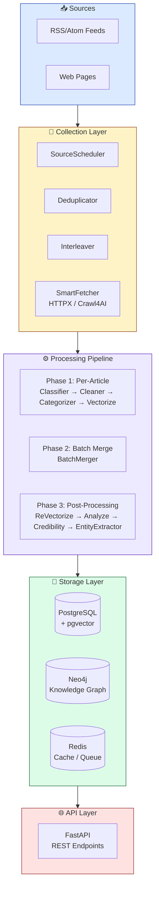

<div align="center">


[](https://github.com/Kirky-X/weaver/releases) [](https://www.python.org/) [](LICENSE) [](https://fastapi.tiangolo.com/)

[中文](README.md) | **English**

**Intelligent News Collection, Analysis & Knowledge Graph Platform**

[✨ Features](#-features) • [🚀 Quick Start](#-quick-start) • [📚 Documentation](#-documentation) • [💻 Examples](#-examples) • [🤝 Contributing](#-contributing)

</div>

---

## 📋 Table of Contents

<details open>
<summary>📑 Table of Contents</summary>

- [✨ Features](#-features)
- [🚀 Quick Start](#-quick-start)
- [📚 Documentation](#-documentation)
- [💻 Examples](#-examples)
- [🏗️ Architecture](#️-architecture)
- [🧪 Testing](#-testing)
- [📊 Performance](#-performance)
- [🔒 Security](#-security)
- [🗺️ Roadmap](#️-roadmap)
- [🤝 Contributing](#-contributing)
- [📋 Changelog](#-changelog)
- [📄 License](#-license)
- [🙏 Acknowledgments](#-acknowledgments)
- [📞 Contact & Support](#-contact--support)
- [⭐ Star History](#-star-history)

</details>

---

## ✨ Features

<table style="width:100%; border-collapse: collapse">
<tr>
<td width="50%" style="vertical-align:top; padding: 16px">

### 🕷️ Smart Collection

RSS/Atom feed subscription, scheduling and incremental fetching; HTTPX / Crawl4AI auto-selected per site, with dynamic page rendering and two-level URL deduplication

</td>
<td width="50%" style="vertical-align:top; padding: 16px">

### ⚙️ LLM Pipeline

Three-phase pipeline for classification, cleaning, summarization, sentiment analysis and entity extraction, with SSE live progress and failure retry

</td>
</tr>
<tr>
<td width="50%" style="vertical-align:top; padding: 16px">

### 🕸️ Knowledge Graph

Entity-relationship storage on Neo4j / LadybugDB, with Leiden community detection, community reports and graph visualization queries

</td>
<td width="50%" style="vertical-align:top; padding: 16px">

### 🔍 Four-Mode Search

`local` / `global` / `drift` / `hybrid` search engines with RRF fusion ranking and intent-based auto routing

</td>
</tr>
<tr>
<td width="50%" style="vertical-align:top; padding: 16px">

### 🎯 Vector Search

pgvector + HNSW index powered semantic similarity search, millisecond queries on 1024-dim vectors

</td>
<td width="50%" style="vertical-align:top; padding: 16px">

### ✅ Credibility Assessment

Multi-signal aggregation for news trustworthiness, with fake-news detection and claim extraction

</td>
</tr>
<tr>
<td width="50%" style="vertical-align:top; padding: 16px">

### 🧠 MAGMA Memory

Multi-graph memory service with temporal evolution, adaptive retrieval and causal reasoning

</td>
<td width="50%" style="vertical-align:top; padding: 16px">

### 🔀 Smart LLM Router

Per-call-point primary/fallback routing for 25 call points, with circuit breaking, hot reload and usage statistics

</td>
</tr>
<tr>
<td width="50%" style="vertical-align:top; padding: 16px">

### 🎲 Monte Carlo Sampling

Multi-anchor smart sampling of long documents with confidence weighting, saving 60%+ tokens

</td>
<td width="50%" style="vertical-align:top; padding: 16px">

### 💾 Knowledge Cluster Cache

Persistent semantic-search cache (DuckDB + Parquet) with FIFO + heat scoring, 40-70% hit rate

</td>
</tr>
<tr>
<td width="50%" style="vertical-align:top; padding: 16px">

### 🔒 Multi-Layer URL Security

Five check layers — SSRF protection, URLhaus, PhishTank, heuristic analysis, SSL verification — with five-level risk rating

</td>
<td width="50%" style="vertical-align:top; padding: 16px">

### 📊 Observability

Prometheus metrics, OpenTelemetry tracing, LLM usage aggregation and alerting

</td>
</tr>
</table>

Beyond these core capabilities, the full REST API suite, the Blinker event bus, dual-database failover (PostgreSQL ↔ DuckDB, Neo4j ↔ LadybugDB), daily briefings and trend alerting all work out of the box: see the [📘 API Reference](docs/API.md) for the complete endpoint list and [🏗️ Architecture](docs/ARCHITECTURE.md) for module responsibilities and design decisions.

<details>
<summary>🧱 Tech Stack</summary>

| Category | Technology |
|:--------:|-----------|
| 🐍 Language | Python 3.12+ |
| 🌐 Web Framework | FastAPI + Uvicorn |
| 🐘 Relational DB | PostgreSQL + pgvector / DuckDB (alternative) |
| 🔵 Graph DB | Neo4j 5+ / LadybugDB (embedded alternative) |
| 🔴 Cache | Redis 7+ / Cashews (optional alternative) |
| 🕷️ Dynamic Pages | Crawl4AI |
| 🤖 LLM Framework | LiteLLM (unified interface + Smart Router) |
| 📝 NLP | spaCy |
| ⏰ Scheduler | APScheduler |
| 📈 Observability | Prometheus + OpenTelemetry |
| 🔔 Event Bus | Blinker (event-driven architecture) |

</details>

---

## 🚀 Quick Start

### 📦 Requirements

| Dependency | Version | Description |
|-----------|---------|-------------|
| Python | 3.12+ | Runtime |
| PostgreSQL | 16+ | Requires pgvector extension (or DuckDB as alternative) |
| Neo4j | 5+ | Graph database (or LadybugDB as embedded alternative) |
| Redis | 7+ | Cache & queue (or built-in Cashews as alternative) |

### 🔧 Installation

#### One-Command Bootstrap (Recommended)

```bash
# 1. Generate config (copies templates, never overwrites existing files) + model install hints
uv run python scripts/bootstrap.py

# 2. Start infrastructure (or add --profile full to include the app)
docker compose -f docker/docker-compose.yml up -d

# 3. After installing models, run migrations and start
uv run alembic upgrade head
uv run uvicorn src.main:get_app --factory --reload
```

<details>
<summary>All-in-One Docker Startup (app included, no local Python needed)</summary>

```bash
docker compose -f docker/docker-compose.yml --profile full up -d --build
# Automatically runs alembic upgrade head before app start; API at http://localhost:8000
```

</details>

#### Manual Installation

```bash
# Clone
git clone https://github.com/Kirky-X/weaver.git
cd weaver

# Install dependencies (uv; --all-extras enables failover deps, --all-groups enables dev/test groups)
uv sync --all-extras --all-groups

# Install spaCy Chinese model & dependencies
# Note: zh_core_web_lg requires the spacy-pkuseg tokenizer dependency
uv pip install "spacy-pkuseg>=0.0.27,<0.1.0"
uv run python -m spacy download zh_core_web_lg

# Optional: install English model
uv run python -m spacy download en_core_web_lg

# Optional: more accurate transformer model (extra dependencies)
# uv pip install spacy-transformers
# uv run python -m spacy download zh_core_web_trf
```

<details style="padding:16px; margin: 16px 0">
<summary style="cursor:pointer; font-weight:600; color:#1E293B">🔧 SpaCy Model Details</summary>

| Model | Size | Dependencies | Notes |
|-------|------|-------------|-------|
| `zh_core_web_lg` | ~600MB | spacy-pkuseg | Recommended: standard, higher accuracy |
| `zh_core_web_sm` | ~40MB | spacy-pkuseg | Lightweight, no GPU needed |
| `zh_core_web_trf` | ~400MB | spacy-transformers + PyTorch | Highest accuracy, GPU recommended |
| `en_core_web_lg` | ~560MB | - | Recommended: English processing |

**Entity type mapping**:

- `PERSON`/`PER` → Person
- `ORG` → Organization
- `GPE`/`LOC` → Location
- `MONEY`/`CARDINAL`/`PERCENT` → Data metrics
- `LAW` → Laws & policies

</details>

### ⚙️ Configuration

Weaver uses a layered configuration strategy supporting environment variables and TOML files:

1. **Copy config templates**:

```bash
cp config/settings.example.toml config/settings.toml
cp config/llm.example.toml config/llm.toml
cp .env.example .env
```

2. **Set environment variables** (`.env` file):

```bash
# PostgreSQL (double underscore separates nested config)
WEAVER_POSTGRES__PASSWORD=your_secure_postgres_password

# Neo4j
WEAVER_NEO4J__PASSWORD=your_secure_neo4j_password
WEAVER_NEO4J__ENABLED=true

# Redis (optional, leave empty for no password)
WEAVER_REDIS__PASSWORD=

# API auth (at least 32 chars in production)
WEAVER_API__API_KEY=your_secure_api_key_at_least_32_characters_long

# LLM API Keys (referenced by llm.toml)
WEAVER_LLM__PROVIDERS__AIPING__API_KEY=your_aiping_api_key
WEAVER_LLM__PROVIDERS__DMX__API_KEY=your_dmx_api_key
```

3. **Configure LLM providers** (`config/llm.toml`):

```toml
[global]
circuit_breaker_threshold = 5
circuit_breaker_timeout = 60.0
default_timeout = 120.0

[providers.openai]
type = "openai"
base_url = "https://api.openai.com/v1"
api_key = ""  # Set via env var WEAVER_LLM__PROVIDERS__OPENAI__API_KEY (env > TOML; ${VAR} is NOT expanded in TOML)
rpm_limit = 500
concurrency = 10
timeout = 120.0
priority = 100
weight = 100

  [providers.openai.models.chat]
  model_id = "gpt-4o"
  temperature = 0.0
  max_tokens = 4096
  capabilities = ["chat", "vision"]

  [providers.openai.models.embedding]
  model_id = "text-embedding-3-large"
  capabilities = ["embedding"]

# Call point routing
[call-points.classifier]
primary = "chat.openai.gpt-4o"
fallbacks = ["chat.anthropic.claude-sonnet-4-20250514"]

[call-points.entity_extractor]
primary = "chat.openai.gpt-4o"
fallbacks = ["chat.anthropic.claude-sonnet-4-20250514"]

[call-points.embedding]
primary = "embedding.openai.text-embedding-3-large"
fallbacks = ["embedding.ollama.nomic-embed-text"]
```

<details style="padding:16px; margin: 16px 0">
<summary style="cursor:pointer; font-weight:600; color:#1E293B">🔧 Full Configuration Options</summary>

| Option                                      | Type   | Default                 | Description                |
|---------------------------------------------|--------|-------------------------|----------------------------|
| **PostgreSQL**                              |        |                         |                            |
| `host`                                      | string | `localhost`             | Database host              |
| `port`                                      | int    | `5432`                  | Database port              |
| `database`                                  | string | `weaver`                | Database name              |
| `user`                                      | string | `postgres`              | Username                   |
| `WEAVER_POSTGRES__PASSWORD`                 | string | -                       | Password (env var, required) |
| `pool_size`                                 | int    | `20`                    | Connection pool size       |
| **Neo4j**                                   |        |                         |                            |
| `uri`                                       | string | `bolt://localhost:7687` | Connection URI             |
| `user`                                      | string | `neo4j`                 | Username                   |
| `WEAVER_NEO4J__PASSWORD`                    | string | -                       | Password (env var, required) |
| `enabled`                                   | bool   | `true`                  | Whether enabled            |
| **Redis**                                   |        |                         |                            |
| `host`                                      | string | `localhost`             | Redis host                 |
| `port`                                      | int    | `6379`                  | Redis port                 |
| `db`                                        | int    | `0`                     | Database number            |
| **API**                                     |        |                         |                            |
| `WEAVER_API__API_KEY`                       | string | -                       | API auth key (min 32 chars) |
| **Fetcher**                                 |        |                         |                            |
| `crawl4ai_headless`                         | bool   | `true`                  | Crawl4AI headless mode     |
| `crawl4ai_stealth_enabled`                  | bool   | `true`                  | Crawl4AI stealth mode      |
| `crawl4ai_timeout`                          | float  | `30.0`                  | Crawl4AI timeout (seconds) |
| `default_per_host_concurrency`              | int    | 2                       | Default per-host concurrency |
| `global_max_concurrency`                    | int    | 32                      | Global max concurrency     |
| `httpx_timeout`                             | float  | 15.0                    | HTTPX timeout (seconds)    |
| **Scheduler**                               |        |                         |                            |
| `pipeline_retry_interval_minutes`           | int    | 15                      | Pipeline retry interval (minutes) |
| `pipeline_retry_batch_size`                 | int    | 20                      | Pipeline retry batch size  |
| **URL Security**                            |        |                         |                            |
| `WEAVER_URL_SECURITY__ENABLED`              | bool   | `true`                  | Enable URL security checks |
| `WEAVER_URL_SECURITY__URLHAUS_API_KEY`      | string | `""`                    | URLhaus API key            |
| `WEAVER_URL_SECURITY__CACHE_SAFE_TTL`       | int    | `21600`                 | Safe result cache TTL (seconds) |
| `WEAVER_URL_SECURITY__CACHE_MALICIOUS_TTL`  | int    | `900`                   | Malicious result cache TTL (seconds) |

</details>

#### 📅 Scheduler Configuration

Smart retry mechanism after failed Pipeline runs:

| Parameter                               | Type  | Default | Description                                                        |
|-----------------------------------------|-------|---------|--------------------------------------------------------------------|
| `pipeline_retry_interval_minutes`       | int   | 15      | Retry check interval (minutes), controls retry frequency          |
| `pipeline_retry_batch_size`             | int   | 20      | Number of tasks processed per retry batch                         |
| `pipeline_retry_dynamic_batch`          | bool  | false   | Dynamically adjust batch size based on success rate               |
| `pipeline_retry_success_rate_threshold` | float | 0.8     | Dynamic adjustment threshold (0.0-1.0); batch shrinks below it    |

**Dynamic batch logic**:

- When enabled, the system monitors the previous batch's success rate
- Success rate ≥ threshold: batch size stays the same or grows
- Success rate < threshold: batch size halves to avoid cascading failures

#### 🏷️ Entity Extraction Configuration

Controls entity extraction stage behavior:

| Parameter                    | Type | Default | Description                                              |
|------------------------------|------|---------|----------------------------------------------------------|
| `disable_data_metrics_nodes` | bool | false   | Disable extraction & storage of "data metrics" entities |

**How to configure**:

```bash
# Environment variable
WEAVER_ENTITY__DISABLE_DATA_METRICS_NODES=true

# Or in settings.toml
[entity]
disable_data_metrics_nodes = true
```

**Scope of effect**:

- **spaCy stage**: skips entity recognition for `CARDINAL`, `PERCENT`, `MONEY` labels
- **LLM stage**: filters "data metrics" entities returned by the LLM
- **Resolver stage**: blocks creation and merging of "data metrics" entities

#### 🔒 URL Security Configuration

Multi-layer URL security checks protect the crawler from malicious URLs:

| Parameter                       | Type   | Default | Description                                        |
|---------------------------------|--------|---------|----------------------------------------------------|
| `enabled`                       | bool   | `true`  | Enable URL security checks                        |
| `urlhaus_api_key`               | string | `""`    | URLhaus API key (empty skips API check)            |
| `urlhaus_api_timeout`           | float  | `5.0`   | URLhaus API timeout (seconds)                      |
| `phishtank_enabled`             | bool   | `true`  | Enable PhishTank phishing database checks          |
| `phishtank_sync_interval_hours` | int    | `6`     | PhishTank sync interval (hours)                    |
| `heuristic_enabled`             | bool   | `true`  | Enable heuristic URL analysis                      |
| `ssl_verify_enabled`            | bool   | `true`  | Enable SSL certificate verification                |
| `cache_safe_ttl_seconds`        | int    | `21600` | Safe result cache TTL (6 hours)                    |
| `cache_malicious_ttl_seconds`   | int    | `900`   | Malicious result cache TTL (15 minutes)            |

**Security check layers**:

1. **SSRF protection**: blocks internal IPs, cloud metadata addresses, dangerous protocols
2. **URLhaus API**: real-time malicious URL database queries
3. **PhishTank**: offline phishing URL blacklist matching
4. **Heuristic analysis**: encoding obfuscation, suspicious keywords, domain anomalies
5. **SSL verification**: certificate validity, trust chain, EV certificate detection

**How to configure**:

```bash
# Environment variables
WEAVER_URL_SECURITY__ENABLED=true
WEAVER_URL_SECURITY__URLHAUS_API_KEY=your-api-key

# Or in settings.toml
[url_security]
enabled = true
urlhaus_api_key = "your-api-key"
cache_safe_ttl_seconds = 21600
```

---

### 🗄️ Database Migration

```bash
# Run migrations
uv run alembic upgrade head
```

### ▶️ Start Service

```bash
# Development mode
uv run uvicorn src.main:get_app --factory --reload --host 0.0.0.0 --port 8000

# Production mode
uv run python -m src.main
```

### 🧭 Core Concepts

- **Three-phase Pipeline**: Phase 1 per-article concurrency (classify / clean / vectorize) → Phase 2 batch merge → Phase 3 post-processing (analyze / credibility / entity extraction)
- **Call-point routing**: each LLM call point (`CallPoint`) gets its own primary/fallback model config, protected by circuit breakers with hot reload
- **Dual-database failover**: PostgreSQL ↔ DuckDB and Neo4j ↔ LadybugDB degrade automatically at startup, unified via Protocol abstractions
- **Four-mode search**: local (entity neighborhood) / global (community reports) / drift (adaptive) / hybrid (RRF fusion), with intent-based auto routing

---

## 📚 Documentation

| Document | Description |
|----------|-------------|
| [📖 User Guide](docs/USER_GUIDE.md) | Complete usage tutorial from installation to advanced topics |
| [📘 API Reference](docs/API.md) | Full API endpoint documentation |
| [🏗️ Architecture](docs/ARCHITECTURE.md) | Design principles, module structure & data flow |
| [🚀 Deployment](docs/DEPLOYMENT.md) | Docker deployment & production configuration |
| [🤝 Contributing](docs/CONTRIBUTING.md) | How to contribute |
| [📋 Changelog](docs/CHANGELOG.md) | Version history |
| [🛠️ Scripts](scripts/README.md) | scripts/ directory subcommand reference |

---

## 💻 Examples

Weaver provides multiple usage patterns, from API calls to CLI tools.

### 🔌 API Examples

All API requests require an API Key in the header: `X-API-Key: your-api-key`

```bash
# Get article list
curl -X GET "http://localhost:8000/api/v1/articles?page=1&page_size=20" \
  -H "X-API-Key: your-api-key"

# Process a single URL
curl -X POST "http://localhost:8000/api/v1/pipeline/url" \
  -H "X-API-Key: your-api-key" \
  -H "Content-Type: application/json" \
  -d '{"url": "https://example.com/article"}'

# Async batch pipeline trigger (returns task_id immediately; poll for status)
curl -X POST "http://localhost:8000/api/v1/pipeline/trigger" \
  -H "X-API-Key: your-api-key" \
  -H "Content-Type: application/json" \
  -d '{"source_ids": ["<source-uuid>"], "force": false}'

# Query task status
curl -X GET "http://localhost:8000/api/v1/pipeline/tasks/<task_id>" \
  -H "X-API-Key: your-api-key"

# Query entities
curl -X GET "http://localhost:8000/api/v1/graph/entities/Apple%20Inc?limit=10" \
  -H "X-API-Key: your-api-key"
```

For the full endpoint list and detailed parameters, see [📡 API Documentation](docs/API.md).

### 🛠️ CLI Tools

The `scripts/` directory provides an argparse subcommand toolkit (full usage in [scripts/README.md](scripts/README.md)):

```bash
# Pipeline test: fast mode (5-10s, 0-2 LLM calls)
uv run python scripts/pipeline.py test --mode fast --url https://example.com/article

# Pipeline test: deep mode (15-30s, 5-8 LLM calls)
uv run python scripts/pipeline.py test --mode deep --url https://example.com/article

# Database statistics
uv run python scripts/db.py stats

# Seed example sources
uv run python scripts/pipeline.py seed-sources
```

### 🤖 LLM Call Points

All 25 call points are defined in the `CallPoint` enum in `src/core/llm/types.py`; configure primary/fallback models per call point via `[call-points.*]` sections in `llm.toml`:

| Call Point | Type | Description |
|-----------|------|-------------|
| classifier | CHAT | News classification |
| cleaner | CHAT | Content cleaning |
| categorizer | CHAT | Category identification |
| merger | CHAT | Article merging |
| analyze | CHAT | Summary & analysis |
| analyze_narrative | CHAT | Merged analysis + narrative call |
| credibility_checker | CHAT | Credibility assessment |
| quality_scorer | CHAT | Quality scoring |
| entity_extractor | CHAT | Entity extraction |
| entity_resolver | CHAT | Entity disambiguation |
| search_local | CHAT | Local search QA |
| search_global | CHAT | Global search QA |
| causal_inference | CHAT | Causal reasoning |
| community_report | CHAT | Community report generation |
| community_title | CHAT | Community title generation |
| entity_facts | CHAT | Fact verification |
| narrative_synthesis | CHAT | Narrative synthesis |
| narrative_schema | CHAT | Narrative schema extraction |
| evidence_sampling | CHAT | Evidence sampling |
| sentiment | CHAT | Sentiment analysis |
| claim_extraction | CHAT | Claim extraction |
| briefing | CHAT | Daily briefing generation |
| query_expander | CHAT | Query expansion |
| embedding | EMBEDDING | Vector generation |
| rerank | RERANK | Re-ranking |

### ⏰ Scheduled Jobs

All jobs are registered in `src/container/lifecycle.py`; jobs marked (conditional) only register when the corresponding config is enabled:

| Job | Interval | Description |
|-----|----------|-------------|
| flush_retry_queue | 30 sec | Flush fetcher retry queue |
| dispatch_outbox_events | 30 sec | Dispatch outbox events |
| process_pending_enrichment | 5 min | Process articles pending enrichment |
| llm_usage_aggregate | 5 min | LLM usage Redis → PostgreSQL aggregation |
| llm_compare_aggregate | 5 min | LLM comparison evaluation aggregation |
| update_persist_status_metrics | 5 min | Update persistence status Prometheus metrics |
| bm25_rebuild_index | 5 min (conditional) | BM25 full-text index rebuild |
| sync_pending_to_neo4j | 10 min | Sync pending records to Neo4j |
| recover_stale_sagas | 10 min | Recover stuck saga transactions |
| retry_neo4j_writes | 10 min | Retry failed Neo4j writes |
| retry_pipeline_processing | 15 min | Retry failed Pipeline processing |
| sync_neo4j_with_postgres | 1 hour | Full Neo4j ↔ PostgreSQL sync |
| community_auto_check | 30 min | Community detection auto-check (threshold-triggered rebuild) |
| memory_consolidation | 30 min (conditional) | Memory slow-path consolidation |
| shift_detection | 60 min | Sentiment/narrative shift detection |
| community_health_check | 6 hours | Community health check & auto-repair |
| sync_phishtank_data | 6 hours | PhishTank sync (URL exact + domain fuzzy dual index) |
| llm_usage_raw_cleanup | 6 hours | Clean raw LLM usage records (2-day retention) |
| causal_inference | 2 hours (conditional) | Batch causal inference |
| evaluate_trend_alerts | Hourly | Trend alert evaluation |
| check_expiring_api_keys | Daily 2:00 | Check expiring API keys |
| daily_hotness_decay | Daily 3:00 | Article hotness decay |
| consistency_check | Daily 3:00 | Data consistency check |
| update_source_auto_scores | Daily 3:00 | Update source authority scores |
| cleanup_old_synced | Daily 3:30 | Clean old sync records (7-day retention) |
| daily_briefing_generation | Daily 8:00 | Generate daily briefing (Asia/Shanghai) |
| archive_old_neo4j_nodes | Sat 2:00 | Archive old Neo4j nodes (90 days) |
| cleanup_orphan_entity_vectors | Sat 3:00 | Clean orphan entity vectors |
| llm_failure_cleanup | 24 hours | Clean LLM failure records (3-day retention) |
| startup_sync_pending_to_neo4j | On startup | Immediate sync on boot |

---

## 🏗️ Architecture

The core data flow follows **URL → Collection → Processing → Knowledge Graph → Search**: the storage layer isolates database dialects behind Protocol abstractions, and PostgreSQL ↔ DuckDB, Neo4j ↔ LadybugDB fail over automatically at startup.

### System Architecture



> For module responsibilities, the Protocol system, LLM client and scheduler design, see the [🏗️ Architecture document](docs/ARCHITECTURE.md).

### 🔄 Core Flow

<details>
<summary>📝 View end-to-end sequence (from source scheduling to searchable)</summary>

```mermaid
sequenceDiagram
    autonumber
    participant S as SourceScheduler
    participant F as SmartFetcher
    participant P as Pipeline
    participant PG as PostgreSQL + pgvector
    participant G as Neo4j / LadybugDB
    participant Q as Search API

    S->>F: Trigger source fetch
    F->>F: Five-layer URL security + two-level dedup
    F->>P: Enqueue new articles
    P->>P: Phase 1 classify / clean / vectorize
    P->>P: Phase 2 batch merge
    P->>P: Phase 3 analyze / credibility / entity extraction
    P->>PG: Persist articles & vectors
    P->>G: Write entity relations (async pending sync)
    Q->>PG: Vector / keyword retrieval
    Q->>G: Graph neighborhood & community queries
    Q->>Q: RRF fusion; Bing fallback when all tiers empty
```

Fetched content lands in PostgreSQL first (single source of truth); the graph
database is synced asynchronously via a pending queue. The query side fuses
relational and graph retrieval, and triggers a Bing web-search fallback with
background ingestion when all three result tiers are empty.

</details>

### Component Status

| Component | Description | Status |
|-----------|------------|--------|
| **SmartFetcher** | Auto-selects HTTPX/Crawl4AI | ✅ Stable |
| **Deduplicator** | Two-level URL deduplication | ✅ Stable |
| **Pipeline** | LiteLLM-driven pipeline orchestration | ✅ Stable |
| **LLM Client** | Multi-provider + Fallback | ✅ Stable |
| **Neo4j Writer** | Entity-relationship persistence | ✅ Stable |
| **Vector Repo** | pgvector vector storage | ✅ Stable |
| **Credibility Checker** | Multi-signal credibility assessment | ✅ Stable |
| **URL Security** | Multi-layer URL security checks | ✅ Stable |
| **APScheduler** | Scheduled task management | ✅ Stable |
| **Bing Web Search** | Network search fallback + background pipeline ingestion | ✅ Stable |
| **Graph Node Slimming** | Neo4j/LadybugDB Article nodes store only `id+pg_id`, business fields via PG | ✅ Stable |

### Network Search Fallback

When the unified search endpoint `GET /api/v1/search` returns empty results across all three tiers (entities / sources / answer), Weaver automatically triggers a Bing HTML search fallback. Result URLs are ingested through the full pipeline via `asyncio.create_task`, so subsequent queries hit the local database. Controlled by `WEAVER_BING__ENABLED` (default: disabled). Reuses the project's `BaseFetcher` URL security chain (SSRF / PhishTank / URLhaus) without introducing third-party HTTP libraries. See the "Bing Web Search Fallback" section in [docs/API.md](docs/API.md).

### Graph Node De-duplication

Neo4j / LadybugDB `Article` nodes store only `{id, pg_id}`. Business fields (`title` / `category` / `publish_time` / `score`) are fetched in batch via `GraphArticleReader` → `ArticleRepository.fetch_titles_by_pg_ids()` against PostgreSQL / DuckDB. This eliminates field redundancy between the graph and relational databases: PG is the single source of truth, and graph nodes only keep cross-database ID links.

---

## 🧪 Testing

### 📈 Test Overview

Weaver uses a layered testing strategy:

| Layer | Location | Count | Characteristics |
|-------|----------|-------|-----------------|
| Unit | `tests/unit/` | ~8700 | Mocked external deps, fast execution |
| Integration | `tests/integration/` | ~420 | Multi-component interaction |
| E2E | `tests/e2e/` | ~80 | Full API flow, real services |
| Performance | `tests/performance/` | ~60 | HNSW / community detection / search / LLM cost benchmarks |

### ▶️ Running Tests

```bash
# All tests (excluding E2E; addopts already include the --cov-fail-under=80 gate)
uv run pytest

# Unit tests
uv run pytest tests/unit/ -v

# Integration tests
uv run pytest tests/integration/ -v

# By marker
uv run pytest -m unit -v
uv run pytest -m integration -v

# With coverage report
uv run pytest --cov=src --cov-report=html

# Skip slow tests
uv run pytest -m "not slow"
```

### 📊 Coverage

The project requires an 80% coverage threshold. Detailed reports:

```bash
# HTML coverage report
uv run pytest --cov=src --cov-report=html
open htmlcov/index.html

# Coverage summary
uv run pytest --cov=src --cov-report=term-missing
```

### 📁 Test Directory Layout

```
tests/
├── unit/                    # Unit tests
│   ├── conftest.py          # Mock fixtures
│   ├── core/                # Core layer (db / llm / security / evidence ...)
│   ├── modules/             # Business modules (ingestion / processing / knowledge / memory / storage ...)
│   └── api/                 # API endpoint tests
├── integration/             # Integration tests
│   ├── api/                 # API integration
│   ├── core/                # Core integration
│   ├── modules/             # Module integration
│   ├── cross_db/            # Dual-database compatibility
│   └── fast/ deep/          # Fast/slow-tiered integration
├── e2e/                     # E2E tests
│   ├── docker-compose.yml   # Isolated service environment
│   ├── base/client.py       # API client
│   ├── endpoints/           # Endpoint flows
│   └── flows/               # Full business flows
└── performance/             # Performance tests
    ├── test_hnsw_performance.py
    ├── test_community_detection_performance.py
    └── test_search_benchmark.py
```

### 🐳 E2E Test Environment

E2E tests run against isolated Docker services:

```bash
# Start E2E test services
docker compose -f tests/e2e/docker-compose.yml up -d

# Wait for services to be ready
docker compose -f tests/e2e/docker-compose.yml ps

# Run E2E tests
uv run pytest tests/e2e/ -v

# Cleanup
docker compose -f tests/e2e/docker-compose.yml down -v
```

### 🧩 Mock Fixtures

Common test fixtures (defined in `tests/unit/conftest.py`):

| Fixture | Description |
|---------|-------------|
| `mock_redis` | Redis mock |
| `mock_postgres_pool` | PostgreSQL connection pool mock |
| `mock_graph_pool` | Graph database mock |
| `mock_llm` | LLM client mock |
| `mock_settings` | Settings object mock |
| `sample_article` | Sample article data |

### 🏭 Test Data Factories

Generate test data with factory classes in `tests/factories.py`:

```python
from tests.factories import RawArticleFactory, SourceConfigFactory

# Create a single object
article = RawArticleFactory.create()

# Batch creation
articles = RawArticleFactory.create_batch(10)
```

### 🗄️ Database Migrations

```bash
# Create a new migration
uv run alembic revision --autogenerate -m "description"

# Apply migrations
uv run alembic upgrade head

# Rollback
uv run alembic downgrade -1
```

### 🎨 Code Style

- `ruff` for formatting and linting
- Complete type annotations required
- Google-style docstrings

---

## 📊 Performance

> The figures below come from the benchmarks in `tests/performance/` (HNSW defaults M=16, ef_construction=64, 1024-dim vectors). Absolute numbers vary by machine and data scale — re-benchmark locally for your environment.

Weaver's performance-critical paths are optimized:

| Path | Description | Notes |
|------|-------------|-------|
| Pipeline Processing | Phase 1 per-article concurrent, Phase 3 post-processing concurrent | LLM call latency dependent |
| Vector Search | HNSW index, pgvector backend | 1024-dim vectors, millisecond queries |
| Knowledge Cluster Cache | Semantic search persistent cache (DuckDB + Parquet) | 40-70% hit rate, FIFO + heat scoring |
| Monte Carlo Sampling | Smart long-document sampling | Saves 60%+ tokens |
| Connection Pool | SQLAlchemy AsyncPG + Neo4j connection pool | Default pool_size=20 |

### ⚡ Performance Design Notes

- Pipeline runs concurrently per phase, with per-call-point LLM timeouts and circuit breaking; the bottleneck is usually the LLM call layer (configure multi-Provider Fallback)
- pgvector HNSW index accelerates nearest-neighbor queries; tunable via `HNSW_M` / `HNSW_EF_CONSTRUCTION` env vars (applied at migration time)
- Knowledge cluster cache hits skip LLM calls entirely; FIFO + heat-score eviction with TTL protection
- Monte Carlo sampling compresses long-document LLM input to high-relevance regions, cutting input token cost
- SQLAlchemy AsyncPG + Neo4j connection pools reuse backend connections, reducing handshake overhead

---

## 🔒 Security

### 🛡️ Security Design

Weaver's security design covers multi-layer protection: URL security multi-layer checks (SSRF protection, URLhaus API, PhishTank phishing database, heuristic analysis, SSL verification), API Key authentication, environment variable injection for sensitive configuration (passwords and API keys are never hardcoded), and startup security configuration audit (scanning for f-string SQL/Cypher injection).

### ⛓️ Supply Chain & Gate

- `bandit -r src/`: Security vulnerability scanning, no HIGH/CRITICAL issues
- Semgrep SAST scanning: Code-level security checks
- pre-commit hooks: Automatic security review before commits

### 🚨 Reporting Security Vulnerabilities

Please do not report security vulnerabilities through public issues. Use the GitHub [Security Advisories](https://github.com/Kirky-X/weaver/security/advisories/new) private disclosure channel.

---

## 🗺️ Roadmap

<table style="width:100%; border-collapse: collapse">
<tr><th style="text-align:center">Status</th><th style="text-align:left">Direction</th><th style="text-align:left">Items</th></tr>
<tr><td align="center">✅</td><td>Core Engine</td><td>RSS/Atom source management, smart fetching, LLM Pipeline, knowledge graph construction</td></tr>
<tr><td align="center">✅</td><td>Search & Retrieval</td><td>Four-mode search (local/global/drift/hybrid), vector search, knowledge cluster cache</td></tr>
<tr><td align="center">✅</td><td>Security & Credibility</td><td>Multi-layer URL security, three-signal credibility assessment, startup security audit</td></tr>
<tr><td align="center">✅</td><td>Observability</td><td>Prometheus metrics, OpenTelemetry, LLM usage statistics, alerting system</td></tr>
<tr><td align="center">✅</td><td>Memory System</td><td>MAGMA multi-graph memory, temporal graph evolution, adaptive retrieval (evolution/integration submodules remain experimental)</td></tr>
<tr><td align="center">📋</td><td>Performance Optimization</td><td>Large-scale knowledge graph query optimization, cache hit rate improvement, concurrency enhancement</td></tr>
</table>

---

## 🤝 Contributing

Everything about development (environment setup, commit conventions, review process) is documented in the [🤝 Contributing Guide](docs/CONTRIBUTING.md).

### 🛠️ Development Environment

| Item | Requirement |
|------|-------------|
| Python | 3.12+ |
| Package manager | [uv](https://docs.astral.sh/uv/) |
| Lint / formatting | `ruff check` + `ruff format` |
| Type checking | `mypy` |
| Testing | `pytest` (80% coverage gate) |
| Git hooks | pre-commit |
| Commit convention | Conventional Commits (commitizen) |

### 💖 Ways to Contribute

<table style="width:100%; border-collapse: collapse">
<tr>
<td width="33%" align="center" style="padding: 16px">

### 🐛 Report Bugs

Found an issue?<br>
<a href="https://github.com/Kirky-X/weaver/issues/new">Create an Issue</a>

</td>
<td width="33%" align="center" style="padding: 16px">

### 💡 Suggest Features

Have an idea?<br>
<a href="https://github.com/Kirky-X/weaver/discussions">Start a Discussion</a>

</td>
<td width="33%" align="center" style="padding: 16px">

### 🔧 Submit PRs

Want to contribute code?<br>
<a href="https://github.com/Kirky-X/weaver/pulls">Fork & Submit a PR</a>

</td>
</tr>
</table>

<details style="padding:16px; margin: 16px 0">
<summary style="cursor:pointer; font-weight:600; color:#1E293B">📝 Contribution Guide</summary>

### 🚀 How to Contribute

1. **Fork** the repo
2. **Clone** your fork: `git clone https://github.com/<your-username>/weaver.git` (replace `<your-username>` with your GitHub username)
3. **Create** a branch: `git checkout -b feature/amazing-feature`
4. **Make** changes
5. **Test** your changes:
   ```bash
   uv run pytest tests/unit/ -v
   uv run pytest tests/integration/ -v
   ```
6. **Check** coverage:
   ```bash
   uv run pytest --cov=src --cov-report=term-missing
   ```
7. **Commit**: `git commit -m 'feat: add some feature'`
8. **Push** to the branch: `git push origin feature/amazing-feature`
9. **Create** a Pull Request

### 📋 Code Standards

- ✅ Follow the Python standard style guide (PEP 8)
- ✅ Format with `ruff`: `uv run ruff check --fix src/`
- ✅ Write comprehensive tests (new features must have test coverage)
- ✅ Update documentation
- ✅ Complete type annotations

### 🧪 Testing Requirements

- All new features must include unit tests
- Public APIs must include integration tests
- Coverage threshold: 80%
- Test naming: `test_<module>_<feature>.py`
- Use mocks to isolate external dependencies

### 🔍 Code Review Checklist

- [ ] New code has test coverage
- [ ] All tests pass
- [ ] Coverage meets the threshold
- [ ] No new linting errors
- [ ] Type annotations complete
- [ ] Documentation updated

</details>

### ⭐ Contributors

<a href="https://github.com/Kirky-X/weaver/graphs/contributors">
  
</a>

---

## 📋 Changelog

Full version history at [📋 Changelog](docs/CHANGELOG.md) (Keep a Changelog format + semantic versioning).

| Version | Date | Highlights |
|---------|------|------------|
| v0.2.0 | 2026-07-21 | First public release: full pipeline from collection → LLM processing → knowledge graph → search |

---

## 📄 License

This project is licensed under the **Apache 2.0 License**, see [LICENSE](LICENSE) for details.

---

## 🙏 Acknowledgments

### 🌟 Core Dependencies

Weaver stands on the shoulders of these excellent open-source projects:

| Dependency | Purpose |
|-----------|--------|
| [FastAPI](https://github.com/tiangolo/fastapi) | Web framework |
| [LiteLLM](https://github.com/BerriAI/litellm) | Unified LLM interface |
| [spaCy](https://github.com/explosion/spaCy) | NLP entity recognition |
| [SQLAlchemy](https://github.com/sqlalchemy/sqlalchemy) | Async ORM |
| [Crawl4AI](https://github.com/unclecode/crawl4ai) | Dynamic web scraping |
| [APScheduler](https://github.com/agronholm/apscheduler) | Task scheduling |

### 💝 Special Thanks

Thanks to the Python community and all [contributors](https://github.com/Kirky-X/weaver/graphs/contributors).

---

## 📞 Contact & Support

<table style="width:100%; max-width: 600px">
<tr>
<td align="center" width="33%">
<a href="https://github.com/Kirky-X/weaver/issues"><b style="color:#991B1B">Issues</b></a><br>
<span style="color:#64748B">Report bugs and issues</span>
</td>
<td align="center" width="33%">
<a href="https://github.com/Kirky-X/weaver/discussions"><b style="color:#1E40AF">Discussions</b></a><br>
<span style="color:#64748B">Ask questions and share ideas</span>
</td>
<td align="center" width="33%">
<a href="https://github.com/Kirky-X/weaver"><b style="color:#1E293B">GitHub</b></a><br>
<span style="color:#64748B">View source code</span>
</td>
</tr>
</table>

---

## ⭐ Star History

[](https://star-history.com/#Kirky-X/weaver&Date)

If this project is helpful, please consider giving it a ⭐️!

**Built by Kirky.X**

---

<sub>© 2026 Kirky.X. All rights reserved.</sub>
