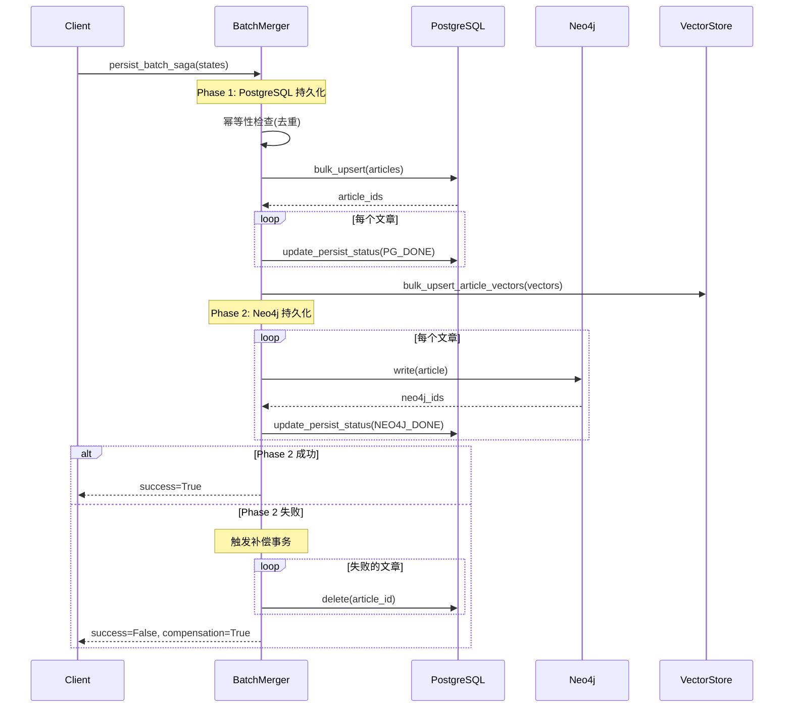
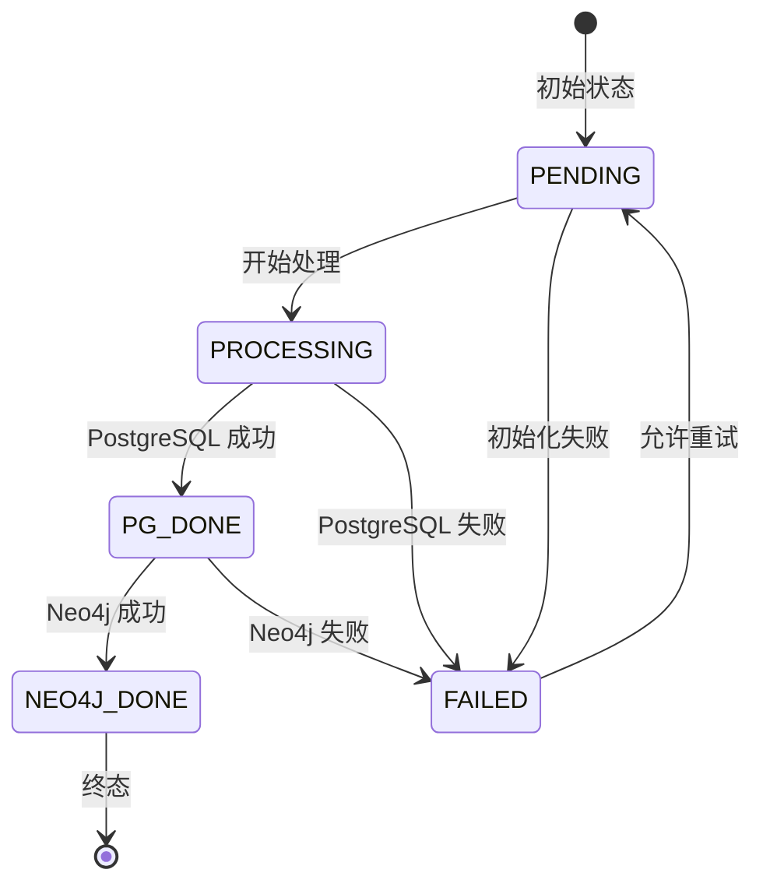
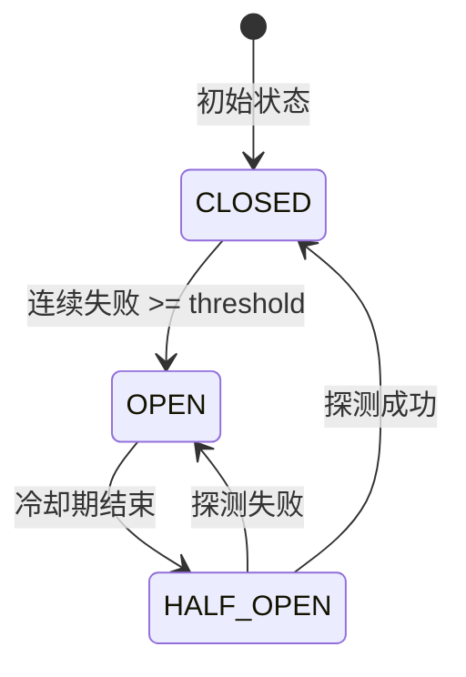

# Weaver 系统架构文档

本文档详细说明 Weaver 系统的核心架构设计，包括数据持久化、一致性保证、容错机制和性能优化。

## 目录

- [依赖注入架构](#依赖注入架构)
- [端口自动检测](#端口自动检测)
- [Saga 模式设计](#saga-模式设计)
- [PersistStatus 状态机](#persiststatus-状态机)
- [数据一致性保证机制](#数据一致性保证机制)
- [Circuit Breaker 线程安全设计](#circuit-breaker-线程安全设计)
- [向量索引架构](#向量索引架构)
- [社区检测架构](#社区检测架构)

---

## 依赖注入架构

### 概述

Weaver 采用 **FastAPI Depends 模式** 实现依赖注入，统一管理服务的创建、生命周期和依赖关系。该架构确保了组件间的松耦合，提高了可测试性和可维护性。

### 架构层次

```
main.py (lifespan)
       ↓
Container.startup() / shutdown()
       ↓
Endpoints._postgres = container.postgres_pool()
Endpoints._redis = container.redis_client()
Endpoints._llm = container.llm_client()
       ↓
_deps.py (Endpoints 类)
  - 存储服务实例的类变量
  - 提供静态 getter 方法
  - 抛出 HTTPException(503) 而非 RuntimeError
       ↓
dependencies.py (依赖函数层)
  - 调用 Endpoints.get_*() 方法
  - 定义 Type Aliases 供端点使用
       ↓
API Endpoints (使用层)
  - pool: PostgresPoolDep (推荐)
```

### 核心组件

#### Container (container.py)

容器负责管理所有服务的生命周期：

```python
from container import Container, get_container

# 应用启动时初始化
container = Container()
await container.startup()

# 获取全局容器实例
container = get_container()
postgres_pool = container.postgres_pool()
```

**主要职责**：

- 创建和配置所有服务实例
- 管理连接池的启动和关闭
- 提供服务实例的访问方法

#### Endpoints 类 (\_deps.py)

集中式依赖注册中心，供所有端点模块使用：

```python
from api.endpoints import _deps as deps

# 在端点中使用
@router.get("/items")
async def list_items(
    pool: PostgresPool = Depends(deps.Endpoints.get_postgres_pool),
):
    ...
```

**特点**：

- 所有 pool/client 实例由 `Container.register_endpoints()` 在应用启动时设置
- 静态方法返回服务实例
- 服务未初始化时抛出 `HTTPException(503)`

### 可用依赖列表

| 依赖函数                     | 返回类型             | 说明              |
| ---------------------------- | -------------------- | ----------------- |
| `get_container()`            | `Container`          | 应用容器实例      |
| `get_postgres_pool()`        | `PostgresPool`       | PostgreSQL 连接池 |
| `get_redis_client()`         | `RedisClient`        | Redis 客户端      |
| `get_neo4j_pool()`           | `Neo4jPool`          | Neo4j 连接池      |
| `get_llm_client()`           | `LLMClient`          | LLM 客户端        |
| `get_vector_repo()`          | `VectorRepo`         | 向量仓库          |
| `get_article_repo()`         | `ArticleRepo`        | 文章仓库          |
| `get_local_search_engine()`  | `LocalSearchEngine`  | 本地搜索引擎      |
| `get_global_search_engine()` | `GlobalSearchEngine` | 全局搜索引擎      |
| `get_hybrid_search_engine()` | `HybridSearchEngine` | 混合搜索引擎      |
| `get_source_scheduler()`     | `SourceScheduler`    | 源调度器          |

### 服务生命周期

| 生命周期      | 说明                         | 示例                                 |
| ------------- | ---------------------------- | ------------------------------------ |
| **Singleton** | 全局唯一实例，应用启动时创建 | PostgresPool, Neo4jPool, RedisClient |
| **Transient** | 每次请求创建新实例           | ArticleRepo (需要传入 Pool)          |

---

## 端口自动检测

### 概述

Weaver 实现了端口自动检测和分配功能，在应用启动时自动检查配置的端口是否可用，若被占用则自动寻找可用端口，确保服务能够正常启动。

### 核心组件

#### PortFinder

端口检测器提供端口可用性检查和搜索功能：

```python
from core.net.port_finder import PortFinder

# 检查端口是否可用
is_available = PortFinder.is_port_available("127.0.0.1", 8000)

# 查找可用端口
port = PortFinder.find_available_port("127.0.0.1", 8000, max_attempts=100)
```

**搜索算法**：双向搜索，优先向上查找

- 搜索顺序：`start → start+1 → start-1 → start+2 → start-2...`
- 跳过特权端口（< 1024）和无效端口（> 65535）
- 达到最大尝试次数时抛出 `PortExhaustionError`

#### PortAnnouncer

端口公告器负责广播实际使用的端口：

```python
from core.net.port_announcer import PortAnnouncer

announcer = PortAnnouncer()
announcer.announce("127.0.0.1", 8005, original_port=8000)
```

**公告渠道**：

1. **控制台日志**：通过结构化日志输出端口信息
2. **环境文件**：写入 `.env.weaver` 文件（`WEAVER_ACTUAL_PORT=8005`）
3. **Prometheus 指标**：设置 `weaver_server_port` Gauge

### 配置选项

在 `APISettings` 中配置：

| 参数                | 默认值 | 说明                 |
| ------------------- | ------ | -------------------- |
| `port_auto_detect`  | `True` | 是否启用端口自动检测 |
| `port_max_attempts` | `100`  | 最大搜索尝试次数     |

**配置示例**：

```toml
[api]
port = 8000
port_auto_detect = true
port_max_attempts = 100
```

### Docker 集成

Docker 容器的健康检查自动读取动态端口：

```dockerfile
HEALTHCHECK --interval=30s --timeout=10s --retries=3 \
    CMD PORT=$(grep -E '^WEAVER_ACTUAL_PORT=' /app/.env.weaver 2>/dev/null | cut -d'=' -f2 || echo 8000) && \
    python -c "import requests; requests.get(f'http://localhost:${PORT}/health')" || exit 1
```

### 使用场景

| 场景                     | 行为                                     |
| ------------------------ | ---------------------------------------- |
| 端口可用                 | 使用配置端口，日志输出 `port_check`      |
| 端口被占用               | 自动分配新端口，日志输出 `port_resolved` |
| 所有端口耗尽             | 抛出 `PortExhaustionError`，应用启动失败 |
| `port_auto_detect=false` | 使用配置端口，不进行检测                 |

---

## Saga 模式设计

### 概述

Weaver 采用 **Saga 模式** 实现跨数据库（PostgreSQL + Neo4j）的原子性批量持久化，通过两阶段提交和补偿事务确保数据一致性。

### 两阶段提交流程



### 补偿事务机制

当 Phase 2（Neo4j 持久化）失败时，系统自动触发补偿事务：

1. **删除 PostgreSQL 记录**：回滚 Phase 1 的所有写入
2. **记录错误详情**：保存失败原因和补偿执行状态
3. **依赖后台对账任务**：`sync_neo4j_with_postgres` 定期检查并修复不一致

### 幂等性保证

通过 URL 去重机制确保批量持久化幂等性：

```python
# 检查重复文章
urls_to_check = [s["raw"].url for s in valid_states]
existing_urls = await self._article_repo.get_existing_urls(urls_to_check)

# 仅处理新文章
new_states = [s for s in valid_states if s["raw"].url not in existing_urls]
```

---

## PersistStatus 状态机

### 状态定义

```python
class PersistStatus(str, enum.Enum):
    PENDING = "pending"          # 初始状态，等待处理
    PROCESSING = "processing"    # 正在处理中
    PG_DONE = "pg_done"          # PostgreSQL 持久化完成
    NEO4J_DONE = "neo4j_done"    # Neo4j 持久化完成（终态）
    FAILED = "failed"            # 失败状态
```

### 状态转换图



### 状态机保证

1. **合法性保证**：所有状态转换必须通过验证
2. **幂等性支持**：允许重复设置相同状态
3. **重试机制**：`FAILED → PENDING` 允许失败任务重新处理
4. **终态保护**：`NEO4J_DONE` 状态不可再转换

---

## 数据一致性保证机制

### 多层次一致性策略

#### 1. Saga 模式（同步保证）

- **两阶段提交**：PostgreSQL → Neo4j
- **补偿事务**：Neo4j 失败时回滚 PostgreSQL
- **幂等性检查**：URL 去重避免重复

#### 2. 定期对账任务（异步保证）

后台任务 `sync_neo4j_with_postgres` 定期检查数据一致性：

```python
# 每小时执行一次
scheduler.add_job(
    jobs.sync_neo4j_with_postgres,
    trigger=IntervalTrigger(hours=1),
    id="sync_neo4j_with_postgres",
)
```

**对账逻辑**：

1. 查询 PostgreSQL 中 `persist_status = 'pg_done'` 超过 1 小时的文章
2. 检查 Neo4j 中是否存在对应节点
3. 缺失则重新写入 Neo4j
4. 更新状态为 `NEO4J_DONE`

#### 3. 重试机制

失败任务自动重新入队，由后台任务 `retry_neo4j_writes` 处理（每 10 分钟）。

### 异常场景处理

| 场景                        | 检测机制                          | 恢复机制                   |
| --------------------------- | --------------------------------- | -------------------------- |
| PostgreSQL 成功，Neo4j 失败 | Saga 补偿事务                     | 删除 PostgreSQL → 重试队列 |
| 补偿事务失败                | 日志告警                          | 定期对账任务修复           |
| 网络超时                    | Circuit Breaker 熔断              | 自动重试 + 对账            |
| 进程崩溃                    | 状态检查 (`pg_done` 长时间未变更) | 重试任务处理               |

---

## Circuit Breaker 线程安全设计

### 概述

Circuit Breaker（熔断器）用于防止级联故障，在依赖服务不可用时快速失败，保护系统稳定性。

### 状态机模型



### 线程安全设计

#### 核心机制

1. **asyncio.Lock 保护**：所有状态转换和计数器更新都通过锁保护
2. **锁超时机制**：避免死锁，5 秒超时后跳过状态转换
3. **原子性更新**：状态和元数据在同一锁内更新

### 配置参数

| 参数           | 默认值 | 说明                  |
| -------------- | ------ | --------------------- |
| `threshold`    | 5      | 连续失败次数阈值      |
| `timeout_secs` | 60.0   | OPEN 状态冷却期（秒） |

### 监控指标

```promql
# 熔断器状态 (0=CLOSED, 1=OPEN, 2=HALF_OPEN)
circuit_breaker_state{service="neo4j"} 0

# 失败计数
circuit_breaker_fail_count{service="neo4j"} 2
```

---

## 向量索引架构

### 概述

Weaver 使用 **pgvector** 扩展在 PostgreSQL 中存储向量嵌入，并采用 **HNSW (Hierarchical Navigable Small World)** 索引优化相似性搜索性能。

### HNSW 索引优势

| 特性     | HNSW      | IVFFlat     | BRUTE FORCE |
| -------- | --------- | ----------- | ----------- |
| 查询速度 | ⚡ 极快   | 🚀 快       | 🐢 慢       |
| 召回率   | 高 (95%+) | 中等 (90%+) | 100%        |
| 适用场景 | 生产环境  | 大规模数据  | 小数据集    |

### 索引配置

```sql
-- 创建 HNSW 索引
CREATE INDEX CONCURRENTLY idx_article_vectors_hnsw
ON article_vectors
USING hnsw (embedding vector_cosine_ops)
WITH (m = 16, ef_construction = 64);
```

**参数说明**：

- **M = 16**：每层最大连接数，影响索引大小和召回率
- **ef_construction = 64**：构建索引时的搜索宽度

### 性能指标

| 数据规模  | 查询延迟 (P95) | 召回率 |
| --------- | -------------- | ------ |
| 10K 向量  | < 10ms         | 98%    |
| 100K 向量 | < 30ms         | 97%    |
| 1M 向量   | < 100ms        | 96%    |

---

## 社区检测架构

### 概述

Weaver 实现了基于 **Hierarchical Leiden 算法** 的社区检测系统，用于发现知识图谱中的社区结构，支持更智能的全局搜索和 DRIFT 搜索。

### 核心组件

#### 1. CommunityDetector

社区检测器使用 Hierarchical Leiden 算法发现图谱中的社区结构：

**算法特点**：

- 基于 leidenalg + igraph 高效实现
- 支持层次化社区结构
- 自动处理孤立实体
- 模块度质量评估

#### 2. CommunityReportGenerator

社区报告生成器为每个社区生成语义摘要：

**报告内容**：

- 社区标题和摘要
- 关键实体列表
- 关键关系描述
- 社区重要性评分 (rank: 1-10)

#### 3. GlobalContextBuilder

全局上下文构建器使用向量相似度搜索相关社区。

**搜索策略**：

1. 向量相似度搜索社区报告
2. 文本搜索社区标题/摘要
3. 实体-文章回退机制

### 自动触发机制

社区检测通过 `IncrementalCommunityUpdater` 自动触发：

```python
# 触发条件
ENTITY_CHANGE_THRESHOLD = 0.10  # 实体变化超过 10%
REBUILD_INTERVAL_DAYS = 7       # 至少每 7 天重建一次

# 定时检查（每 30 分钟）
scheduler.add_job(
    community_updater.check_and_run,
    trigger=IntervalTrigger(minutes=30),
    id="community_auto_check",
)
```

### 性能指标

| 图谱规模 | 检测时间 | 内存使用 | 社区数量 |
| -------- | -------- | -------- | -------- |
| 1K 实体  | < 5s     | ~100MB   | 10-30    |
| 5K 实体  | < 30s    | ~500MB   | 50-150   |
| 10K 实体 | < 60s    | ~1GB     | 100-300  |

---

## 总结

Weaver 通过以下核心架构设计确保系统的可靠性、一致性和高性能：

1. **Saga 模式**：跨数据库原子性保证，补偿事务机制
2. **状态机验证**：合法状态转换，幂等性支持
3. **多层次一致性**：同步 Saga + 异步对账 + 自动重试
4. **线程安全 Circuit Breaker**：锁保护 + 超时机制，防止级联故障
5. **HNSW 向量索引**：高性能相似性搜索，支持大规模向量数据
6. **社区检测系统**：Hierarchical Leiden 算法，支持智能搜索

这些设计确保了 Weaver 在生产环境中的稳定运行，能够处理复杂的分布式数据持久化场景。
