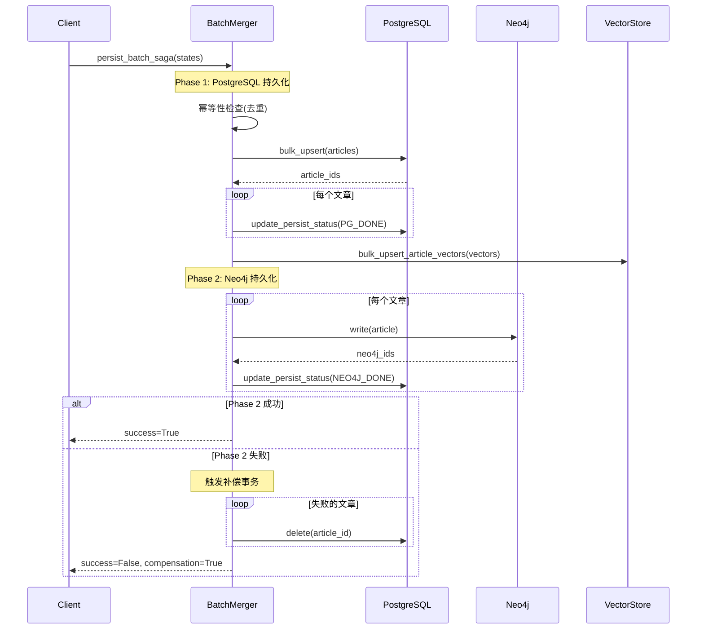
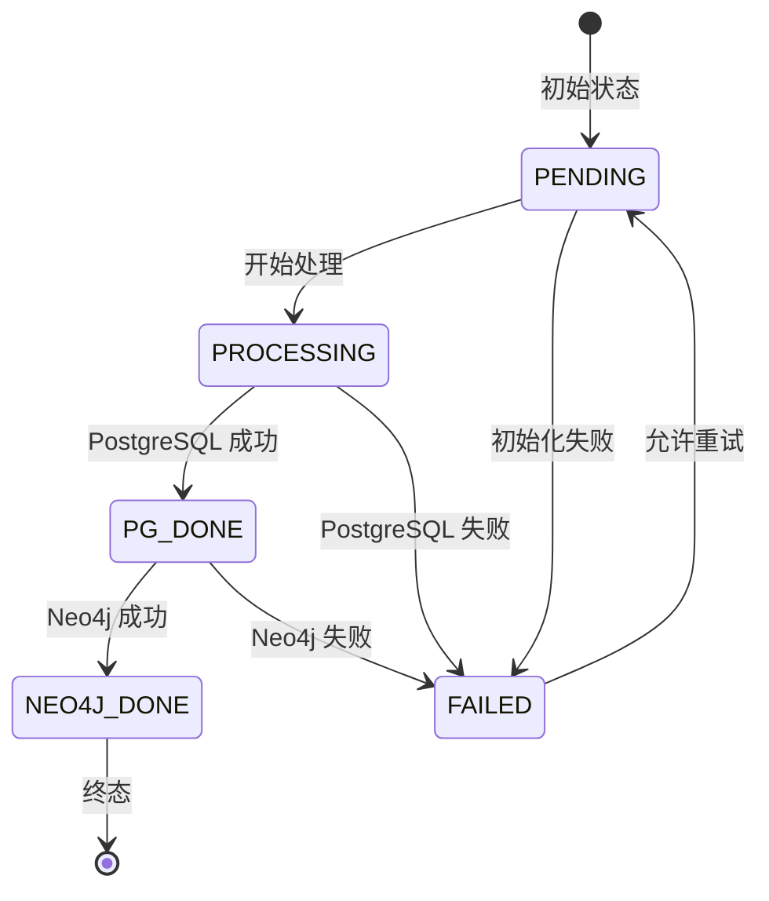
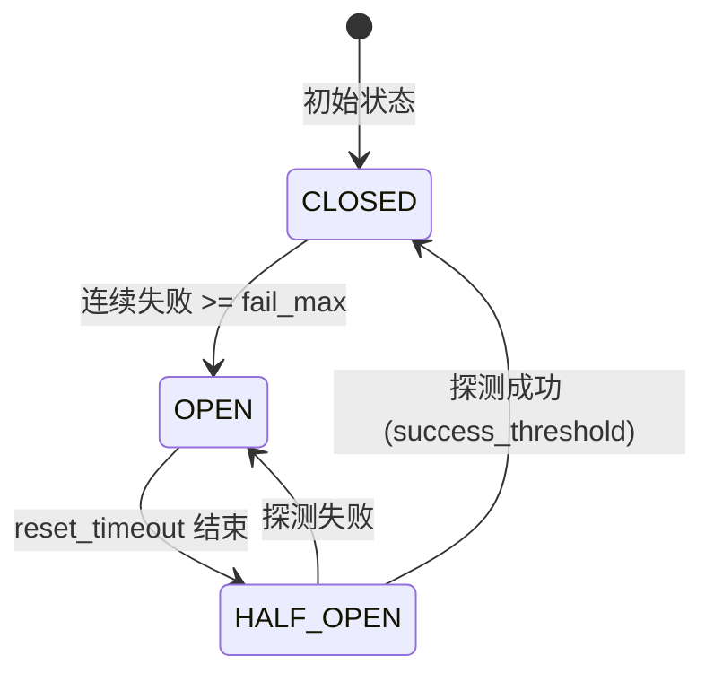

# Weaver 系统架构文档

本文档详细说明 Weaver 系统的核心架构设计，包括数据持久化、一致性保证、容错机制和性能优化。

## 目录

- [依赖注入架构](#依赖注入架构)
- [端口自动检测](#端口自动检测)
- [Saga 模式设计](#saga-模式设计)
- [PersistStatus 状态机](#persiststatus-状态机)
- [数据一致性保证机制](#数据一致性保证机制)
- [Circuit Breaker 线程安全设计](#circuit-breaker-线程安全设计)
- [向量索引架构](#向量索引架构)
- [社区检测架构](#社区检测架构)

---

## 依赖注入架构

### 概述

Weaver 采用 **FastAPI Depends 模式** 实现依赖注入,统一管理服务的创建、生命周期和依赖关系。该架构确保了组件间的松耦合,提高了可测试性和可维护性。

### 多数据库策略

Weaver 支持多种数据库后端,根据配置自动选择并使用 Protocol 接口实现抽象:

**关系型数据库 (Relational)**:
- **PostgreSQL**: 生产环境首选,支持完整功能
- **DuckDB**: 开发/测试环境,零配置嵌入式数据库

**图数据库 (Graph)**:
- **Neo4j**: 生产环境首选,完整图谱功能
- **LadybugDB**: 开发/测试环境,嵌入式图数据库
- **可选**: 图数据库可以为 None,部分功能降级

**缓存 (Cache)**:
- **Redis**: 生产环境,分布式缓存
- **CashewsRedisFallback**: 开发环境,内存缓存自动降级

### 架构层次

```
main.py (lifespan)
       ↓
Container.startup() / shutdown()
       ↓
Endpoints 类变量设置 (通过 Container 内部管理)
  - Container 直接管理服务实例,不通过 register_endpoints()
  - Endpoints 类通过静态变量存储实例
  - 提供静态 getter 方法
  - 抛出 HTTPException(503) 而非 RuntimeError
       ↓
dependencies.py (依赖函数层)
  - 调用 Endpoints.get_*() 方法
  - 定义 Type Aliases 供端点使用
  - 检查 Container._container 是否初始化
       ↓
API Endpoints (使用层)
  - pool: RelationalPoolDep (推荐)
```

**注意**: Container 不通过 `register_endpoints()` 注册依赖,而是直接管理所有服务实例。Endpoints 类的变量由外部设置(目前代码中未显式调用,依赖全局 Container 实例)。

### 初始化顺序和依赖关系

初始化顺序至关重要,修改可能导致启动失败:

| 阶段 | 依赖项 | 方法 |
|------|--------|------|
| database | - | init_strategy() |
| migrations | database | initialize_database() |
| redis | - | init_redis() |
| llm | database, redis | init_llm() |
| search_engines | database, llm | init_search_engines() |
| bm25_index | search_engines | _init_bm25_index() |
| smart_fetcher | - | init_smart_fetcher() |
| source_scheduler | smart_fetcher, database | init_source_scheduler() |
| pipeline | llm, database, redis | init_pipeline() |
| memory_service | database, llm, redis | init_memory_service() |
| llm_failure_logging | database, event_bus | (inline in startup) |
| llm_usage_stats | redis, database | (inline in startup) |
| scheduler | pipeline | _setup_scheduler() |

### 核心组件

#### Container (container.py)

容器负责管理所有服务的生命周期：

```python
from container import Container, get_container

# 应用启动时初始化
container = Container()
await container.startup()

# 获取全局容器实例
container = get_container()
relational_pool = container.relational_pool()
```

**主要职责**：

- 创建和配置所有服务实例
- 管理连接池的启动和关闭
- 提供服务实例的访问方法

#### Endpoints 类 (\_deps.py)

集中式依赖注册中心,供所有端点模块使用:

```python
from api.dependencies import get_relational_pool

# 在端点中使用
@router.get("/items")
async def list_items(
    pool: RelationalPoolDep,
):
    ...
```

**特点**:

- 所有 getter 为静态方法,直接返回服务实例
- 服务未初始化时抛出 `HTTPException(503)`
- 提供 Optional 版本的方法 (如 `get_relational_pool_optional()`)
- 数据库类型查询方法: `get_relational_type()`, `get_graph_type()`, `get_cache_type()`

### 可用依赖列表

**依赖函数** (在 `api/dependencies.py` 中定义):

| 依赖函数                     | 返回类型             | 说明              |
| ---------------------------- | -------------------- | ----------------- |
| `get_container()`            | `Container`          | 应用容器实例      |
| `get_relational_pool()`      | `RelationalPool`     | 关系型数据库连接池 (PostgreSQL/DuckDB) |
| `get_graph_pool()`           | `GraphPool`          | 图数据库连接池 (Neo4j/LadybugDB) |
| `get_graph_pool_type()`      | `str`                | 图数据库类型 ('neo4j' 或 'ladybug') |
| `get_cache_client()`         | `CachePool`          | 缓存客户端 (Redis/Cashews) |
| `get_llm_client()`           | `LLMClient`          | LLM 客户端        |
| `get_vector_repo()`          | `VectorRepo`         | 向量仓库          |
| `get_graph_repo()`           | `GraphRepository`    | 图数据库仓库      |
| `get_local_search_engine()`  | `LocalSearchEngine`  | 本地搜索引擎      |
| `get_global_search_engine()` | `GlobalSearchEngine` | 全局搜索引擎      |
| `get_hybrid_search_engine()` | `HybridSearchEngine` | 混合搜索引擎      |
| `get_source_scheduler()`     | `SourceScheduler`    | 源调度器          |
| `get_source_config_repo()`   | `SourceConfigRepo`   | 源配置仓库        |
| `get_source_authority_repo()`| `SourceAuthorityRepo`| 源权威仓库        |
| `get_llm_failure_repo()`     | `LLMFailureRepo`     | LLM 失败仓库      |
| `get_llm_usage_repo()`       | `LLMUsageRepo`       | LLM 使用统计仓库  |
| `get_pipeline_service()`     | `PipelineServiceImpl` | Pipeline 服务   |
| `get_task_registry()`        | `InMemoryTaskRegistry` | 任务注册表    |

**Type Aliases** (用于更简洁的函数签名):

```python
RelationalPoolDep = Annotated["RelationalPool", Depends(get_relational_pool)]
GraphPoolDep = Annotated["GraphPool", Depends(get_graph_pool)]
CachePoolDep = Annotated["CachePool", Depends(get_cache_client)]
LLMClientDep = Annotated["LLMClient", Depends(get_llm_client)]
# ... 更多类型别名见 dependencies.py
```

**数据库类型查询** (Endpoints 类方法):

| 方法                         | 返回值   | 说明                           |
| ---------------------------- | -------- | ------------------------------ |
| `get_relational_type()`      | `str`    | "postgres" 或 "duckdb" (未初始化返回 "unknown") |
| `get_graph_type()`           | `str`    | "neo4j" 或 "ladybug" (未初始化返回 "unknown") |
| `get_cache_type()`           | `str`    | 类名: "RedisClient", "CashewsRedisFallback" 或 "none" |

### 服务生命周期

| 生命周期      | 说明                         | 示例                                 |
| ------------- | ---------------------------- | ------------------------------------ |
| **Singleton** | 全局唯一实例,应用启动时创建 | RelationalPool, GraphPool, RedisClient, LLMClient |
| **Transient** | 每次请求创建新实例           | Repo 类 (通过 Container 方法获取,内部缓存实例) |

### Event Bus 事件系统

Weaver 使用 EventBus 实现组件间的松耦合通信:

**核心事件类型**:
- `LLMFailureEvent`: LLM 调用失败事件,自动记录到数据库
- `LLMUsageEvent`: LLM 使用统计事件,更新 Prometheus 指标、Redis Buffer 和原始记录
- `LLMCompareEvent`: LLM 对比评估事件,用于影子评估 (EvalCompareBuffer + EvalCompareRepo)
- `MemoryIngestEvent`: 记忆摄入事件,触发 Memory Service 处理

**事件订阅者** (在 Container.startup 中注册):

| 事件类型 | 订阅者 | 功能 |
|---------|--------|------|
| `LLMFailureEvent` | `_handle_llm_failure_async` | 记录失败到 LLMFailureRepo |
| `LLMUsageEvent` | `_handle_llm_usage_metrics` | 更新 Prometheus token 指标 |
| `LLMUsageEvent` | `_handle_llm_usage_buffer` | 累加到 Redis Buffer (2小时 TTL) |
| `LLMUsageEvent` | `_handle_llm_usage_raw` | 插入原始记录到数据库 (PostgreSQL 或 DuckDB) |
| `LLMCompareEvent` | `_handle_eval_compare_buffer` | 累加到 EvalCompareBuffer (24小时 TTL) |
| `LLMCompareEvent` | `_handle_eval_compare_raw` | 插入原始对比记录到数据库 |
| `MemoryIngestEvent` | `handle_memory_ingest` | 调用 MemoryService.ingest() |

**实际应用**:
- LLM 失败自动记录和监控
- Token 使用量实时统计 (3层: Prometheus + Redis Buffer + Database Raw)
- 影子评估数据收集 (LLMCompareEvent)
- Pipeline 到 Memory 的数据流 (MemoryIngestEvent)
- LLM 配置热重载 (LiveConfig 监听 llm.toml 变化)

---

## 端口自动检测

### 概述

Weaver 实现了端口自动检测和分配功能，在应用启动时自动检查配置的端口是否可用，若被占用则自动寻找可用端口，确保服务能够正常启动。

### 核心组件

#### PortFinder

端口检测器提供端口可用性检查和搜索功能：

```python
from core.net.port_finder import PortFinder

# 检查端口是否可用
is_available = PortFinder.is_port_available("127.0.0.1", 8000)

# 查找可用端口
port = PortFinder.find_available_port("127.0.0.1", 8000, max_attempts=100)
```

**搜索算法**：双向搜索，优先向上查找

- 搜索顺序：`start → start+1 → start-1 → start+2 → start-2...`
- 跳过特权端口（< 1024）和无效端口（> 65535）
- 达到最大尝试次数时抛出 `PortExhaustionError`

#### PortAnnouncer

端口公告器负责广播实际使用的端口：

```python
from core.net.port_announcer import PortAnnouncer
import os

# 通过环境变量控制是否写入 .env.weaver 文件
write_env = os.getenv("WEAVER_WRITE_PORT_ENV", "false").lower() in ("true", "1", "yes")
announcer = PortAnnouncer(write_env_file=write_env)
announcer.announce("127.0.0.1", 8005, original_port=8000)
```

**公告渠道**：

1. **控制台日志**：通过结构化日志输出端口信息
2. **环境文件**（可选）：当 `WEAVER_WRITE_PORT_ENV=true` 时写入 `.env.weaver` 文件
3. **Prometheus 指标**：设置 `weaver_server_port` Gauge

### 配置选项

在 `APISettings` 中配置：

| 参数                | 默认值 | 说明                 |
| ------------------- | ------ | -------------------- |
| `port_auto_detect`  | `True` | 是否启用端口自动检测 |
| `port_max_attempts` | `100`  | 最大搜索尝试次数     |

**配置示例**：

```toml
[api]
port = 8000
port_auto_detect = true
port_max_attempts = 100
```

### 环境变量控制

| 环境变量                | 默认值  | 说明                                  |
| ----------------------- | ------- | ------------------------------------- |
| `WEAVER_WRITE_PORT_ENV` | `false` | 是否写入 `.env.weaver` 文件 (true/false) |

**配置示例**：

```bash
# 启用写入 .env.weaver 文件
export WEAVER_WRITE_PORT_ENV=true

# 禁用写入（默认）
export WEAVER_WRITE_PORT_ENV=false
```

### Docker 集成

Docker 容器的健康检查应读取环境变量获取动态端口:

```dockerfile
HEALTHCHECK --interval=30s --timeout=10s --retries=3 \
    CMD python -c "import requests, os; port=os.getenv('WEAVER_ACTUAL_PORT', os.getenv('WEAVER_API__PORT', '8000')); requests.get(f'http://localhost:{port}/health')" || exit 1
```

**注意**: 实际写入环境变量名为 `WEAVER_ACTUAL_PORT`,不是 `WEAVER_API__PORT`。

### 使用场景

| 场景                     | 行为                                     |
| ------------------------ | ---------------------------------------- |
| 端口可用                 | 使用配置端口，日志输出 `port_check`      |
| 端口被占用               | 自动分配新端口，日志输出 `port_resolved` |
| 所有端口耗尽             | 抛出 `PortExhaustionError`，应用启动失败 |
| `port_auto_detect=false` | 使用配置端口，不进行检测                 |

---

## Smart LLM Router架构

### 概述

Weaver 实现了智能 LLM 路由系统，通过历史性能学习、熔断器集成和多 Provider 自动切换，确保 LLM 调用的可靠性和成本效益。

### 核心组件

#### SmartRouter

SmartRouter 负责智能选择最优 LLM Provider:

**工作原理**:
1. **ExperienceStore**: 记录每个 Provider 的历史性能数据
   - 响应时间
   - 成功率
   - Token 消耗
   - 错误类型

2. **Circuit Breaker 集成**: 自动熔断不健康的 Provider
   - 连续失败 5 次后打开熔断器
   - 60 秒冷却期后尝试半开状态
   - 探测成功则关闭熔断器

3. **多 Provider 自动切换**:
   - 主 Provider 失败时自动切换到 Fallback
   - 基于历史性能动态调整优先级
   - 支持成本优化路由

**配置示例** (config/llm.toml):
```toml
# Provider 配置 (两层嵌套结构)
[providers.openai]
type = "openai"
base_url = "https://api.openai.com/v1"
api_key = "${OPENAI_API_KEY}"
rpm_limit = 500
concurrency = 10
timeout = 120.0
priority = 100
weight = 100

  [providers.openai.models.chat]
  model_id = "gpt-4o"
  temperature = 0.0
  max_tokens = 4096
  capabilities = ["chat", "vision"]

  [providers.openai.models.embedding]
  model_id = "text-embedding-3-large"
  capabilities = ["embedding"]

# Call Point 路由配置
[call-points.classifier]
primary = "chat.openai.gpt-4o"
fallbacks = ["chat.anthropic.claude-sonnet-4-20250514"]

[call-points.embedding]
primary = "embedding.openai.text-embedding-3-large"
fallbacks = ["embedding.ollama.nomic-embed-text"]

# Smart Router 评分权重配置
[routing.classifier]
mode = "auto"  # auto | fast | best

  [routing.classifier.weights]
  editorial = 0.35      # 预设优先级
  reliability = 0.25    # 历史成功率
  cost = 0.15           # 预估 token 成本
  latency = 0.10        # 历史 P50 延迟

  [routing.classifier.bandit]
  enabled = true
  exploration_weight = 0.15  # Thompson Sampling 探索权重
  warmup_calls = 3           # 统计数据可信前的最小调用次数
```

#### EvalRunner 评估系统

EvalRunner 提供影子评估能力:

**功能**:
- 并行调用多个 Provider
- 对比响应质量
- 收集评估数据到 LLMCompareEvent
- 支持 A/B 测试

**配置**:
```toml
# 影子评估配置 (config/llm.toml)
[eval]
enabled = false                    # 启用影子评估
sample_rate = 0.1                  # 10% 的请求触发影子调用
target_call_points = ["classifier", "entity_extractor"]
baseline_model = "chat.openai.gpt-4o"
candidate_models = ["chat.anthropic.claude-sonnet-4-20250514"]
```

### LLM Usage 统计和监控

**实时统计**:
1. **Redis Buffer**: 聚合 LLM 使用量 (2小时 TTL)
2. **Database Raw Records**: 持久化详细记录
3. **Prometheus Metrics**: 实时指标暴露

**Prometheus 指标**:
```prometheus
# Input/Output/Total Tokens
llm_token_input_total{provider="openai",model="gpt-4o",call_point="search_local"} 123456
llm_token_output_total{provider="openai",model="gpt-4o",call_point="search_local"} 78901
llm_token_total{provider="openai",model="gpt-4o",call_point="search_local"} 202357
```

**后台聚合任务**:
- 每 5 分钟从 Redis 刷新到 PostgreSQL
- 原始记录保留 2 天
- 自动清理过期数据

### 事件驱动架构

**LLM 调用流程**:
```
LLMClient.call()
  ↓
SmartRouter.select_provider()
  ↓
ProviderPool.execute()
  ↓
发布 LLMUsageEvent → Redis Buffer
                  → Database Raw Record
                  → Prometheus Metrics
  ↓
失败时发布 LLMFailureEvent → Database Record
```

---

## MAGMA Memory集成架构

### 概述

Weaver 实现了基于 MAGMA 框架的记忆集成服务，支持快速检索、深度整合和因果关系推理，为搜索和对话提供长期记忆能力。

### 核心组件

#### MemoryIntegrationService

记忆集成服务提供三大核心能力:

**1. Fast Path (快速路径)**:
- 从图数据库快速检索已有记忆
- 基于实体和关系的即时召回
- 低延迟响应 (< 100ms)

**2. Slow Path (慢速路径)**:
- 深度记忆整合和推理
- 因果关系链发现
- 后台定时 Consolidation (合并冗余记忆)

**3. Causal Inference (因果推理)**:
- 识别实体间的因果关系
- 时间窗口内的因果链构建
- 支持 WHY 类型查询的深度回答

**配置参数** (MemorySettings, config/settings.toml):
```toml
[memory]
fast_path_enabled = true           # 启用快速路径 (同步摄入)
slow_path_enabled = true           # 启用慢速路径 (后台整合)
causal_confidence_threshold = 0.7  # 因果关系置信度阈值
max_traversal_depth = 5            # 最大遍历深度
beam_width = 10                    # Beam Search 宽度
token_budget = 4000                # Token 预算
consolidation_interval_minutes = 60  # 后台整合间隔 (分钟)
```

**核心组件**:
- **TemporalGraphRepo**: 时间骨架图,存储事件的时间顺序
- **CausalGraphRepo**: 因果关系图,存储实体间的因果链
- **SynapticIngestionService**: 快速路径摄入服务
- **StructuralConsolidationWorker**: 慢速路径整合工作器
- **ConsolidationQueue**: Redis 驱动的整合队列
- **AdaptiveSearchEngine**: 意图感知的检索引擎

### Memory Event Handler

**Pipeline 到 Memory 的数据流**:

```python
# Pipeline 处理文章后发布事件
event_bus.publish(MemoryIngestEvent(
    article_id="uuid",
    state=pipeline_state,
))

# Memory Service 自动处理
async def handle_memory_ingest(event: MemoryIngestEvent):
    await memory_service.ingest(event.state)
```

**摄入内容**:
- 实体及其关系
- 时间信息
- 因果链
- 情感分析结果

### 搜索集成

Memory 服务与搜索系统深度集成:

**Intent-Aware Routing 增强**:
- WHY 查询: 使用因果记忆链
- WHEN 查询: 使用时间记忆窗口
- ENTITY 查询: 使用实体记忆网络

**输出模式**:
- `output_mode=context`: 返回原始记忆片段
- `output_mode=narrative`: LLM 合成叙述性答案

### 依赖要求

Memory 服务需要以下组件:
- Graph Pool (Neo4j/LadybugDB)
- LLM Client
- Redis Client
- Vector Repo
- Entity Repo

如果依赖不满足，Memory 服务将自动跳过初始化，不影响核心功能。

---

## Saga 模式设计

### 概述

Weaver 采用 **Saga 模式** 实现跨数据库（PostgreSQL + Neo4j）的原子性批量持久化，通过两阶段提交和补偿事务确保数据一致性。

### 两阶段提交流程


```mermaid
sequenceDiagram
    participant Client
    participant BatchMerger
    participant PostgreSQL
    participant Neo4j
    participant VectorStore

    Client->>BatchMerger: persist_batch_saga(states)

    Note over BatchMerger: Phase 1: PostgreSQL 持久化

    BatchMerger->>BatchMerger: 幂等性检查(去重)
    BatchMerger->>PostgreSQL: bulk_upsert(articles)
    PostgreSQL-->>BatchMerger: article_ids

    loop 每个文章
        BatchMerger->>PostgreSQL: update_persist_status(PG_DONE)
    end

    BatchMerger->>VectorStore: bulk_upsert_article_vectors(vectors)

    Note over BatchMerger: Phase 2: Neo4j 持久化

    loop 每个文章
        BatchMerger->>Neo4j: write(article)
        Neo4j-->>BatchMerger: neo4j_ids
        BatchMerger->>PostgreSQL: update_persist_status(NEO4J_DONE)
    end

    alt Phase 2 成功
        BatchMerger-->>Client: success=True
    else Phase 2 失败
        Note over BatchMerger: 触发补偿事务
        loop 失败的文章
            BatchMerger->>PostgreSQL: delete(article_id)
        end
        BatchMerger-->>Client: success=False, compensation=True
    end
```

### 补偿事务机制

当 Phase 2（Neo4j 持久化）失败时，系统自动触发补偿事务：

1. **删除 PostgreSQL 记录**：回滚 Phase 1 的所有写入
2. **记录错误详情**：保存失败原因和补偿执行状态
3. **依赖后台对账任务**：`sync_neo4j_with_postgres` 定期检查并修复不一致

### 幂等性保证

通过 URL 去重机制确保批量持久化幂等性：

```python
# 检查重复文章
urls_to_check = [s["raw"].url for s in valid_states]
existing_urls = await self._article_repo.get_existing_urls(urls_to_check)

# 仅处理新文章
new_states = [s for s in valid_states if s["raw"].url not in existing_urls]
```

---

## PersistStatus 状态机

### 状态定义

```python
class PersistStatus(str, enum.Enum):
    PENDING = "pending"          # 初始状态，等待处理
    PROCESSING = "processing"    # 正在处理中
    PG_DONE = "pg_done"          # PostgreSQL 持久化完成
    NEO4J_DONE = "neo4j_done"    # Neo4j 持久化完成（终态）
    FAILED = "failed"            # 失败状态
```

### 状态转换图


```mermaid
stateDiagram-v2
    [*] --> PENDING: 初始状态

    PENDING --> PROCESSING: 开始处理
    PENDING --> FAILED: 初始化失败

    PROCESSING --> PG_DONE: PostgreSQL 成功
    PROCESSING --> FAILED: PostgreSQL 失败

    PG_DONE --> NEO4J_DONE: Neo4j 成功
    PG_DONE --> FAILED: Neo4j 失败

    FAILED --> PENDING: 允许重试

    NEO4J_DONE --> [*]: 终态
```

### 状态机保证

1. **合法性保证**：所有状态转换必须通过验证
2. **幂等性支持**：允许重复设置相同状态
3. **重试机制**：`FAILED → PENDING` 允许失败任务重新处理
4. **终态保护**：`NEO4J_DONE` 状态不可再转换

---

## 数据一致性保证机制

### 多层次一致性策略

#### 1. Saga 模式（同步保证）

- **两阶段提交**：PostgreSQL → Neo4j
- **补偿事务**：Neo4j 失败时回滚 PostgreSQL
- **幂等性检查**：URL 去重避免重复

#### 2. 定期对账任务（异步保证）

后台任务 `sync_neo4j_with_postgres` 定期检查数据一致性：

```python
# 每小时执行一次
scheduler.add_job(
    jobs.sync_neo4j_with_postgres,
    trigger=IntervalTrigger(hours=1),
    id="sync_neo4j_with_postgres",
)
```

**对账逻辑**：

1. 查询 PostgreSQL 中 `persist_status = 'pg_done'` 超过 1 小时的文章
2. 检查 Neo4j 中是否存在对应节点
3. 缺失则重新写入 Neo4j
4. 更新状态为 `NEO4J_DONE`

#### 3. 重试机制

失败任务自动重新入队，由后台任务 `retry_neo4j_writes` 处理（每 10 分钟）。

### 异常场景处理

| 场景                        | 检测机制                          | 恢复机制                   |
| --------------------------- | --------------------------------- | -------------------------- |
| PostgreSQL 成功，Neo4j 失败 | Saga 补偿事务                     | 删除 PostgreSQL → 重试队列 |
| 补偿事务失败                | 日志告警                          | 定期对账任务修复           |
| 网络超时                    | Circuit Breaker 熔断              | 自动重试 + 对账            |
| 进程崩溃                    | 状态检查 (`pg_done` 长时间未变更) | 重试任务处理               |

---

## Circuit Breaker 线程安全设计

### 概述

Circuit Breaker（熔断器）用于防止级联故障，在依赖服务不可用时快速失败，保护系统稳定性。

### 实现方式

Weaver 使用 **pybreaker** 库实现熔断器,通过 `ProviderCircuitBreaker` 封装提供异步支持:

```python
from core.llm.resilience.circuit_breaker import ProviderCircuitBreaker

breaker = ProviderCircuitBreaker(
    name="openai",
    fail_max=5,              # 连续失败 5 次打开熔断器
    reset_timeout=60.0,      # 60 秒冷却期
    slow_threshold=0.5,      # 慢请求阈值 (timeout 的 50%)
)

# 异步调用
result = await breaker.call(async_func, arg1, arg2)
```

### 状态机模型


```mermaid
stateDiagram-v2
    [*] --> CLOSED: 初始状态

    CLOSED --> OPEN: 连续失败 >= fail_max
    OPEN --> HALF_OPEN: reset_timeout 结束
    HALF_OPEN --> CLOSED: 探测成功 (success_threshold)
    HALF_OPEN --> OPEN: 探测失败
```

### 核心特性

1. **异步调用支持**: 手动实现 async/await 支持 (pybreaker 的 call_async 是 Tornado 专用)
2. **慢请求追踪**: 连续慢请求会降低 provider 的 editorial 分数
   - 慢请求阈值: `timeout * slow_threshold` (默认 50%)
   - 连续 5 次慢请求触发警告
3. **状态查询**: 提供 `is_open`, `state`, `slow_count` 等属性
4. **异常处理**: 抛出 `CircuitOpenError` 当熔断器开启时

### 配置参数

| 参数              | 默认值  | 说明                                    |
| ----------------- | ------- | --------------------------------------- |
| `fail_max`        | 5       | 连续失败次数阈值，超过后打开熔断器      |
| `reset_timeout`   | 60.0    | OPEN 状态冷却期（秒），之后进入半开状态 |
| `slow_threshold`  | 0.5     | 慢请求阈值 (timeout 的比例)             |
| `exclude_exceptions` | []   | 不计入失败的异常类型列表                |

### 慢请求降级机制

```python
# 连续慢请求追踪
breaker.mark_slow()    # 慢请求计数器 +1
breaker.mark_fast()    # 重置慢请求计数器

# 检查是否降级
if breaker.is_slow:    # 连续 >= 5 次慢请求
    # ModelSelector 会降低该 provider 的 editorial 分数
    pass
```

### 监控指标

```promql
# 熔断器状态 (通过 ProviderCircuitBreaker.state 查询)
# CircuitState: CLOSED=0, OPEN=1, HALF_OPEN=2

# 慢请求计数
provider_slow_requests{provider="openai"} 3
```

### 与 SmartRouter 集成

Circuit Breaker 与 SmartRouter 的 ModelSelector 集成:
- ModelSelector 查询 Circuit Breaker 状态
- 开启的熔断器自动排除对应 provider
- 慢请求降低 editorial 分数,影响路由权重

---

## 后台任务调度

### 概述

Weaver 使用 **APScheduler** 实现统一的后台任务调度系统，替代了原有的多线程和分散调度器。所有任务通过单一调度器管理，确保资源可控、易于监控。

### 调度器配置

**全局配置** (config/settings.toml):
```toml
[scheduler]
enabled = true                                    # 总开关
misfire_grace_time_seconds = 300                  # 错过执行的宽限期
# 各个任务的间隔时间配置见下方任务列表
```

**默认任务参数**:
- `max_instances=1`: 同一任务不会并发执行
- `coalesce=True`: 错过多次执行时合并为一次 (IntervalTrigger 任务)

### 任务分类

#### 1. 数据同步任务 (Data Sync)

| 任务 ID | 触发器 | 间隔 | 说明 |
|---------|--------|------|------|
| `sync_pending_to_neo4j` | Interval | 10 分钟 | 同步待处理记录到 Neo4j |
| `retry_neo4j_writes` | Interval | 10 分钟 | 重试失败的 Neo4j 写入 |
| `sync_neo4j_with_postgres` | Interval | 1 小时 | 全量 Neo4j ↔ PostgreSQL 同步 |
| `consistency_check` | Cron | 配置值 (默认每天) | 数据一致性检查 |
| `startup_sync_pending_to_neo4j` | Date | 启动时 | 启动时立即执行一次同步 |

#### 2. 清理任务 (Cleanup)

| 任务 ID | 触发器 | 间隔 | 说明 |
|---------|--------|------|------|
| `cleanup_old_synced` | Cron | 配置值 (默认每天) | 清理旧同步记录 (保留 7 天) |
| `llm_failure_cleanup` | Interval | 24 小时 | 清理 LLM 失败记录 (保留 3 天) |
| `llm_usage_raw_cleanup` | Interval | 6 小时 | 清理 LLM 使用原始记录 (保留 2 天) |

#### 3. Pipeline 重试任务

| 任务 ID | 触发器 | 间隔 | 说明 |
|---------|--------|------|------|
| `retry_pipeline_processing` | Interval | 15 分钟 | 重试失败的 Pipeline 处理 |

#### 4. 归档任务 (Archive, 条件性)

需要 Neo4j 可用才注册:

| 任务 ID | 触发器 | 间隔 | 说明 |
|---------|--------|------|------|
| `archive_old_neo4j_nodes` | Cron | 每周六 2:00 | 归档旧 Neo4j 节点 (90 天) |
| `cleanup_orphan_entity_vectors` | Cron | 每周六 3:00 | 清理孤立实体向量 |

#### 5. 抓取重试任务 (Crawl Retry)

| 任务 ID | 触发器 | 间隔 | 说明 |
|---------|--------|------|------|
| `flush_retry_queue` | Interval | 30 秒 | 刷新过期抓取重试队列 |

#### 6. LLM 使用统计 (LLM Usage)

| 任务 ID | 触发器 | 间隔 | 说明 |
|---------|--------|------|------|
| `llm_usage_aggregate` | Interval | 5 分钟 | LLM 使用量 Redis → PostgreSQL 聚合 |

#### 7. 源评分任务 (Source Scoring)

| 任务 ID | 触发器 | 间隔 | 说明 |
|---------|--------|------|------|
| `update_source_auto_scores` | Cron | 配置值 (默认每天) | 更新源权威评分 |

#### 8. 社区检测任务 (Community Detection)

| 任务 ID | 触发器 | 间隔 | 说明 |
|---------|--------|------|------|
| `community_auto_check` | Interval | 30 分钟 | 社区自动检测检查 |
| `community_health_check` | Interval | 6 小时 | 社区健康检查和自动修复 |

#### 9. 指标更新任务 (Metrics)

| 任务 ID | 触发器 | 间隔 | 说明 |
|---------|--------|------|------|
| `update_persist_status_metrics` | Interval | 5 分钟 | 更新 Prometheus 持久化状态指标 |

#### 10. Memory Consolidation (条件性)

需要 Memory Service 可用才注册:

| 任务 ID | 触发器 | 间隔 | 说明 |
|---------|--------|------|------|
| `memory_consolidation` | Interval | 60 分钟 | Memory 慢路径整合 |

### 任务执行保证

**可靠性机制**:
- `max_instances=1`: 同一任务不会并发执行
- `coalesce=True`: 错过多次执行时合并为一次
- `misfire_grace_time`: 允许延迟执行的宽限期

**监控**:
- 所有任务执行日志结构化输出
- 关键任务失败告警
- Prometheus 指标暴露

### 调度器生命周期

```python
# 启动时
scheduler.start()
log.info("scheduler_started", jobs=len(scheduler.get_jobs()))

# 关闭时
scheduler.shutdown(wait=False)  # 不等待当前任务完成
```

---

## 向量索引架构

### 概述

Weaver 使用 **pgvector** 扩展在 PostgreSQL 中存储向量嵌入，并采用 **HNSW (Hierarchical Navigable Small World)** 索引优化相似性搜索性能。

### HNSW 索引优势

| 特性     | HNSW      | IVFFlat     | BRUTE FORCE |
| -------- | --------- | ----------- | ----------- |
| 查询速度 | ⚡ 极快   | 🚀 快       | 🐢 慢       |
| 召回率   | 高 (95%+) | 中等 (90%+) | 100%        |
| 适用场景 | 生产环境  | 大规模数据  | 小数据集    |

### 索引配置

```sql
-- 创建 HNSW 索引
CREATE INDEX CONCURRENTLY idx_article_vectors_hnsw
ON article_vectors
USING hnsw (embedding vector_cosine_ops)
WITH (m = 16, ef_construction = 64);
```

**参数说明**：

- **M = 16**：每层最大连接数，影响索引大小和召回率
- **ef_construction = 64**：构建索引时的搜索宽度

### 性能指标

| 数据规模  | 查询延迟 (P95) | 召回率 |
| --------- | -------------- | ------ |
| 10K 向量  | < 10ms         | 98%    |
| 100K 向量 | < 30ms         | 97%    |
| 1M 向量   | < 100ms        | 96%    |

---

## 社区检测架构

### 概述

Weaver 实现了基于 **Hierarchical Leiden 算法** 的社区检测系统，用于发现知识图谱中的社区结构，支持更智能的全局搜索和 DRIFT 搜索。

### 核心组件

#### 1. CommunityDetector

社区检测器使用 Hierarchical Leiden 算法发现图谱中的社区结构：

**算法特点**：

- 基于 leidenalg + igraph 高效实现
- 支持层次化社区结构
- 自动处理孤立实体
- 模块度质量评估

#### 2. CommunityReportGenerator

社区报告生成器为每个社区生成语义摘要：

**报告内容**：

- 社区标题和摘要
- 关键实体列表
- 关键关系描述
- 社区重要性评分 (rank: 1-10)

#### 3. GlobalContextBuilder

全局上下文构建器使用向量相似度搜索相关社区。

**搜索策略**：

1. 向量相似度搜索社区报告
2. 文本搜索社区标题/摘要
3. 实体-文章回退机制

### 自动触发机制

社区检测通过 `IncrementalCommunityUpdater` 自动触发：

```python
# 触发条件
ENTITY_CHANGE_THRESHOLD = 0.10  # 实体变化超过 10%
REBUILD_INTERVAL_DAYS = 7       # 至少每 7 天重建一次

# 定时检查（每 30 分钟）
scheduler.add_job(
    community_updater.check_and_run,
    trigger=IntervalTrigger(minutes=30),
    id="community_auto_check",
)
```

### 性能指标

| 图谱规模 | 检测时间 | 内存使用 | 社区数量 |
| -------- | -------- | -------- | -------- |
| 1K 实体  | < 5s     | ~100MB   | 10-30    |
| 5K 实体  | < 30s    | ~500MB   | 50-150   |
| 10K 实体 | < 60s    | ~1GB     | 100-300  |

---

## 降级数据处理

### 概述

当 LLM 服务不可用或处理失败时，系统需要标记降级数据，确保后续处理能够识别和处理不完整的数据。

### 核心组件

#### PipelineState (TypedDict)

`PipelineState` 是一个 **TypedDict**，通过 `degraded_fields` 和 `degradation_reasons` 字段跟踪降级状态:

```python
from modules.processing.pipeline.state import PipelineState, has_degraded_data, get_degradation_summary

state: PipelineState = {
    "raw": article_raw,
    "degraded_fields": ["summary", "entities"],
    "degradation_reasons": {
        "summary": "LLM timeout after 30s",
        "entities": "Provider circuit breaker OPEN"
    },
    # ... 其他字段
}

# 检查是否有降级数据
if has_degraded_data(state):
    summary = get_degradation_summary(state)
    # {"summary": "LLM timeout after 30s", "entities": "Provider circuit breaker OPEN"}
```

**PipelineState 关键字段**:

| 字段 | 类型 | 说明 |
|------|------|------|
| `degraded_fields` | `list[str]` | 使用降级/默认值的字段名列表 |
| `degradation_reasons` | `dict[str, str]` | 字段名 → 降级原因映射 |

### 降级标记点

| 节点              | 降级字段             | 触发条件     |
| ----------------- | -------------------- | ------------ |
| `Cleaner`         | `content`, `summary` | LLM 清洗失败 |
| `EntityExtractor` | `entities`           | 实体提取失败 |
| `Categorizer`     | `categories`         | 分类失败     |

### 使用场景

```python
# 在后续处理中检查降级状态
if "entities" in state.degraded_fields:
    logger.warning(f"Using fallback entity extraction: {state.degradation_reasons['entities']}")
    # 使用规则提取作为 fallback
```

---

## Redis 健康检查与 Fallback

### 概述

`Deduplicator` 实现 Redis 健康检查和自动 fallback 到数据库，确保去重服务在 Redis 不可用时仍能正常工作。

### 架构设计

```
┌─────────────────┐
│   Deduplicator  │
├─────────────────┤
│ 1. Redis Hash   │ ← 快速缓存层 (crawl:dedup)
│ 2. 健康检查探测 │ ← 60秒间隔 (time.monotonic)
│ 3. DB Fallback  │ ← 可靠持久层
└─────────────────┘
```

### 健康检查机制

```python
# 健康检查探测（60秒间隔）
async def _check_cache_health(self) -> bool:
    now = time.monotonic()  # 使用 monotonic 避免系统时钟变化
    if now - self._last_health_check < self.HEALTH_CHECK_INTERVAL:
        return self._cache_healthy

    self._last_health_check = now
    try:
        await self._cache.ping()
        self._cache_healthy = True
    except Exception:
        self._cache_healthy = False

    return self._cache_healthy
```

### Fallback 流程

```python
async def dedup(self, items: list) -> list:
    # 1. 检查缓存健康状态
    cache_available = await self._check_cache_health()

    # 2. 尝试 Redis Hash 批量去重
    if cache_available:
        try:
            url_hashes = [self._hash(item.url) for item in items]
            exists = await self._cache.hexists_many(self.DEDUP_KEY, url_hashes)
            candidates = [item for item, ex in zip(items, exists) if not ex]
        except Exception:
            # Fallback 到数据库
            metrics.dedup_redis_fallback_total.inc()
            candidates = items

    # 3. 数据库级别精确去重
    urls = [item.url for item in candidates]
    db_existing = await self._repo.get_existing_urls(urls)
    new_items = [item for item in candidates if item.url not in db_existing]

    # 4. 写回 Redis (如果健康)
    if new_items and self._cache_healthy:
        for item in new_items:
            await self._cache.hset(self.DEDUP_KEY, self._hash(item.url), timestamp)

    return new_items
```

### 核心特性

1. **两级去重**: Redis Hash (快速) + Database UNIQUE constraint (精确)
2. **批量操作**: 使用 `hexists_many` 批量检查,减少网络往返
3. **自动恢复**: Redis 恢复后自动切换回缓存模式
4. **指标统计**: 记录 fallback 次数和处理时间

### 配置参数

| 参数 | 默认值 | 说明 |
|------|--------|------|
| `DEDUP_KEY` | `"crawl:dedup"` | Redis Hash 键名 |
| `DEFAULT_TTL` | `604800` (7天) | 缓存条目 TTL |
| `HEALTH_CHECK_INTERVAL` | `60` (秒) | 健康检查间隔 |

### Prometheus 指标

| 指标名 | 类型 | 说明 |
|------|------|------|
| `weaver_dedup_redis_fallback_total` | Counter | Redis 不可用时回退到数据库的次数 |
| `weaver_dedup_total{stage="url"}` | Counter | URL 去重总数 |
| `weaver_dedup_processing_time{stage="url"}` | Histogram | 去重处理时间 |

---

## Embedding 缓存优化

### 概述

LLM Client 使用 Redis `MGET` 批量获取 embedding 缓存，避免 N+1 查询问题。

**注意**: Deduplicator 使用的是 Redis Hash (`hexists_many`) 进行 URL 去重,与 Embedding 缓存 (使用 `MGET`) 是不同的场景。

### 优化前后对比

```python
# 优化前：N+1 查询
for text in texts:
    cache_key = self._make_cache_key(text)
    cached = await self._redis.get(cache_key)  # N 次 Redis 调用
    results.append(cached)

# 优化后：批量获取
cache_keys = [self._make_cache_key(text) for text in texts]
cached_values = await self._redis.mget(cache_keys)  # 1 次批量调用
for i, cached in enumerate(cached_values):
    results.append(cached)
```

### 性能基准测试结果

> 测试环境: Python 3.12, 模拟 1ms 网络延迟 (tests/performance/test_embedding_cache_performance.py)

| 文本数量 | 循环 GET 延迟 | 批量 MGET 延迟 | 性能提升   |
| -------- | ------------- | -------------- | ---------- |
| 10 条    | 11.05ms       | 1.09ms         | **10.1x**  |
| 50 条    | 55.37ms       | 1.10ms         | **50.2x**  |
| 100 条   | 110.46ms      | 1.12ms         | **98.7x**  |
| 500 条   | 552.29ms      | 1.14ms         | **483.4x** |

**结论**: 批量 MGET 将 O(N) 网络往返降低到 O(1)，在大批量场景下性能提升高达 **480x**。

---

## 总结

Weaver 通过以下核心架构设计确保系统的可靠性、一致性和高性能：

1. **依赖注入架构**: FastAPI Depends 模式 + Container 统一管理,支持多数据库策略 (PostgreSQL/DuckDB, Neo4j/LadybugDB, Redis/Cashews)
2. **Smart LLM Router**: 智能路由系统,集成 ExperienceStore + ModelSelector + Circuit Breaker,支持影子评估和热重载
3. **Saga 模式**: 跨数据库原子性保证,补偿事务机制,幂等性支持
4. **PersistStatus 状态机**: 合法状态转换验证,支持失败重试和终态保护
5. **多层次一致性**: 同步 Saga + 异步对账 + 自动重试,确保 PostgreSQL ↔ Neo4j 数据一致
6. **Circuit Breaker**: 基于 pybreaker 实现,支持异步调用、慢请求追踪和自动降级
7. **HNSW 向量索引**: 高性能相似性搜索 (m=16, ef_construction=64),支持大规模向量数据
8. **社区检测系统**: Hierarchical Leiden 算法 + 健康检查 + 自动修复,支持智能搜索
9. **降级数据处理**: TypedDict + 模块级函数跟踪降级字段,确保不完整数据可识别
10. **Redis 健康检查与 Fallback**: 两级去重 (Hash + DB),自动切换,批量操作优化
11. **Embedding 缓存优化**: MGET 批量获取,将 O(N) 网络往返降低到 O(1),性能提升高达 480x

这些设计确保了 Weaver 在生产环境中的稳定运行,能够处理复杂的分布式数据持久化场景。
