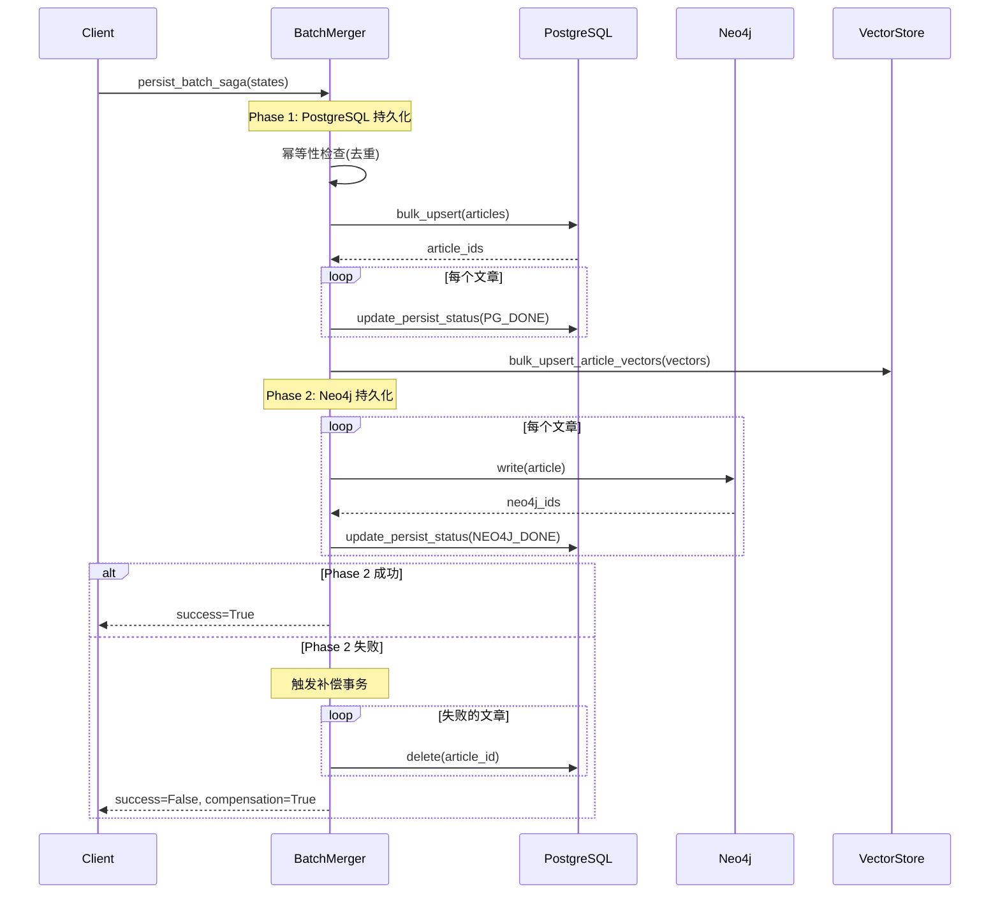
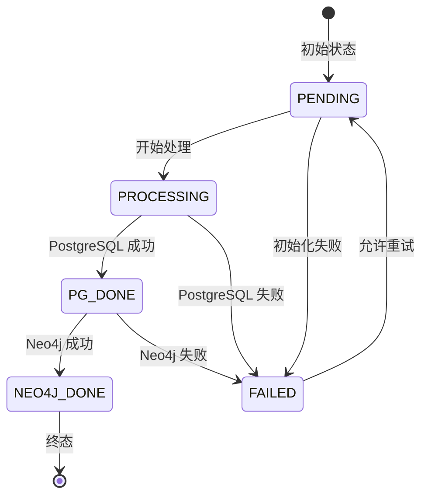
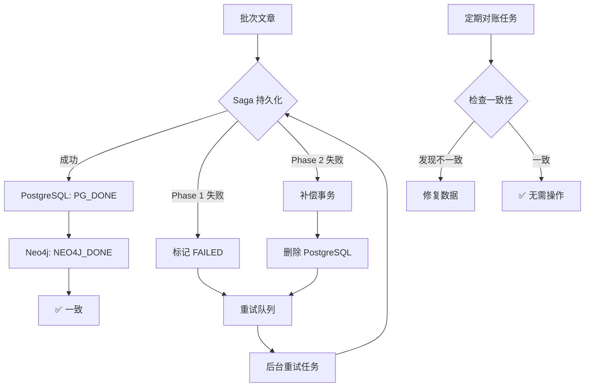
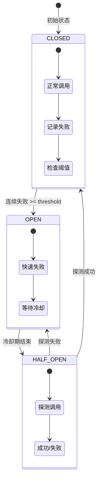
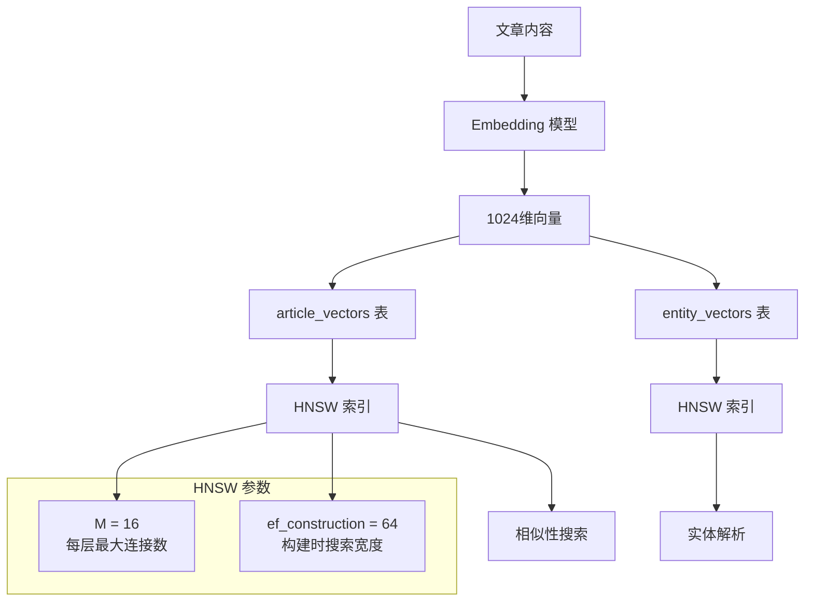

# Weaver 系统架构文档

本文档详细说明 Weaver 系统的核心架构设计，包括数据持久化、一致性保证、容错机制和性能优化。

## 目录

- [Saga 模式设计](#saga-模式设计)
- [PersistStatus 状态机](#persiststatus-状态机)
- [数据一致性保证机制](#数据一致性保证机制)
- [Circuit Breaker 线程安全设计](#circuit-breaker-线程安全设计)
- [向量索引架构](#向量索引架构)

---

## Saga 模式设计

### 概述

Weaver 采用 **Saga 模式** 实现跨数据库（PostgreSQL + Neo4j）的原子性批量持久化，通过两阶段提交和补偿事务确保数据一致性。

### 设计原理

Saga 模式将分布式事务拆分为多个本地事务，每个本地事务都有对应的补偿事务。如果某个步骤失败，则执行之前所有步骤的补偿事务进行回滚。

### 两阶段提交流程



### 补偿事务机制

当 Phase 2（Neo4j 持久化）失败时，系统自动触发补偿事务：

1. **删除 PostgreSQL 记录**：回滚 Phase 1 的所有写入
2. **记录错误详情**：保存失败原因和补偿执行状态
3. **依赖后台对账任务**：`sync_neo4j_with_postgres` 定期检查并修复不一致

### 幂等性保证

通过 URL 去重机制确保批量持久化幂等性：

```python
# 检查重复文章
urls_to_check = [s["raw"].url for s in valid_states]
existing_urls = await self._article_repo.get_existing_urls(urls_to_check)

# 仅处理新文章
new_states = [s for s in valid_states if s["raw"].url not in existing_urls]
```

**优点**：
- 避免重复文章
- 支持安全重试
- 失败批次可重新入队

### 代码示例

```python
from modules.pipeline.nodes.batch_merger import BatchMergerNode

# 创建 BatchMerger 实例
merger = BatchMergerNode(
    llm_client,       # LLMClient 实例
    prompt_loader,     # PromptLoader 实例
    vector_repo=vector_repo,    # 可选
    article_repo=article_repo,  # 可选
    neo4j_writer=neo4j_writer,  # 可选
)

# 执行批量持久化 Saga
result = await merger.persist_batch_saga(states)

if result["success"]:
    print(f"成功持久化 {len(result['pg_ids'])} 篇文章")
else:
    print(f"持久化失败: {result['error']}")
    if result["compensation_executed"]:
        print("已执行补偿事务")
```

---

## PersistStatus 状态机

### 概述

`PersistStatus` 枚举定义了文章在持久化过程中的状态转换，确保每个状态转换都是合法且可追踪的。

### 状态定义

```python
class PersistStatus(str, enum.Enum):
    PENDING = "pending"          # 初始状态，等待处理
    PROCESSING = "processing"    # 正在处理中
    PG_DONE = "pg_done"          # PostgreSQL 持久化完成
    NEO4J_DONE = "neo4j_done"    # Neo4j 持久化完成（终态）
    FAILED = "failed"            # 失败状态
```

### 状态转换图



### 状态转换验证

系统通过 `is_valid_transition()` 方法验证状态转换的合法性：

```python
@classmethod
def is_valid_transition(
    cls,
    from_status: "PersistStatus",
    to_status: "PersistStatus",
) -> bool:
    """验证状态转换是否合法。"""
    # 幂等性：允许保持当前状态
    if from_status == to_status:
        return True

    # 定义合法转换
    valid_transitions = {
        cls.PENDING: {cls.PROCESSING, cls.FAILED},
        cls.PROCESSING: {cls.PG_DONE, cls.FAILED},
        cls.PG_DONE: {cls.NEO4J_DONE, cls.FAILED},
        cls.FAILED: {cls.PENDING},  # 允许重试
        cls.NEO4J_DONE: set(),      # 终态
    }

    allowed = valid_transitions.get(from_status, set())
    return to_status in allowed
```

### 使用示例

```python
from core.db.models import PersistStatus

# 验证状态转换
current_status = PersistStatus.PENDING
new_status = PersistStatus.PROCESSING

if PersistStatus.is_valid_transition(current_status, new_status):
    article.persist_status = new_status
    await session.commit()
else:
    raise InvalidStateTransitionError(
        f"Invalid transition: {current_status} → {new_status}"
    )
```

### 状态机保证

1. **合法性保证**：所有状态转换必须通过验证
2. **幂等性支持**：允许重复设置相同状态
3. **重试机制**：`FAILED → PENDING` 允许失败任务重新处理
4. **终态保护**：`NEO4J_DONE` 状态不可再转换

---

## 数据一致性保证机制

### 多层次一致性策略

Weaver 通过以下机制确保跨数据库一致性：

#### 1. Saga 模式（同步保证）

- **两阶段提交**：PostgreSQL → Neo4j
- **补偿事务**：Neo4j 失败时回滚 PostgreSQL
- **幂等性检查**：URL 去重避免重复

#### 2. 定期对账任务（异步保证）

后台任务 `sync_neo4j_with_postgres` 定期检查数据一致性：

```python
# 每小时执行一次
scheduler.add_job(
    jobs.sync_neo4j_with_postgres,
    trigger=IntervalTrigger(hours=1),
    id="sync_neo4j_with_postgres",
)
```

**对账逻辑**：
1. 查询 PostgreSQL 中 `persist_status = 'pg_done'` 超过 1 小时的文章
2. 检查 Neo4j 中是否存在对应节点
3. 缺失则重新写入 Neo4j
4. 更新状态为 `NEO4J_DONE`

#### 3. 重试机制

失败任务自动重新入队，由后台任务 `retry_neo4j_writes` 处理：

```python
# 每 10 分钟执行一次
scheduler.add_job(
    jobs.retry_neo4j_writes,
    trigger=IntervalTrigger(minutes=10),
    id="retry_neo4j_writes",
)
```

### 一致性保证流程



### 异常场景处理

| 场景 | 检测机制 | 恢复机制 |
|------|----------|----------|
| PostgreSQL 成功，Neo4j 失败 | Saga 补偿事务 | 删除 PostgreSQL → 重试队列 |
| 补偿事务失败 | 日志告警 | 定期对账任务修复 |
| 网络超时 | Circuit Breaker 熔断 | 自动重试 + 对账 |
| 进程崩溃 | 状态检查 (`pg_done` 长时间未变更) | 重试任务处理 |

---

## Circuit Breaker 线程安全设计

### 概述

Circuit Breaker（熔断器）用于防止级联故障，在依赖服务不可用时快速失败，保护系统稳定性。Weaver 的实现确保了线程安全，支持高并发场景。

### 状态机模型



### 线程安全设计

#### 核心机制

1. **asyncio.Lock 保护**：所有状态转换和计数器更新都通过锁保护
2. **锁超时机制**：避免死锁，5 秒超时后跳过状态转换
3. **原子性更新**：状态和元数据在同一锁内更新

#### 代码实现

```python
import asyncio
import time
from enum import Enum

class CBState(Enum):
    CLOSED = "closed"
    OPEN = "open"
    HALF_OPEN = "half_open"

class CircuitBreaker:
    def __init__(self, threshold: int = 5, timeout_secs: float = 60.0) -> None:
        self._threshold = threshold
        self._timeout = timeout_secs
        self._state = CBState.CLOSED
        self._fail_count = 0
        self._opened_at = 0.0
        self._lock = asyncio.Lock()  # 🔒 线程安全锁

    async def record_failure(self) -> bool:
        """记录失败（线程安全）。"""
        try:
            async with asyncio.timeout(5.0):  # 5秒超时
                async with self._lock:  # 🔒 获取锁
                    self._fail_count += 1
                    if self._fail_count >= self._threshold:
                        self._state = CBState.OPEN
                        self._opened_at = time.monotonic()
                    return True
        except TimeoutError:
            logger.warning("circuit_breaker_lock_timeout")
            return False

    async def record_success(self) -> bool:
        """记录成功（线程安全）。"""
        try:
            async with asyncio.timeout(5.0):
                async with self._lock:
                    self._fail_count = 0
                    self._state = CBState.CLOSED
                    return True
        except TimeoutError:
            logger.warning("circuit_breaker_lock_timeout")
            return False
```

### 并发场景处理

#### 场景 1: 多个并发请求同时失败

```
时间线：
T1: Request A 失败 → 获取锁 → fail_count=1 → 释放锁
T2: Request B 失败 → 获取锁 → fail_count=2 → 释放锁
T3: Request C 失败 → 获取锁 → fail_count=3 → 释放锁
...
T5: Request E 失败 → 获取锁 → fail_count=5 >= threshold → 状态=OPEN → 释放锁
```

**保证**：
- 计数器更新原子性
- 状态转换一致性
- 无竞态条件

#### 场景 2: 状态转换时的并发请求

```
状态: OPEN (冷却期)
T1: Request A 调用 → is_open() 检查 → 冷却期已过 → 状态=HALF_OPEN
T2: Request B 调用 → is_open() 检查 → 状态=HALF_OPEN → 允许通过
T3: Request A 成功 → record_success() → 状态=CLOSED
T4: Request B 成功 → record_success() → 状态=CLOSED (幂等)
```

**保证**：
- 状态转换串行化
- 锁超时防止死锁
- 幂等性支持

### 配置参数

| 参数 | 默认值 | 说明 |
|------|--------|------|
| `threshold` | 5 | 连续失败次数阈值 |
| `timeout_secs` | 60.0 | OPEN 状态冷却期（秒）|
| `lock_timeout` | 5.0 | 锁获取超时时间（秒）|

### 监控指标

Circuit Breaker 暴露以下 Prometheus 指标：

```promql
# 熔断器状态 (0=CLOSED, 1=OPEN, 2=HALF_OPEN)
circuit_breaker_state{service="neo4j"} 0

# 失败计数
circuit_breaker_fail_count{service="neo4j"} 2

# 锁超时次数
circuit_breaker_lock_timeouts_total{service="neo4j"} 0
```

---

## 向量索引架构

### 概述

Weaver 使用 **pgvector** 扩展在 PostgreSQL 中存储向量嵌入，并采用 **HNSW (Hierarchical Navigable Small World)** 索引优化相似性搜索性能。

### HNSW 索引优势

| 特性 | HNSW | IVFFlat | BRUTE FORCE |
|------|------|---------|-------------|
| 查询速度 | ⚡ 极快 | 🚀 快 | 🐢 慢 |
| 构建速度 | 🚀 快 | ⚡ 极快 | - |
| 内存使用 | 中等 | 低 | 低 |
| 召回率 | 高 (95%+) | 中等 (90%+) | 100% |
| 适用场景 | 生产环境 | 大规模数据 | 小数据集 |

### 索引架构



### 索引配置

#### 参数说明

- **M = 16**：每层最大连接数，影响索引大小和召回率
  - 值越大，召回率越高，但内存占用越大
  - 推荐范围：8-64

- **ef_construction = 64**：构建索引时的搜索宽度
  - 值越大，索引质量越高，构建时间越长
  - 推荐范围：32-128

#### 索引创建

```sql
-- 为 article_vectors 创建 HNSW 索引
CREATE INDEX CONCURRENTLY idx_article_vectors_hnsw
ON article_vectors
USING hnsw (embedding vector_cosine_ops)
WITH (m = 16, ef_construction = 64);

-- 为 entity_vectors 创建 HNSW 索引
CREATE INDEX CONCURRENTLY idx_entity_vectors_hnsw
ON entity_vectors
USING hnsw (embedding vector_cosine_ops)
WITH (m = 16, ef_construction = 64);
```

**注意**：使用 `CONCURRENTLY` 避免阻塞写入操作。

### 相似性搜索

#### 查询示例

```python
from modules.storage.vector_repo import VectorRepo

# 初始化仓库
vector_repo = VectorRepo(postgres_pool, embedding_dim=1024)

# 查询相似文章
similar = await vector_repo.find_similar(
    embedding=query_vector,    # 1024维查询向量
    category="政治",           # 可选：按类别过滤
    threshold=0.80,            # 相似度阈值
    limit=20,                  # 返回前20个结果
)

for hit in similar:
    print(f"文章ID: {hit.article_id}, 相似度: {hit.similarity:.3f}")
```

#### 性能优化

1. **索引使用验证**

```sql
EXPLAIN ANALYZE
SELECT article_id, 1 - (embedding <=> query_vector) AS similarity
FROM article_vectors
WHERE 1 - (embedding <=> query_vector) > 0.80
ORDER BY embedding <=> query_vector
LIMIT 20;
```

预期输出包含 `Index Scan using idx_article_vectors_hnsw`。

2. **查询参数调优**

```sql
-- 设置查询时的搜索宽度（影响召回率）
SET hnsw.ef_search = 100;

-- 执行查询
SELECT article_id, embedding <=> query_vector AS distance
FROM article_vectors
ORDER BY embedding <=> query_vector
LIMIT 20;
```

- `hnsw.ef_search` 值越大，召回率越高，查询越慢
- 推荐范围：`ef_construction` 到 `2 * ef_construction`

3. **批量查询优化**

```python
# 批量相似性查询（减少数据库往返）
batch_results = await vector_repo.batch_find_similar(
    queries=[(query_id_1, vector_1), (query_id_2, vector_2)],
    threshold=0.80,
    limit=50,
)
```

### 性能指标

| 数据规模 | 查询延迟 (P95) | 召回率 | 内存占用 |
|----------|----------------|--------|----------|
| 10K 向量 | < 10ms | 98% | ~200MB |
| 100K 向量 | < 30ms | 97% | ~2GB |
| 1M 向量 | < 100ms | 96% | ~20GB |

**测试环境**：
- CPU: Intel Xeon 4核
- 内存: 16GB
- PostgreSQL: 15
- pgvector: 0.5.0

### 维护操作

#### 索引重建

```sql
-- 删除旧索引
DROP INDEX CONCURRENTLY IF EXISTS idx_article_vectors_hnsw;

-- 创建新索引（新参数）
CREATE INDEX CONCURRENTLY idx_article_vectors_hnsw
ON article_vectors
USING hnsw (embedding vector_cosine_ops)
WITH (m = 32, ef_construction = 128);
```

#### 索引统计

```sql
-- 查看索引大小
SELECT
    indexname,
    pg_size_pretty(pg_relation_size(indexname::regclass)) AS size
FROM pg_indexes
WHERE indexname LIKE '%hnsw%';

-- 查看索引使用情况
SELECT
    indexrelname,
    idx_scan,
    idx_tup_read,
    idx_tup_fetch
FROM pg_stat_user_indexes
WHERE indexrelname LIKE '%hnsw%';
```

---

## 总结

Weaver 通过以下核心架构设计确保系统的可靠性、一致性和高性能：

1. **Saga 模式**：跨数据库原子性保证，补偿事务机制
2. **状态机验证**：合法状态转换，幂等性支持
3. **多层次一致性**：同步 Saga + 异步对账 + 自动重试
4. **线程安全 Circuit Breaker**：锁保护 + 超时机制，防止级联故障
5. **HNSW 向量索引**：高性能相似性搜索，支持大规模向量数据
6. **多模式搜索引擎**：本地/全局/文章搜索，支持LLM驱动的知识图谱问答

这些设计确保了 Weaver 在生产环境中的稳定运行，能够处理复杂的分布式数据持久化场景。

---

## 社区检测架构

### 概述

Weaver 实现了基于 **Hierarchical Leiden 算法** 的社区检测系统，用于发现知识图谱中的社区结构，支持更智能的全局搜索和 DRIFT 搜索。

### 架构组件

```
┌─────────────────────────────────────────────────────────────┐
│                    社区检测系统架构                           │
├─────────────────────────────────────────────────────────────┤
│                                                             │
│  ┌─────────────────┐    ┌─────────────────┐                │
│  │ Community       │    │ Community       │                │
│  │ Detector        │───▶│ Report          │                │
│  │ (Leiden算法)     │    │ Generator       │                │
│  └────────┬────────┘    └────────┬────────┘                │
│           │                      │                          │
│           ▼                      ▼                          │
│  ┌─────────────────┐    ┌─────────────────┐                │
│  │ Neo4j           │    │ LLM (报告生成)   │                │
│  │ Community       │    │                 │                │
│  │ Repository      │    └─────────────────┘                │
│  └─────────────────┘                                        │
│                                                             │
├─────────────────────────────────────────────────────────────┤
│                    搜索集成层                                 │
├─────────────────────────────────────────────────────────────┤
│                                                             │
│  ┌─────────────────┐    ┌─────────────────┐                │
│  │ Global Search   │    │ DRIFT Search    │                │
│  │ (Map-Reduce)    │    │ (三阶段迭代)     │                │
│  └────────┬────────┘    └────────┬────────┘                │
│           │                      │                          │
│           ▼                      ▼                          │
│  ┌─────────────────────────────────────────┐                │
│  │        Global Context Builder           │                │
│  │   (向量相似度搜索社区报告)                 │                │
│  └─────────────────────────────────────────┘                │
│                                                             │
└─────────────────────────────────────────────────────────────┘
```

### 核心组件

#### 1. CommunityDetector

社区检测器使用 Hierarchical Leiden 算法发现图谱中的社区结构：

```python
from modules.graph_store.community_detector import CommunityDetector

detector = CommunityDetector(neo4j_pool)
result = await detector.detect_communities()

# 结果包含：
# - communities: 社区列表
# - modularity: 模块度（社区质量指标）
# - levels: 层次结构层数
# - orphan_count: 孤立实体数量
```

**算法特点**：
- 基于 graspologic-native 高效实现
- 支持层次化社区结构
- 自动处理孤立实体
- 模块度质量评估

#### 2. CommunityReportGenerator

社区报告生成器为每个社区生成语义摘要：

```python
from modules.graph_store.community_report_generator import CommunityReportGenerator

generator = CommunityReportGenerator(neo4j_pool, llm_client)
result = await generator.generate_report(community_id)
```

**报告内容**：
- 社区标题和摘要
- 关键实体列表
- 关键关系描述
- 社区重要性评分 (rank: 1-10)

#### 3. GlobalContextBuilder

全局上下文构建器使用向量相似度搜索相关社区：

```python
from modules.search.context.global_context import GlobalContextBuilder

builder = GlobalContextBuilder(neo4j_pool, llm_client)
context = await builder.build(query="人工智能研究", max_tokens=4000)
```

**搜索策略**：
1. 向量相似度搜索社区报告
2. 文本搜索社区标题/摘要
3. 实体-文章回退机制

### Neo4j Schema

```cypher
// Community 节点
CREATE CONSTRAINT community_id_unique IF NOT EXISTS
FOR (c:Community) REQUIRE c.id IS UNIQUE;

// HAS_ENTITY 关系索引
CREATE INDEX has_entity_idx IF NOT EXISTS
FOR ()-[r:HAS_ENTITY]-() ON r.id;

// CommunityReport 节点
CREATE CONSTRAINT report_id_unique IF NOT EXISTS
FOR (r:CommunityReport) REQUIRE r.id IS UNIQUE;
```

### 自动触发机制

社区检测通过 `CommunityDetectionScheduler` 自动触发：

```python
# 触发条件
ENTITY_CHANGE_THRESHOLD = 0.10  # 实体变化超过 10%
REBUILD_INTERVAL_DAYS = 7       # 至少每 7 天重建一次

# 手动触发
POST /api/v1/admin/communities/rebuild
```

### API 端点

| 端点 | 方法 | 说明 |
|------|------|------|
| `/api/v1/admin/communities/rebuild` | POST | 手动触发社区重建 |
| `/api/v1/graph/communities` | GET | 社区列表查询 |
| `/api/v1/graph/communities/{id}` | GET | 社区详情 |
| `/api/v1/graph/metrics/community` | GET | 社区指标 |
| `/api/v1/search/drift` | POST | DRIFT 搜索 |

### 性能指标

| 图谱规模 | 检测时间 | 内存使用 | 社区数量 |
|----------|----------|----------|----------|
| 1K 实体 | < 5s | ~100MB | 10-30 |
| 5K 实体 | < 30s | ~500MB | 50-150 |
| 10K 实体 | < 60s | ~1GB | 100-300 |

### 相关文档

- [社区模块使用指南](./community-guide.md)
- [DRIFT 搜索说明](./api.md#drift-search)