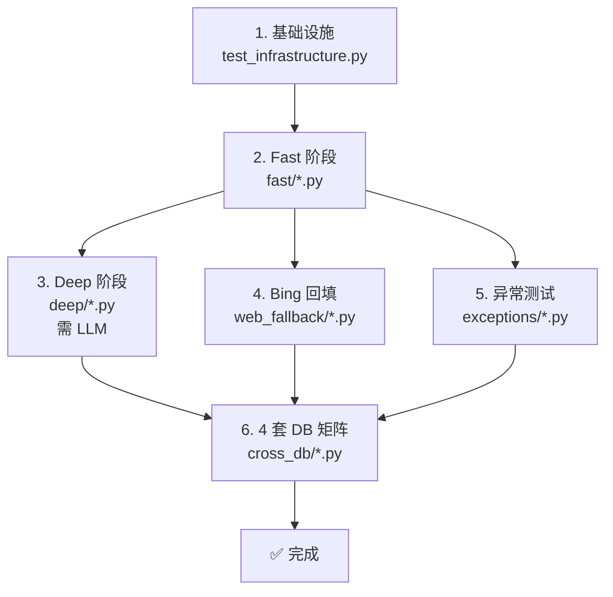

# Weaver 集成测试套件

> 162+ 个集成测试用例，覆盖搜索、图谱、管道、管理、异常、Bing 回填、4 套 DB 矩阵。

## 目录结构

```
tests/integration/
├── pytest.ini                    # 集成测试专用配置
├── conftest.py                   # 共享 fixture（DB 组合、API key、动态数据、lifespan）
├── fast/                         # Fast 阶段（基础功能，无 LLM 依赖）
│   ├── test_infrastructure.py    # 基础设施验证（markers、DB_COMBOS）
│   ├── test_search_fast.py       # F-S-01~18 搜索接口
│   ├── test_articles_sources_fast.py  # F-C-01~05 文章/源
│   ├── test_graph_fast.py        # F-G-01~11 图谱
│   └── test_monitoring_fast.py   # F-M-01~12 监控
├── deep/                         # Deep 阶段（需 LLM 服务）
│   ├── test_pipeline_deep.py     # D-P-01~08 管道
│   └── test_search_deep.py       # D-S-01~12 深度搜索
├── web_fallback/                 # Bing 网络回填
│   └── test_bing_fallback.py     # W-01~20（19 协议层 + 1 live）
├── exceptions/                   # 异常场景
│   ├── test_auth_exceptions.py   # A-01~15 认证
│   ├── test_rate_limit.py        # R-01~05 限流
│   ├── test_ssrf_protection.py   # S-01~12 SSRF
│   ├── test_llm_failures.py      # L-01~08 LLM 失败
│   ├── test_db_failover.py       # D-01~08 故障转移
│   ├── test_input_validation.py  # V-01~15 输入校验
│   ├── test_saga.py             # SG-01~05 Saga
│   └── test_alerts.py           # AL-01~08 告警
└── cross_db/                     # 4 套 DB 组合矩阵
    └── test_4db_consistency.py   # X-01~05 × 4 参数化
```

## 快速开始

### 运行全部集成测试

```bash
# 使用集成测试专用配置（覆盖率门禁 85%，仅统计 src/api/）
uv run pytest tests/integration/ -c tests/integration/pytest.ini

# 或从项目根目录（需覆盖默认 addopts）
uv run pytest tests/integration/ -o addopts="" -m "integration" --no-cov
```

### 按阶段运行

```bash
# Fast 阶段（无 LLM 依赖，约 30s）
uv run pytest tests/integration/fast/ -o addopts="" -m "integration" --no-cov

# Deep 阶段（需 LLM 服务，约 5-10min）
uv run pytest tests/integration/deep/ -o addopts="" -m "integration and slow" --no-cov

# Bing 回填（19 协议层，无需网络）
uv run pytest tests/integration/web_fallback/ -o addopts="" -m "integration and not bing_live" --no-cov

# 异常测试（无 LLM 依赖）
uv run pytest tests/integration/exceptions/ -o addopts="" -m "integration and not slow and not db_failover" --no-cov
```

## 4 套 DB 组合切换

通过环境变量 `WEAVER__DB__TYPE` 和 `WEAVER__GRAPH__TYPE` 控制：

| 组合 | 环境变量 | 说明 |
|------|----------|------|
| PG + LadybugDB | `WEAVER__DB__TYPE=postgres` `WEAVER__GRAPH__TYPE=ladybug` | 默认组合，Neo4j 不可用时降级 |
| DuckDB + Neo4j | `WEAVER__DB__TYPE=duckdb` `WEAVER__GRAPH__TYPE=neo4j` | PG 不可用时降级 |
| PG + Neo4j | `WEAVER__DB__TYPE=postgres` `WEAVER__GRAPH__TYPE=neo4j` | 全外部服务 |
| DuckDB + LadybugDB | `WEAVER__DB__TYPE=duckdb` `WEAVER__GRAPH__TYPE=ladybug` | 全嵌入式，无外部依赖 |

```bash
# 运行 4 套 DB 矩阵测试（需 4 次独立运行）
WEAVER__DB__TYPE=postgres WEAVER__GRAPH__TYPE=ladybug uv run pytest tests/integration/cross_db/ -o addopts="" -m "db_combo" --no-cov
WEAVER__DB__TYPE=duckdb WEAVER__GRAPH__TYPE=neo4j uv run pytest tests/integration/cross_db/ -o addopts="" -m "db_combo" --no-cov
WEAVER__DB__TYPE=postgres WEAVER__GRAPH__TYPE=neo4j uv run pytest tests/integration/cross_db/ -o addopts="" -m "db_combo" --no-cov
WEAVER__DB__TYPE=duckdb WEAVER__GRAPH__TYPE=ladybug uv run pytest tests/integration/cross_db/ -o addopts="" -m "db_combo" --no-cov
```

## Bing Live 测试

仅当 `WEAVER_BING__ENABLED=true` 时运行真实 Bing 网络调用测试（W-11）：

```bash
WEAVER_BING__ENABLED=true uv run pytest tests/integration/web_fallback/ -o addopts="" -m "bing_live" --no-cov
```

## DB 故障转移测试

需特殊环境（模拟 PG/Neo4j/Redis 不可用），标注 `@pytest.mark.db_failover`：

```bash
uv run pytest tests/integration/exceptions/test_db_failover.py -o addopts="" -m "db_failover" --no-cov
```

## 测试执行顺序



## Markers

| Marker | 用途 | 默认运行 |
|--------|------|----------|
| `integration` | 集成测试 | 需显式 `-m integration` |
| `slow` | Deep 阶段慢速测试 | 需显式 `-m slow` |
| `db_combo` | 4 套 DB 矩阵 | 仅 CI 矩阵任务 |
| `bing_live` | 真实 Bing 调用 | 需 `WEAVER_BING__ENABLED=true` |
| `db_failover` | 故障转移测试 | 仅 CI |

## 关键 fixture

| Fixture | 作用域 | 说明 |
|---------|--------|------|
| `async_client` | session | httpx.AsyncClient（ASGITransport + lifespan 触发） |
| `admin_headers` | session | {"X-API-Key": ...}（从 .env 加载） |
| `test_api_keys` | session | 4 个 key（normal/admin/expired/revoked） |
| `real_entity_name` | session | 从 /graph/entities 取真实实体名 |
| `real_article_id` | session | 从 /articles 取真实文章 ID |
| `real_source_id` | session | 从 /sources 取首个 enabled source ID |
| `cleanup_test_data` | session | 测试结束后清理 API key |

## 注意事项

1. **禁止 MagicMock**：conftest.py 的 `pytest_collection_modifyitems` hook 会拒绝含 `MagicMock`/`AsyncMock`/`patch`/`unittest.mock` 的测试文件。使用 `monkeypatch` + 手写 fakes。
2. **真实数据**：测试使用真实运行数据（非 mock），通过 fixture 动态获取实体/文章/源 ID。
3. **API 响应格式**：项目使用自定义 APIResponse 格式（`message`/`details` 字段，非标准 `detail`）。
4. **DuckDB 单写者**：并发写操作需顺序执行，避免写锁竞争。
5. **Lifespan 触发**：`async_client` fixture 通过 `app.router.lifespan_context(app)` 显式触发 ASGI lifespan，确保容器初始化。
